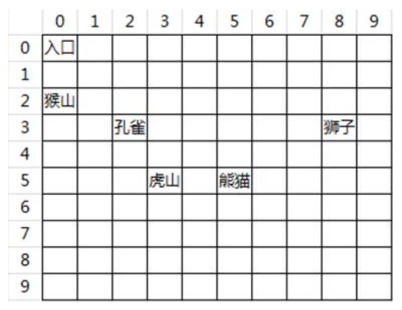

# C++算法竞赛入门篇

114道题

# 6.拆位运算

### **02-1027 - 求任意三位数各个数位上数字的和**

**题目描述**

对于一个任意的三位自然数 *x* ，编程计算其各个数位上的数字之和 *S* 。

**输入**

输入一行，只有一个整数 (100≤*x*≤999) 。

**输出**

输出只有一行，包括 1 个整数。

**样例**

**输入复制**

```
123
```

**输出复制**

```
6
```

**来源**

基础问题

### 03-**1028 - 输入一个三位数，把个位和百位对调后输出**

**题目描述**

输入一个三位自然数，然后把这个数的百位数与个位数对调，输出对调后的数。

**输入**

输入一行，只有一个整数 (100≤*x*≤999) 。

**输出**

输出只有一行，包括 1 个整数。

**样例**

**输入复制**

```
123
```

**输出复制**

```
321
```

**输入复制**

```
120
```

**输出复制**

```
21
```

**来源**

基础问题

# 7.分支

## 7.1双分支

### **1303 - 冷饮的价格（1）**

**题目描述**

小明去冷饮店买冰激凌，如果买 10 个以上或者 10 个，2 元 / 个， 10 个以下， 2.2 元 / 个。

请从键盘读入小明的购买数量，计算小明应付的价格！

**输入**

一个整数，代表小明购买的冰激凌的数量（*n*≤100） 。

**输出**

小明应付的金额，金额保留 11 位小数！

**样例**

**输入复制**

```
20
```

**输出复制**

```
40.0
```

---

### **1033 - 判断奇偶数**

**题目描述**

输入一个整数，判断是否为偶数。是输出 `y e s` ，否则输出 `n o`。

**输入**

输入只有一行，包括 1 个整数（该整数在 1∼10000 的范围内）。

**输出**

输出只有一行。（**注意输出格式**，具体请看下方提示）。

**样例**

**输入复制**

```
2
```

**输出复制**

```
y e s
```

**说明**

要注意空格！！！！！！！！

**来源**

分支问题

**标签**

---

### **1302 - 是否适合晨练？**

**题目描述**

夏天到了，气温太高，小明的爷爷每天有晨练的习惯，但有时候温度不适合晨练；小明想编写一个程序，帮助爷爷判断温度是否适合晨练。

输入温度 *t* 的值，判断其是否适合晨练，适合晨练输出 `OK` ，不适合输出 `NO` 。( 20≤*t*≤30 ,则适合晨练 `OK` ，否则不适合 `NO` )。

**输入**

一个整数代表当天的温度。

**输出**

`OK` 或者 `NO` 。

**样例**

**输入复制**

```
22
```

**输出复制**

```
OK
```

**来源**

分支问题

---

## 7.2多分支

### **1304 - 冷饮的价格（2）**

**题目描述**

小明夏天去买冰棍，老板说买 30个及以上 1 元 /个， 20∼29 个 1.2 元 /个，10∼19 个 1.5 元 /个， 10 个以下1.8 元 /个！

请从键盘读入小明买冰棍的数量，计算小明应该付的价格（价格保留 1位小数）！

**输入**

一个整数 *n* 代表小明购买的冰棍的数量。

**输出**

小明应付的金额。

**样例**

**输入复制**

```
30
```

**输出复制**

```
30.0
```

**来源**

分支问题

---

### **1035 - 判断成绩等级**

**题目描述**

输入某学生成绩，如果 86 分以上(包括 86 分）则输出 `VERY GOOD` ，如果在 60 到 85之间的则输出 `GOOD` (包括 60 和 85 )，小于 60 的则输出 `BAD`。

**输入**

输入只有一行，包括 1 个整数。

**输出**

输出只有一行（这意味着末尾有一个回车符号）。

**样例**

**输入复制**

```
80
```

**输出复制**

```
GOOD
```

**来源**

分支问题

---

### **1044 - 找出最经济型的包装箱型号**

**题目描述**

已知有 A，*B*，*C*，*D*，E 五种包装箱，为了不浪费材料，小于 10 公斤的用 *A* 型，大于等于 10公斤小于 20公斤的用 *B* 型，大于等于 20 公斤小于 40 公斤的用 *C* 型，大于等于 40 公斤的小于 50公斤的用 *D* 型，大于等于 50公斤小于 80 公斤的用 *E* 型。

现在输入一货物的重量（小于 80 公斤），找出最经济型的包装箱型号。

**输入**

输入只有一行，包括一个整数。

**输出**

输出只有一行（这意味着末尾有一个回车符号），包括 1个字符。

**样例**

**输入复制**

```
8
```

**输出复制**

```
A
```

**来源**

分支问题

---

### **1039 - 求三个数的最大数**

**题目描述**

已知有三个不等的数，将其中的最大数找出来。

**输入**

输入只有一行，包括3个整数。之间用一个空格分开。

**输出**

输出只有一行（这意味着末尾有一个回车符号），包括1个整数。

**样例**

**输入复制**

```
1 5 8
```

**输出复制**

```
8
```

---

## 7.3多if

### **1299 - 请问一个整数n能够被2、3、5、7中哪些数整除**

**题目描述**

从键盘读入一个整数 *n* ，请问 *n* 能够被 2、3、5、7 中哪些数整除，从小到大依次输出 *n* 能够整除的数，每行一个。

如： 输入： 20

输出：

2

5

**输入**

一个整数 *n*（*n*≤10000 ）。

**输出**

*n* 能够整除的数。

**样例**

**输入复制**

```
20
```

**输出复制**

```
2
5
```

**来源**

分支问题

---

### **1310 - 至少要买几瓶止咳糖浆？**

**题目描述**

花花生病了，妈妈去给花花买儿童止咳糖浆。一瓶儿童止咳糖浆的规格及用法如下所示，一般花花咳嗽需要 5天才能痊愈。

止咳糖浆规格：每瓶 120 毫升，每日 3 次， 10 岁以上儿童：每次 25 毫升，7∼10 岁儿童：每次 15 毫升， 3∼6 岁儿童：每次 5 毫升。

请根据止咳糖浆的规格以及花花的年龄计算，写一个程序计算如果花花要痊愈，妈妈至少要买几瓶止咳糖浆？（4.1.7）

**输入**

一个整数，代表花花的年龄（花花的年龄在 2 岁以上）。

**输出**

一个整数，代表妈妈最少需要购买的糖浆瓶数。

**样例**

**输入复制**

```
5
```

**输出复制**

```
1
```

**来源**

分支问题

---

### **1039 - 求三个数的最大数**

**题目描述**

已知有三个不等的数，将其中的最大数找出来。

**输入**

输入只有一行，包括3个整数。之间用一个空格分开。

**输出**

输出只有一行（这意味着末尾有一个回车符号），包括1个整数。

**样例**

**输入复制**

```
1 5 8
```

**输出复制**

```
8
```

**来源**

分支问题

---

### **1042 - 求任意三位数打乱次序后的最大值**

**题目描述**

任意输入一个三位整数，再把它的次序打乱重新组合一个新的三位整数，使其值最大。

**输入**

输入只有一行，包括 1个整数。

**输出**

输出只有一行（这意味着末尾有一个回车符号），包括 1 个整数。

**样例**

**输入复制**

```
470
```

**输出复制**

```
740
```

**来源**

分支问题

---

### **1041 - 判断三个整数是否相邻**

**题目描述**

判断三个整数是否相邻，是输出 `TRUE`，否则输出 `FALSE`。

**输入**

输入只有一行，包括3个整数。

**输出**

输出只有一行。

**样例**

**输入复制**

```
1 3 2
```

**输出复制**

```
TRUE
```

**说明**

三个整数不一定是有序的，例如：1 3 2，是相邻的数！

**来源**

分支问题

---

### **1018 - 三角形类别**

**题目描述**

输入三个整数，以这三个数为边长，判断是否构成三角形；若不能输出 `no` 。

若构成三角形，进一步判断它们构的是：锐角三角形或直角三角形或钝角三角形。

分别输出 `ruijiao` ,`zhijiao`, `dunjiao` 。

**输入**

三个整数。

**输出**

一个字符串。

**样例**

**输入复制**

```
3 4 5
```

**输出复制**

```
zhijiao
```

**输入复制**

```
9 7 5
```

**输出复制**

```
dunjiao
```

**输入复制**

```
20 16 12
```

**输出复制**

```
zhijiao
```

**说明**

两个短边的平方和等于一个长边的平方时为直角三角形。

两个短边的平方和小于一个长边的平方时为钝角三角形。

两个短边的平方和大于一个长边的平方时为锐角三角形。

**来源**

分支问题

---

### 多if特别应用：

 三个数排序  和   打擂台求最大值，这两个核心应用

---

# 8.循环

## 8.1while循环

### **1004 - 编程求1\*2\*3\*...\*n**

**题目描述**

编程求 1×2×3×⋯×*n* 。

**输入**

输入一行，只有一个整数 *n*(1≤*n*≤10)；

**输出**

输出只有一行（这意味着末尾有一个回车符号），包括 1 个整数。

**样例**

**输入复制**

```
5
```

**输出复制**

```
120
```

**来源**

简单循环

### **1056 - 所有不超过1000的数中含有数字3的自然数**

**题目描述**

编程求出所有不超过 1000 的数中，含有数字 3 的自然数，并统计总数。

**输入**

无

**输出**

输出只有一行（这意味着末尾有一个回车符号），包括 1 个整数。

**来源**

简单循环

### **1059 - 求数**

**题目描述**

输出 1∼999 中有因数 3 ，且至少有一位数字是 5 的数。

**输入**

无。

**输出**

若干个数 每行一个。

**来源**

简单循环

---

### **1055 - 求满足条件的整数个数**

**题目描述**

在 1∼*n* 中，找出能同时满足用 3 除余 2 ，用 5 除余 3 ，用 7 除余 2 的所有整数的个数,如果没有请输出 0 。

**输入**

输入一行，只有一个整数 1≤*n*≤2000) 。

**输出**

输出只有一行（这意味着末尾有一个回车符号），包括 1 个整数。

**样例**

**输入复制**

```
100
```

**输出复制**

```
1
```

**来源**

简单循环

---

### **1014 - 编程求1+1/2+1/3+...+1/n**

**题目描述**

编程求 1+1/2+1/3+⋯+1/*n* 。

**输入**

输入一行，只有一个整数 (1≤*n*≤200) 。

**输出**

输出只有一行（这意味着末尾有一个回车符号），包括 1个实数。(保留 3位小数) 。

**样例**

**输入复制**

```
5
```

**输出复制**

```
2.283
```

**来源**

简单循环

---

### **1058 - 求出100至999范围内的所有水仙花数**

**题目描述**

所谓水仙花数，就是指各位数字立方之和等于该数的数；*a*^3 称为 *a* 的立方，即等于 *a*×*a*×*a* 的值。

例如：因为 153=1^3+5^3+3^3 ，所以153 是一个水仙花数。

**输入**

无

**输出**

若干行，每行一个整数，表示该范围内的所有水仙花数。

按从小到大的顺序输出。

**来源**

简单循环

---

### **1085 - 寻找雷劈数**

**题目描述**

把整数 3025 从中剪开分为 30 和 25 两个数，此时再将这两数之和平方，计算结果又等于原数。

(30+25)×(30+25)=55×55=3025 ，这样的数叫“雷劈数”。

求所有符合这样条件的四位数。(*ab*+*cd*)×(*ab*+*cd*)=*ab**c**d*

**输入**

无

**输出**

若干行，每行一个雷劈数，从小到大输出。

**来源**

需要找规律的循环

---

## 8.2for循环

### **1264 - 4位反序数**

**题目描述**

设 *N* 是一个四位数，它的 9 倍恰好是其反序数，求 *N* 。

反序数就是将整数的数字倒过来形成的整数。例如： 1234 的反序数是 4321 。

**输入**

无。

**输出**

输出 *N* 这个四位数。

**来源**

简单循环

【本题的循环范围隐藏在题目中，一个四位数】

---

### **1085 - 寻找雷劈数**

**题目描述**

把整数 3025 从中剪开分为 30 和 25 两个数，此时再将这两数之和平方，计算结果又等于原数。

(30+25)×(30+25)=55×55=3025 ，这样的数叫“雷劈数”。

求所有符合这样条件的四位数。(*ab*+*cd*)×(*ab*+*cd*)=*ab**c**d*

**输入**

无

**输出**

若干行，每行一个雷劈数，从小到大输出。

**来源**

需要找规律的循环

---

### **1244 - 请问一个正整数能够整除几次2**

**题目描述**

请问一个正整数 *n* 能够整除几次 2？

比如： 4 可以整除 2 次 2，100 可以整除 2 次 2 ， 9 可以整除 0次 2 。

**输入**

从键盘读入一个正整数 *n* 。

**输出**

输出一个整数，代表 *n* 能够整除 2 的次数。

**样例**

**输入复制**

```
8
```

**输出复制**

```
3
```

**来源**

简单循环

---

### **1078 - 求恰好使s=1+1/2+1/3+…+1/n的值大于X时n的值。**

**题目描述**

求恰好使 s=1+1/2+1/3+⋯+1/n的值大于 *X* 时 *n* 的值。( 2≤*x*≤10 )

**输入**

输入只有一行，包括 1 个整数 *X* 。

**输出**

输出只有一行（这意味着末尾有一个回车符号），包括 1 个整数。

**样例**

**输入复制**

```
2
```

**输出复制**

```
4
```

**来源**

需要找规律的循环

---

### **1261 - 韩信点兵**

**题目描述**

韩信有一对士兵，他想知道有多少人，他就让士兵报数，如果按照 1 到 5报数，最末一个士兵报的数为 1 。

按照 1到 6 报数，最末一个士兵报的数为 5 。

按照 1 到 7 报数，最末一个士兵报的数为 4 。

最后再按 1 到11 报数，最末一个士兵报的数为 10 。

请问韩信这队士兵最少有多少人？

**输入**

无。

**输出**

输出这队士兵最少有多少人？

**来源**

简单循环

---


### while循环实现短除法

短除法应用：取出任意一个数（不限长度）的每一位

### **1119 - 求各位数字之和**

**题目描述**

输入一个正整数 N（0≤N≤2147483647） ，求它的各位数字之和。【输入的整数长度是不在是之前规定的三位数、四位数，可能是任意位数】

**输入**

一行，一个正整数 *N* 。

**输出**

一行，一个整数。

**样例**

**输入复制**

```
189
```

**输出复制**

```
18
```

**来源**

简单循环

---

### **1121 - “倒”数**

**题目描述**

输入一个正整数 N（0<N<2147483647），将这个数倒着合成一个新数后输出。

比如： 543 ，倒过来是 345 （请注意： 34500 ，倒过来是 543 ，不是 00543 ）！

**输入**

一行，一个正整数 *N* 。

**输出**

一行，一个正整数。

**样例**

**输入复制**

```
345
```

**输出复制**

```
543
```

**来源**

需要找规律的循环

---

# 9.嵌套循环

### **1065 - 字符图形1-星号矩形**

**题目描述**

打印字符图形。

输出 *n* 行 *n* 列 `*`

**输入**

一个整数 *n*(0<*n*<10) 。

**输出**

一个矩形字符图形。

**样例**

**输入复制**

```
3
```

**输出复制**

```
***
***
***
```

**来源**

嵌套循环

---

### **1422 - 数字矩形(1)**

**题目描述**

从键盘读入一个整数 *n*，输出如下图形 如：n=3 ，输出

```
111
222
333
```

如：n=5，输出

```
11111
22222
33333
44444
55555
```

**输入**

一个整数 n（n<10 ）

**输出**

输出 *n* 行的图形。

**样例**

**输入复制**

```
3
```

**输出复制**

```
111
222
333
```

**来源**

嵌套循环

---

### **1363 - 数字矩形(2)**

**题目描述**

从键盘读入一个整数 *n*，输出如下图形

如：*n*=3，输出

```
123
123
123
```

如：*n*=5，输出

```
12345
12345
12345
12345
12345
```

**输入**

一个整数 n（n<10）

**输出**

输出 *n* 行的图形。

**样例**

**输入复制**

```
3
```

**输出复制**

```
123
123
123
```

**来源**

嵌套循环

---

### **1066 - 字符图形2-星号直角**

**题目描述**

打印字符图形。

**输入**

一个整数（0<*n*<10 ）。

**输出**

一个字符图形。

**样例**

**输入复制**

```
3
```

**输出复制**

```
*
**
***
```

**来源**

嵌套循环

---

### **1067 - 字符图形3-平行四边形**

**题目描述**

输入一个整数打印字符图形。

**输入**

一个整数（0<*n*<10）。

**输出**

一个字符图形。

**样例**

**输入复制**

```
5
```

**输出复制**

```
*****
 *****
  *****
   *****
    *****
```

**说明**

注意：第一行没有空格，第二行有 1 个空格，第 3 行有 2 个空格，以此类推！

**来源**

嵌套循环

---

### **1068 - 字符图形4-星号正三角**

**题目描述**

输入一个整数打印字符图形。

**输入**

一个整数（0<*n*<10 ）。

**输出**

一个字符图形，例如，输入 3 ，则输出图形如下：（为方便统计， □□ 代表空格， ×× 代表 ∗∗）

```
□□×
□×××
×××××
```

*n*=4 ,输出如下：

```
□□□×
□□×××
□×××××
×××××××
```

*n*=5 ,输出如下：

```
□□□□×
□□□×××
□□×××××
□×××××××
×××××××××
```

**样例**

**输入复制**

```
3
```

**输出复制**

```
  *
 ***
*****
```

**来源**

嵌套循环

---

### **1070 - 字符图形6-星号倒三角**

**题目描述**

输入一个整数打印字符图形。

**输入**

一个整数（０<*n*<10 ）。

**输出**

一个字符图形，如：*n*=3，则输出图形如下：

```
××××× 
□××× 
 □□× 
```

**样例**

**输入复制**

```
3
```

**输出复制**

```
*****
 ***
  *
```

**来源**

嵌套循环

---

### **1071 - 字符图形7-星号菱形**

**题目描述**

输入一个整数 *n* ，请打印出 *n*∗2+1 行的字符图形。

**输入**

一个整数（0<*n*<10）。

**输出**

一个字符图形，如输入 2 ，则产生 5 行的菱形（为方便找规律，这里将空格用 □□ 替代，实际输出，请输出空格）。

```
□□×
□×××
×××××
□×××
□□×
```

**样例**

**输入复制**

```
2
```

**输出复制**

```
  *
 ***
*****
 ***
  *
```

**来源**

嵌套循环

---

### **1219 - 放大的箭头**

**题目描述**

请打印 *n* 行的放大的箭头（ *n* 一定是一个奇数）

如：输出 5 行的箭头，输出结果如下，为方便理解，我们用□□ 代表空格，实际输出的时候，请输出空格！

每行有 *n* 颗星！

```
*****
□*****
□□*****
□*****
*****
```

**输入**

*n* ，代表有 *n* 行的图形（ *n* 一定是一个奇数 1≤*n*≤9）。

**输出**

*n* 行的图形！

**样例**

**输入复制**

```
5
```

**输出复制**

```
*****
 *****
  *****
 *****
*****
```

**来源**

嵌套循环

---

### **1225 - 打印空心等腰三角形**

**题目描述**

从键盘读入一个整数 *n* ，代表等腰三角形的边长，请输出一个边长为 *n* 的等腰三角形！

为了方便观察，我们在例子中将空格替换成□，将 `*`替换为 `×`，请在程序中正常输出空格和 `*`！

如：*n*=3 则输出

```
□□×
□×□×
×××××
```

*n*=5 则输出：

```
□□□□×
□□□×□×
□□×□□□×
□×□□□□□×
×××××××××
```

**输入**

整数 n（*n*≤9）

**输出**

按题意输出图形。

**样例**

**输入复制**

```
3
```

**输出复制**

```
  *
 * *
*****
```

**来源**

嵌套循环

---

# 10.穷举算法

## 10.1单循环穷举

### **1015 - 鸡兔同笼问题**

**题目描述**

鸡兔同笼问题：一个笼子里面有鸡若干只，兔若干只。共有头 50 个，共有腿 160 条。求鸡兔各多少只？

（ 6.2.32 ）

**输入**

无

**输出**

两个整数，在一行。

鸡的只数 兔的只数。

中间空格隔开！

**来源**

需要找规律的循环

---

### **1351 - 买公园门票**

**题目描述**

某公园门票价格为：成人票 8 元 /张，儿童票 3 元 /张；某旅游团来公园游玩，该团内有成人和儿童（成人和儿童都有），共花了 40 元买门票。

请你分别计算出成人和儿童可能的人数，按照成人从少到多，儿童从多到少的规律数出结果。

（ 7.2 ）

**输入**

无

**输出**

若干行，每行 2个整数用空格隔开，分别代表成人和儿童可能的人数。（成人从少到多，儿童从多到少）

**来源**

需要找规律的循环

---

### **1016 - 买小猫小狗**

**题目描述**

某动物饲养中心用 *X* 元专款购买小狗(每只 *A* 元)和小猫(每只B 元)两种小动物。

要求专款专用，(至少猫狗各一)，正好用完。

请求出方案的总数。如没有请输出 0 。

**输入**

输入一行，只有三个整数.分别为 *X*,*A*,*B*。( 100<*X*<32768，1≤*A*≤100，1≤*B*≤100 )

**输出**

输出只有一行（这意味着末尾有一个回车符号），包括 1 个整数。

**样例**

**输入复制**

```
1700 31 21
```

**输出复制**

```
3
```

**来源**

需要找规律的循环

【就是把前面两道题增加了变量代替】

---

### **1227 - 阿凡提的难题**

**题目描述**

阿凡提去集市上买餐具，财主正好在卖餐具，所以准备为难一下阿凡提。

财主的餐具有 2 种：大碗和小碗，财主和阿凡提说，你买我的碗，要花光你带的钱，而且，两种碗都要买，买的两种碗的数量都得是偶数。

请你编程帮助阿凡提计算，可以有哪些购买的方案呢？

**输入**

三个整数，分别代表了阿凡提带的钱的数量，大碗的价格，小碗的价格！

**输出**

所有的购买方案，一行一个方案，先输出大碗的采购只数，再输出小碗的采购只数！

**样例**

**输入复制**

```
100 20 10
```

**输出复制**

```
2 6
4 2
```

**来源**

需要找规律的循环

---

## 10.2嵌套循环穷举

### **1022 - 百钱百鸡问题**

**题目描述**

用 100 元钱买 100 只鸡，公鸡，母鸡，小鸡都要有。

公鸡 5 元 1 只，母鸡 3 元 1 只，小鸡 1 元 3 只。

请问公鸡，母鸡，小鸡各应该买多少只？

**输入**

无。

**输出**

每种买法占一行，由 3 个数组成，顺序为 公鸡数 母鸡数 小鸡数。每个数字空格隔开。

输出时，按公鸡数从少到多，母鸡数从多到少的顺序输出，本题符合条件的第一组解为： 4 18 78 。

**来源**

需要找规律的循环

---

### **1025 - 兑换硬币**

**题目描述**

用一张一元票换 1 分、2 分和 5 分的硬币，每种至少一枚， 问有几种换法？

**输入**

无

**输出**

输出只有一行（这意味着末尾有一个回车符号），包括 1 个整数。

**来源**

需要找规律的循环

---

### **1024 - 购买文具**

**题目描述**

新学年就要开始了，爸爸把 N元钱给了小青，让他购买一批文具，并作了以下要求：只能买圆珠笔、铅笔和铅笔芯，并且每样至少买一支，总数要超过 30 支，而且钱要全部花完。

当小青去到文具店时，发现圆珠笔 8 角钱一支、铅笔 2 角钱一支、铅笔芯 1 角钱一支。小青怎么买才能符合爸爸的要求呢？

请你编个程序帮他算出符合购买要求的所有方案总数。

**输入**

一个整数 *N*，表示购买文具一共的元数。（ 1≤*N*≤50 ）

**输出**

一个整数，即符合购买要求的所有方案总数。

**样例**

**输入复制**

```
8
```

**输出复制**

```
135
```

**来源**

需要找规律的循环

---

# 11.数组

## 11.1 数组基础例题

### **1423 - 考试成绩的简单统计**

**题目描述**

期末考试结束，王老师想知道这次考试中成绩优秀的同学有多少人（考试成绩大于或等于 90 表示成绩优秀），请你编程帮助王老师来计算出成绩优秀的人数。

**输入**

第一行，一个整数 *n* 代表有 n个人的成绩（ n≤100）；

第二行，n个人的成绩，用空格隔开。

**输出**

成绩优秀的同学的总人数。

**样例**

**输入复制**

```
5
98 88 85 99 90
```

**输出复制**

```
3
```

**来源**

数组问题

---

### **1153 - 查找“支撑数”**

**题目描述**

在已知一组整数中，有这样一种数非常怪，它们不在第一个，也不在最后一个，而且刚好都比左边和右边相邻的数大，你能找到它们吗？

**输入**

第一行为整数 m，表示输入的整数个数。（ 3≤m≤100 )

第二行为 m 个整数。

**输出**

若干个支撑数，每行一个。

**样例**

**输入复制**

```
14
1 3 2 4 1 5 3 9 7 10 8 23 85 43
```

**输出复制**

```
3
4
5
9
10
85
```

**来源**

数组问题

---

### **1156 - 排除异形基因**

**题目描述**

神舟号飞船在完成宇宙探险任务回到地球后，宇航员张三感觉身体不太舒服，去了医院检查，医生诊断结果：张三体内基因已被改变，原有人体基因序列中已经被渗入外星球不明异形生物基因，但可喜的是，这些异形基因都有一个共同的特征，就是该基因序号的平方除以 7 的余数都是 1，要赶快清除掉，否则会危害整个人类。赶快行动吧。

**输入**

第一行是一个整数 *n* （基因个数 3≤*n*≤200）；

第二行是 *n* 个整数（张三的基因序列）。

**输出**

去除异形基因后的正常序列，空格隔开。

**样例**

**输入复制**

```
4
6 2 8 12
```

**输出复制**

```
2 12
```

**来源**

数组问题

---

### **1155 - 找找谁的身高超过全家的平均身高**

**题目描述**

找找谁的身高超过全家的平均身高。

全家 *n* 口人，输入输出数据如下： (平均身高保留一位小数)。

**输入**

第一行有一个整数 *n* ( 1<*n*<11 )；

第二行是 *n* 个整数，用空格隔开。

**输出**

第一行为全家的平均身高（保留一位小数）；

第二行有若干个数，为超过平均身高的人的身高厘米数。

**样例**

**输入复制**

```
7
175 160 172 158 178 162 142
```

**输出复制**

```
AVE=163.9
1:175 3:172 5:178
```

**来源**

数组问题

---

## 11.2数组找数

### **1154 - 数组元素的查找**

**题目描述**

给你 m 个整数，查找其中有无值为 *n* 的数，有则输出该数第一次出现的位置,没有则输出 −1 。

**输入**

第一行一个整数 m代表数的个数 ( 0≤*m*≤100 ) 。

第二行 m 个整数（空格隔开）( 这些数在0∼1000000范围内 )。

第三行为要查找的数 *n*。

**输出**

*n* 的位置或 −1。

**样例**

**输入复制**

```
4
1 2 6 6
6
```

**输出复制**

```
3
```

**输入复制**

```
5
10 20 30 40 50
60
```

**输出复制**

```
-1
```

**来源**

数组问题

---

### **1152 - 求n个数的最大值和最小值**

**题目描述**

任意输入 *n* 个整数，把它们的最大值，最小值求出来。

**输入**

输入只有一行，包括一个整数 n (1≤*n*≤20),后面跟着 n个数， 每个数的范围在0∼32767之间。

**输出**

输出只有一行,包括 2 个整数。

**样例**

**输入复制**

```
5 1 99 3 6 0
```

**输出复制**

```
99 0
```

**来源**

数组问题

---

## 11.3数组元素移动

### **1009 - 数组逆序**

**题目描述**

给你 *n* 个整数，将其逆序输出。

**输入**

第一行一个整数 n（3≤*n*≤100)代表数的个数。

第二行 n 个整数（空格隔开）（这些数在 0∼10^6 之间)。

**输出**

*n* 个整数（空格隔开）。

**样例**

**输入复制**

```
3
1 7 5
```

**输出复制**

```
5 7 1
```

**来源**

数组问题

---

### **1162 - 数组元素的删除**

**题目描述**

把一个数组的第 *x* 个位置的元素删除掉。【删除的下标是x-1】

**输入**

输出有三行：

第一行有一个整数 n ( n≤10 )；

第二行有 n 个整数（每个整数在1~1000之间）；

第三行有一个整数 x（1≤*x*≤n），为要删除的位置。

**输出**

输出更新后的数组。

**样例**

**输入复制**

```
5
1 2 3 4 5 
3
```

**输出复制**

```
1 2 4 5
```

**输入复制**

```
5
1 2 3 4 5 
5
```

**输出复制**

```
1 2 3 4
```

**输入复制**

```
5
1 2 3 4 5 
1
```

**输出复制**

```
2 3 4 5 
```

**来源**

数组问题

---

### **1211 - 数组元素的插入**

**题目描述**

在一个数组的第 *x* 个位置插入一个新的数*y*。

**输入**

有四行 第一行有一个整数 n(5≤*n*≤10）；

第二行有 *n* 个整数，用空格隔开；

第三行有一个整数 x，为要插入的位置；

第四行有一个整数 *y*，为要插入的整数。

**输出**

更新后的数组。

**样例**

**输入复制**

```
5
7 2 3 4 5
2
9
```

**输出复制**

```
7 9 2 3 4 5
```

**输入复制**

```
5
7 2 3 4 5
1
9
```

**输出复制**

```
9 7 2 3 4 5
```

**输入复制**

```
5
7 2 3 4 5
6
9
```

**输出复制**

```
7 2 3 4 5 9
```

**来源**

数组问题

---

### **1161 - 元素插入有序数组**

**题目描述**

给你一个整数 *n* 和一个数列(数列个数不超过 1000 )，这个数列保证从小到大排列，现要求将这个整数 n 插入到数列中，使新的数列仍然从小到大排列。

**输入**

第一行一个整数 n 表示等待插入的数 ；

第二行一个整数 m表示数列中数的个数；

第三行 m个整数（空格隔开）。

**输出**

一行整数：新的数列（空格隔开）。

**样例**

**输入复制**

```
2
4
1 3 4 5
```

**输出复制**

```
1 2 3 4 5
```

**来源**

数组问题

---

# 12.数组进阶

## 12.1数组排序

### **1010 - 数组元素的排序**

**题目描述**

对数组的元素按从小到大进行排序。

**输入**

第一行有一个整数 n(5≤*n*≤10 )；

第二行有 n 个整数，每个整数的值在 [0,10^9] 的范围内。

**输出**

输出排序后的数组。

**样例**

**输入复制**

```
8
1 2 3 6 8 7 4 5
```

**输出复制**

```
1 2 3 4 5 6 7 8
```

**来源**

数组问题

---

### **1166 - 数的排序**

**题目描述**

输入 n个不超过 30000 的整数（*n*≤10 ）。然后求出每个数的数字和，再按每个数的数字和由小到大排列输出。

**输入**

第一行为整数 n；

第二行为 n 个整数。

**输出**

由小到大排列的每个数的数字和（每个数之间保留一个空格）。

**样例**

**输入复制**

```
4
33 104 87 16
```

**输出复制**

```
5 6 7 15
```

**来源**

数组问题

---

### **1175 - 语文成绩**

**题目描述**

给出 N ( 5≤*N*≤150 )个人的语文成绩，求 N个人的语文总分和平均分，并按成绩高低排序后输出。

**输入**

第 1 行：一个整数 *N* ；

第 2 行：空格隔开的 N 个整数，表示 N 个人的语文成绩。

**输出**

第 1 行：一个整数，为 N个人的总分；

第 2行： N 个人的语文平均分，保留两位小数；

第 3 行： N个空格隔开的整数，为从高到低输出的 N 个人的成绩。

**样例**

**输入复制**

```
5
72 98 95 81 86
```

**输出复制**

```
432
86.40
98 95 86 81 72
```

**来源**

数组问题

---

### **1233 - 求中位数**

**题目描述**

中位数指的是一组数，如果按照大小排序排好后最中间的那个数的值，如果有偶数个元素，那么就是最中间两个数的平均数！

比如：2 5 8 1 6 ，排序后的结果为 1 2 5 6 8 ，那么这组数的中位数就是 5 ！

再比如： 8 9 1 2 3 0 ，排序后的结果为 0 1 2 3 8 9 ，那么这组数的中位数就是 (2+3)/2=2.5 。

**输入**

第一行：一个整数 *n* 代表有 n 个数（ n≤100） 。

第二行： *n* 个数的值。

**输出**

中位数（结果保留1位小数）。

**样例**

**输入复制**

```
5
2 5 8 1 6
```

**输出复制**

```
5.0
```

**输入复制**

```
6
8 9 1 2 3 0
```

**输出复制**

```
2.5
```

**来源**

数组问题

---

## 12.2利用数组存放运算结果

### **1178 - COUNT**

**题目描述**

一本书的页数为 N，页码从 1 开始编起，请你求出全部页码中，用了多少个 0，1，2…9 。

**输入**

一个正整数 *N* （ *N*≤10000 ），表示总的页码。

**输出**

共十行：第 k行为数字 *k*−1 的个数。

**样例**

**输入复制**

```
11
```

**输出复制**

```
1
4
1
1
1
1
1
1
1
1
```

**来源**

数组问题

---

### **1180 - 数字出现次数**

**题目描述**

有 50 个数（ 0∼19），求这 50个数中相同数字出现的最多次数为几次？

**输入**

50 个数字。

**输出**

1 个数字（即相同数字出现的最多次数）。

**样例**

**输入复制**

```
1 10 2 0 15 8 12 7 0 3 15 0 15 18 16 7 17 16 9 1 19 16 12 17 12 4 3 11 1 14 2 11 14 6 11 4 6 4 11 13 18 7 0 3 2 3 18 19 2 16
```

**输出复制**

```
4
```

**来源**

数组问题

---

### **1183 - 去除重复数字**

**题目描述**

给你 N 个数（N≤100），每个数都在（0∼1000）之间，其中由很多重复的数字，请将重复的数字只保留一个，并将剩下的数由小到大排序并输出。

**输入**

输入有 2 行；

第 1 行为 1 个正整数，表示数的个数：*N*；

第 2 行有 N个用空格隔开的整数。

**输出**

第 1 行为 1 个正整数 M，表示不相同数的个数。

接下来的 M行，每行一个整数，表示从小到大排好序的不相同的数。

**样例**

**输入复制**

```
10
20 40 32 67 40 20 89 300 400 15
```

**输出复制**

```
8
15
20
32
40
67
89
300
400
```

**来源**

数组问题

## 12.3连续性元素统计

### **1740 - 统计每个数出现的次数**

**题目描述**

从键盘读入 *n* 个数（ n≤1000 ），统计每个数出现的次数，从小到大输出每个出现过的数，及每个数出现的次数。

比如：假设从键盘读入 6 个数，分别是：1 6 8 1 2 6，那么输出如下：

```
1 2
2 1
6 2
8 1
```

输出含义为：1出现了 2 次， 2 出现了 1 次， 6出现了 2次， 8出现了 1 次。

**输入**

第 1 行有一个整数 *n* （n≤1000）

第 2 行有 n 个整数，数字之间用空格隔开，这 n 个数都是 int范围内的数。

**输出**

输出若干行，每行 2个数，第 1 个数是出现过的数，第 2 个数是该数出现的次数，要求从小到大输出每个数及每个数出现的次数。

**样例**

**输入复制**

```
10
2 8 1 2 3 3 6 1 1 1000
```

**输出复制**

```
1 3
2 2
3 2
6 1
8 1
1000 1
```

**来源**

数组问题 容器 map

---

### **2173 - 连续的最长偶数序列**

**题目描述**

从键盘读入 *n* 个整数，请问这 n 个整数中，连续的偶数最多有多少个？

**输入**

第 1 行输入一个整数 n （n≤100）；

第 2 行读入 *n* 个整数，数字之间用空格隔开；

**输出**

输出一个整数，代表连续偶数的最长序列有多长。

**样例**

**输入复制**

```
10
1 2 8 47 2 3374 944 992 198 100
```

**输出复制**

```
6
```

**来源**

数组问题

## 12.4 部分问题边读边处理

### **1152 - 求n个数的最大值和最小值**

**题目描述**

任意输入 *n* 个整数，把它们的最大值，最小值求出来。

**输入**

输入只有一行，包括一个整数 n (1≤*n*≤20),后面跟着 n个数， 每个数的范围在0∼32767之间。

**输出**

输出只有一行,包括 2 个整数。

**样例**

**输入复制**

```
5 1 99 3 6 0
```

**输出复制**

```
99 0
```

**来源**

数组问题


---

# 13.函数

## 13.1 sqrt平方根函数

### **1267 - 完全平方数**

**题目描述**

一个非负整数 *n* ，加上 100 是得到的 n+100 一个完全平方数，在加 100 的基础上再加上 168 得到的 n+100+168 又是一个完全平方数，请问该数最小是多少？

**输入**

无

**输出**

符合条件的最小的数

**来源**

简单循环

---

### **1023 - 判断素数**

**题目描述**

任意输入一个整数，判断它是否为素数。是的话输出 `T`，不是的话输出 `F`。

质数又称素数，质数定义为在大于 1 的自然数中，除了 1 和它本身以外不再有其他因数。

**输入**

输入只有一行，包括 1 个整数。（ 1≤*n*≤10^9 ）

**输出**

输出只有一行。

**样例**

**输入复制**

```
57
```

**输出复制**

```
F
```

**输入复制**

```
7
```

**输出复制**

```
T
```

**来源**

简单循环

---

### **1084 - 因子求和**

**题目描述**

已知一个正整数 *N*（ 20≤*N*≤800000000 ），请你编写程序求出该数的全部因子（不包括 1 和 n）的和。**【特别注意：如果两个因子是一样的，那么累加一个就行】**

**输入**

一个正整数 n。

**输出**

一个整数代表 n的因子和。

**样例**

**输入复制**

```
24
```

**输出复制**

```
35
```

**输入复制**

```
36
```

**输出复制**

```
54
```

**来源**

需要找规律的循环

---

## 13.2自定义函数

### **1137 - 纯粹素数**

**题目描述**

纯粹素数是这样定义的：一个素数，去掉最高位，剩下的数仍为素数，再去掉剩下的数的最高位，余下的数还是素数。这样下去一直到最后剩下的个位数也还是素数。

求出所有小于 3000 的四位的纯粹素数。

**输入**

无

**输出**

按从小到大的顺序输出若干个纯粹素数，每行一个。

**来源**

函数问题

---

### **1258 - 求一个三位数*

**题目描述**

求这样一个三位数，该三位数等于其每位数字的阶乘之和， 即 abc=*a*!+*b*!+*c*!。

(*n*! 表示 n 的阶乘, n!=1×2×3×⋯×n，如：5!=1×2×3×4×5)

**输入**

无

**输出**

输出这个数

**来源**

简单循环

---

### **1140 - 亲密数对**

**题目描述**

键盘输入 N ，N 在 2至 2000 之间，求 2 至 N 中的亲密数对，就是 *A* 的因子和等于 B ，B的因子和等于 A ，且 A=B 。

如 48 和 75 是亲密数对。48 的因子和为 2+3+4+6+8+12+16+24=75 ，而 75 的因子和为 3+5+15+25=48 。

**输入**

只有一行，为一个整数 *N* （ 2≤*N*≤2000 ）

**输出**

输出若干行，每行两个整数（用一个空格隔开）。

**样例**

**输入复制**

```
200
```

**输出复制**

```
48 75
75 48
140 195
195 140
```

**输入复制**

```
150
```

**输出复制**

```
48 75
75 48
```

**说明**

**请注意**

请注意，求出的亲密数对的 2个数都不应该超过 *n* 的范围。

**来源**

函数问题

---

### **1149 - 回文数个数**

**题目描述**

一个正整数，正读和反读都相同的数为回文数。

例如 22 ， 131 ， 2442 ，37073 ， 66 ，…… 所有 1 位数都是回文数。

给出一个正整数 *n* （ 1≤*n*≤10000 ），求出 1,2,…,*n* 之中（包括 1 和 n ）的回文数的个数。

**输入**

任意给定一个正整数 *n* （ 0<*n*≤10000 ）

**输出**

一个正整数，表示[ 1,*n* ]之间的回文数的个数。

**样例**

**输入复制**

```
325
```

**输出复制**

```
41
```

**说明**

来源
2015江苏省青少年信息学奥林匹克竞赛复赛

**来源**

省赛 函数问题 简单循环

---

### **1135 - 歌德巴赫猜想**

**题目描述**

任一个大于等于 4 的偶数都可以拆分为两个素数之和。

从键盘读入一个整数 n，请将小于等于 n 的偶数拆分为 2 个质数之和，列出所有方案。

**输入**

一个整数 *n* (4≤*n*≤200）；

**输出**

将小于等于 n 的偶数拆分为 2 个质数之和，列出所有方案，输出格式请参考样例输出。

**样例**

**输入复制**

```
10
```

**输出复制**

```
4=2+2
6=3+3
8=3+5
10=3+7
10=5+5
```

**来源**

函数问题

---

# 14.递归

### 等差数列

例子：定义函数，递归求解等差数列 1 4 7 10 13…第 n 项的值

### 等比数列

例子：定义函数，递归求解等比数列：1 2 4 8 16…第 n 项的值

### n的阶乘

例子：定义函数，递归求解 n 的阶乘的值

提示：5！=5 * 4 * 3 * 2 * 1 = 5 * 4！

---

### **1238 - 统计每个月兔子的总数**

**题目描述**

有一对兔子，从出生后第 3 个月起每个月都生一对兔子，一对小兔子长到第三个月后每个月又生一对兔子，假如兔子都不死。

问第 n 个月（ *n*≤50 ）的兔子总数为多少对？

**输入**

输入 1个整数 n ，表示第几个月。

**输出**

第 n 个月兔子的总数量有多少对？

**样例**

**输入复制**

```
9
```

**输出复制**

```
34
```

**来源**

递归 递推

【本题三种解法】---都要会！！！！！！

---

### **1146 - 求S的值**

**题目描述**

求 S=1+2+4+7+11+16…的值刚好大于等于 5000 时 *S* 的值。

**输入**

无

**输出**

一行，一个整数。

**来源**

函数问题

---

### **1147 - 求1/1+1/2+2/3+3/5+5/8+8/13+13/21……的前n项的和**

**题目描述**

求1/1+1/2+2/3+3/5+5/8+8/13+13/21+21/34…的前 n项的和。

**输入**

输入一个整数 n（1≤*n*≤30）。

**输出**

输出一个小数，即前 n 项之和（保留 3 位小数）。

**样例**

**输入复制**

```
20
```

**输出复制**

```
12.660
```

**来源**

函数问题

---

# 15.字符

### 大写转小写

例子：定义一个大写字母，请获取这个大写字母对应的编码，利用编码表的规律求出对应的小写字母！

---

### 大小写转换

例子：从键盘读入一个字母，如果是大写转换为对应小写，如果是小写转换为对应大写。

---

### **1093 - 打印小写字母表**

**题目描述**

把英文字母表的小写字母按顺序和倒序打印出来。(每行 13 个)

**输入**

无

**输出**

输出四行。

**样例**

**输入复制**

```

```

**输出复制**

```
abcdefghijklm
nopqrstuvwxyz
zyxwvutsrqpon
mlkjihgfedcba
```

**来源**

字符型

---

### **1094 - 字符图形10-字母三角**

**题目描述**

输入一个整数打印字符图形。

**输入**

一个整数。（ 0<*n*<10）

**输出**

一个字符图形。

**样例**

**输入复制**

```
3
```

**输出复制**

```
  A
 BBB
CCCCC
```

**来源**

字符型

---

# 16.字符数组

## 16.1字符数组问题

### **1097 - 统计字符的个数**

**题目描述**

从键盘中任意输入一串字符，直至输入 `#` 字符代表结束。

请编程统计输入的字符中的大写字母，小写字母和数字字符的个数分别是多少？

**输入**

输入只有一行，包括一串字符。(长度小于 20，且没有空格)

**输出**

输出只有一行，包括 3 个整数。分别代表大写字符，小写字符和数字字符的个数。

**样例**

**输入复制**

```
daDSALDdcada3240#
```

**输出复制**

```
5 7 4
```

**来源**

字符串

---

### **1115 - 数字和**

**题目描述**

输入一个很大的数，求各位上的数字和。

**输入**

一个很大的整数（不超过 200 位）。

**输出**

一个整数。

**样例**

**输入复制**

```
123
```

**输出复制**

```
6
```

**来源**

字符串

---

### **1116 - 调换位置**

**题目描述**

将用逗号隔开的两个英语单词交换位置输出。

**输入**

一行以逗号隔开的两个英文单词。（字符串长度不超过 100）

**输出**

将两个单词交换后输出的结果。

**样例**

**输入复制**

```
abc,de
```

**输出复制**

```
de,abc
```

**来源**

字符串

---

### **1098 - 判断是否构成回文**

**题目描述**

输入一串字符，字符个数不超过 100 ，且以 `.` 结束。

判断它们是否构成回文，如果不含 `.` 能构成回文输出 `TRUE`，否者输出 `FALSE`。

**输入**

输入只有一行，包括一串字符。（测试数据不含空格）

**输出**

输出只有一行，`TRUE` 或者 `FALSE` 。

**样例**

**输入复制**

```
12321.
```

**输出复制**

```
TRUE
```

**输入复制**

```
abcbb.
```

**输出复制**

```
FALSE
```

**来源**

字符串

---

### **1177 - 统计字母出现次数**

**题目描述**

输入一串小写字母（以 `.` 为结束标志），统计出每个字母在该字符串中出现的次数(若某字母不出现，则不要输出，题目保证每个字母出现的次数<10)。

**输入**

输入只有一行，包括若干个字符。

**输出**

输出只有两行，第一行为出现的小写字母，第二行为字母的出现次数。

**样例**

**输入复制**

```
abdceeef.
```

**输出复制**

```
abcdef
111131
```

**来源**

字符串

---

### **1134 - 国王的魔镜**-没学会

**题目描述**

国王有一个魔镜，可以把任何接触镜面的东西变成原来的两倍——只是，因为是镜子嘛，增加的那部分是反的。

比如一条项链，我们用 AB 来表示，不同的字母表示不同颜色的珍珠。如果把 B 端接触镜面的话，魔镜会把这条项链变为 A**BB**A。如果再用一端接触的话，则会变成 A**BB**AA**BB**A （假定国王只用项链的某一端接触魔镜）。

给定最终的项链，请编写程序输出国王没使用魔镜之前，最初的项链可能的最小长度。

**输入**

只有一个字符串（长度 ≤100），由大写英文字母组成，表示最终的项链。

**输出**

只有一个整数，表示国王没使用魔镜前，最初的项链可能的最小长度。

**样例**

**输入复制**

```
ABBAABBA
```

**输出复制**

```
2
```

**来源**

字符串

---

## 16.2字符数组进阶问题

### **1100 - 词组缩写**

**题目描述**

定义：一个词组中每个单词的首字母的大写组合称为该词组的缩写。

比如，C语言里常用的 `EOF` 就是 end of file 的缩写。

**输入**

测试数据占一行，有一个词组（总长度不超过 200），每个词组由一个或多个单词组成；每组的单词个数不超过 10 个，每个单词有一个或多个大写或小写字母组成；

单词长度不超过 10，由一个或多个空格分隔这些单词。

**输出**

输出规定的缩写。

**样例**

**输入复制**

```
end of file
```

**输出复制**

```
EOF
```

**来源**

字符串

---

### **1103 - 字符串压缩**

**题目描述**

输入字符串，输出压缩后的字符串。压缩的方法是把连续的相同字母压缩为"长度+字母"的形式，在本题中，单个的字母不需要压缩。

**输入**

一行，一个字符串，只包含小写英文字母，长度不超过 255 。

**输出**

输出压缩的结果。

**样例**

**输入复制**

```
aaabbbbbx
```

**输出复制**

```
3a5bx
```

**来源**

字符串

---

## 16.3字符数组函数练习题

### **1107 - 求英文句子中的最长单词**

**题目描述**

一个英文句子（长度不超过 255 ），只含有字母和空格，输出最长的一个单词。如有多个长度相同的单词，则输出最前面的一个。

**输入**

一个字符串。

**输出**

输出最长的单词。

**样例**

**输入复制**

```
in which four coins
```

**输出复制**

```
which
```

**来源**

字符串

---

### **1012 - 我是第几个单词**

**题目描述**

输入一个英文句子，例如：`This is a Book.`，可以看到句子是以 `.` 来作为结束符号的，并且单词之间以一个空格来分隔。

接着再输入一个单词 *A* ，请找出首次在句子中出现的与 A 相同的单词，是句子中的第几个单词，若不存在，则输出该句子中单词字符的总个数。

例如对上句子而言，若输入单词 `is`，则应输出：2。 若输入单词 `isa`，则应输出：11。

**输入**

第一行为以 `.` 结束的一个词组（仅由若干个大小写字母组成的单词构成，单词间由一空格隔开，除单词和最后的 `.` 以外，不含其它字符，句子总长度不超过 800，每个单词长度不超过 90 个字符）

第二行是一个单词（不含空格，长度不超过 90）。

**输出**

一个整数。

**样例**

**输入复制**

```
This is a Book.
Book
```

**输出复制**

```
4
```

**输入复制**

```
This is a Book.
isa
```

**输出复制**

```
11
```

**来源**

字符串

---

### **1130 - 简单a+b**

**题目描述**

张晓菲同学做了简单的 *ab* 求和的问题。

但是，如果要求输入的情况不是 a和 *b* ，而是整个加法表达式呢？ 请想办法，计算加法表达式的结果。

**输入**

输入一个加法表达式，如 1+2=，或者 23+58= 。（注意：做加法的 2 个整数都在 0∼10^9的范围内）

**输出**

计算出输入表达式的正确结果。

**样例**

**输入复制**

```
1+2=
```

**输出复制**

```
3
```

**来源**

字符串

---

# 17.二维数组

### **1272 - 郭远摘苹果**

**题目描述**

郭远有一天走到了一片苹果林，里面每颗树上都结有不同数目的苹果，郭远身上只能拿同一棵树上的苹果，他每到一棵果树前都会把自己身上的苹果扔掉并摘下他所在树上的苹果并带走（假设郭远会走过每一棵苹果树），问在郭远摘苹果的整个过程中，他身上携带的最多苹果数与最小苹果数的差是多少？

**输入**

第 1 行读入 *n*,*m*（即苹果林中有果树的行数和列数，0<*n*,*m*≤10）；

接下来 n 行，每行读入 *m* 个整数（即每颗树上的苹果数）；

**输出**

1个数字（郭远摘苹果的整个过程中，他身上携带的最多苹果数与最小苹果数的差）

**样例**

**输入复制**

```
4 3
2 6 5
1 3 7
5 3 5
1 7 12
```

**输出复制**

```
11
```

**来源**

二维数组

二维数组的打擂台找最大值和最小值

---

### **1274 - 求各个科目成绩的平均分**

**题目描述**

请从键盘读入一个整数 *n*（*n*≤100），代表一个班级同学的人数，然后读入 *n* 个人的语文、数学、英语成绩。

请求出这 *n* 个人的语文、数学、英语三科成绩的平均分分别是多少，结果保留 1 位小数。

**输入**

第 1行：一个整数 n ，代表班级的人数。

第 2 行~第 n+1 行，输入 n 个同学的语文、数学、英语成绩，每行输入一个同学的成绩，成绩用空格隔开！

**输出**

输出语文、数学、英语三科的平均成绩，分别用空格隔开，平均成绩保留 1 位小数！

**样例**

**输入复制**

```
2
100 99 98
99 98 97
```

**输出复制**

```
99.5 98.5 97.5
```

**来源**

二维数组

---

### **1275 - 输出杨辉三角的前N行**

**题目描述**

输出杨辉三角的前 *N* 行( *N*<10 )。

**输入**

输入只有一行，包括 1 个整数 N。

**输出**

输出只有 N 行。

**样例**

**输入复制**

```
5
```

**输出复制**

```
1
1 1
1 2 1
1 3 3 1
1 4 6 4 1
```

**来源**

二维数组

---

### **1407 - 图像相似度**

**题目描述**

给出两幅相同大小的黑白图像（用 0−1 矩阵表示，0 代表白色，1 代表黑色）表示，求它们的相似度。

说明：若两幅图像在相同位置上的像素点颜色的值相同，则称它们在该位置具有相同的像素点。两幅图像的相似度定义为相同像素点数占总像素点数的百分比。

比如：输入

```
2 2
1 0
0 1
1 1
1 1
```

数据解释：第一行的 2 2 表示图像的尺寸是 2 行，每行 2 个整数；接下来的两行数据 1 0 和 0 1 表示第一幅图片的数值，再接下来两行数据 1 1 和 1 1 表示第二幅图片的数值；

从数据上可以看出，两幅图片有 2 个数是相等的，因此两幅图片的相似度为 50%，实际输出不需要输出百分号，结果保留 2 位小数，因此实际输出 50.00 。

**输入**

第一行包含两个整数 n和 *m* ，表示图像的行数和列数，中间用单个空格隔开。（1≤*n*,*m*≤100）

之后 n行，每行 *m* 个整数 0 或 1 ，表示第一幅黑白图像上各像素点的颜色。相邻两个数之间用单个空格隔开。

之后 n 行，每行 m 个整数 0 或 1 ，表示第二幅黑白图像上各像素点的颜色。相邻两个数之间用单个空格隔开。

**输出**

一个小数，表示相似度（以百分比的形式给出，但百分号不需要显示），精确到小数点后两位。

**样例**

**输入复制**

```
3 3
1 0 1
0 0 1
1 1 0
1 1 0
0 0 1
0 0 1
```

**输出复制**

```
44.44
```

**来源**

二维数组

---

# 18.二维数组进阶

## 18.1二维数组矩阵题

### **1190 - 对角线I**

**题目描述**

输入整数 N ，输出相应方阵。

**输入**

一个整数 N 。（ 0<*N*≤10 )

**输出**

一个方阵，每个数字的场宽为 3 。

**样例**

**输入复制**

```
5
```

**输出复制**

```
  1  0  0  0  0
  0  1  0  0  0
  0  0  1  0  0
  0  0  0  1  0
  0  0  0  0  1
```

**来源**

二维数组

---

### **1191 - 对角线II**

**题目描述**

输入整数 N ，输出相应方阵。

**输入**

一个整数 N 。（ 0<*N*≤10 )

**输出**

一个方阵，每个数字的场宽为 3 。

**样例**

**输入复制**

```
5
```

**输出复制**

```
  0  0  0  0  1
  0  0  0  1  0
  0  0  1  0  0
  0  1  0  0  0
  1  0  0  0  0
```

**来源**

二维数组

---

### **1184 - 数字走向I**

**题目描述**

输入整数 *N* ，输出相应方阵。

**输入**

一个整数 N 。（ 0<*N*≤10 )

**输出**

一个方阵，每个数字的场宽为 3 。

**样例**

**输入复制**

```
5
```

**输出复制**

```
  1  2  3  4  5
  6  7  8  9 10
 11 12 13 14 15
 16 17 18 19 20
 21 22 23 24 25
```

**来源**

二维数组

---

### **1185 - 数字走向II**

**题目描述**

输入整数 N ，输出相应方阵。

**输入**

一个整数 *N* 。（ 0<*N*≤10 )

**输出**

一个方阵，每个数字的场宽为 3 。

**样例**

**输入复制**

```
5
```

**输出复制**

```
 21 22 23 24 25
 16 17 18 19 20
 11 12 13 14 15
  6  7  8  9 10
  1  2  3  4  5
```

**来源**

二维数组

---

### **1186 - 数字走向III**

**题目描述**

输入整数 *N* ，输出相应方阵。

**输入**

一个整数 *N* 。（ 0<*N*≤10 )

**输出**

一个方阵，每个数字的场宽为 3 。

**样例**

**输入复制**

```
5
```

**输出复制**

```
  1  6 11 16 21
  2  7 12 17 22
  3  8 13 18 23
  4  9 14 19 24
  5 10 15 20 25
```

**来源**

二维数组

---

### **1187 - 数字走向IV**

**题目描述**

输入整数 *N* ，输出相应方阵。

**输入**

一个整数 *N* 。（ 0<*N*≤10 )

**输出**

一个方阵，每个数字的场宽为 3 。

**样例**

**输入复制**

```
5
```

**输出复制**

```
 21 16 11  6  1
 22 17 12  7  2
 23 18 13  8  3
 24 19 14  9  4
 25 20 15 10  5
```

**来源**

二维数组

---

### **1193 - 斜角II**

**题目描述**

输入整数 *N* ，输出相应方阵。

**输入**

一个整数 *N* 。（ 0<*N*≤10 )

**输出**

一个方阵，每个数字的场宽为 3 。

**样例**

**输入复制**

```
5
```

**输出复制**

```
  1  2  3  4  5
  2  3  4  5  4
  3  4  5  4  3
  4  5  4  3  2
  5  4  3  2  1
```

**来源**

二维数组

---

### **1192 - 斜角I**

**题目描述**

输入整数 *N* ，输出相应方阵。

**输入**

一个整数 *N* 。（ 0<*N*≤10 )

**输出**

一个方阵，每个数字的场宽为 3 。

**样例**

**输入复制**

```
5
```

**输出复制**

```
  1  2  3  4  5
  2  3  4  5  6
  3  4  5  6  7
  4  5  6  7  8
  5  6  7  8  9
```

**来源**

二维数组

---

### **1196 - 拐角I**

**题目描述**

输入整数 N，输出相应方阵。

**输入**

一个整数 N 。（ 0<*N*≤10 )

**输出**

一个方阵，每个数字的场宽为 3 。

**样例**

**输入复制**

```
5
```

**输出复制**

```
  1  1  1  1  1
  1  2  2  2  2
  1  2  3  3  3
  1  2  3  4  4
  1  2  3  4  5
```

**来源**

二维数组

---

### **1205 - 有趣的数字图形II**

**题目描述**

输入一个整数 n （ *n*≤12），打印出如下要求的方阵：左上到右下对角线上的数与行数相同，右上半个区域中每个元素等于左边的和下面的元素之和。每个元素场宽为 5 。左下半个区域为空。

**输入**

一个整数 n （ *n*≤12 ）

**输出**

*n*×*n* 的方阵（场宽为 5 ）。

**样例**

**输入复制**

```
4
```

**输出复制**

```
    1    3    8   20
         2    5   12
              3    7
                   4
```

**来源**

二维数组

---

## 18.2二维数组应用题

### **1315 - 遥控飞机争夺赛**

**题目描述**

红太阳杯遥控飞机大赛拉开帷幕。比赛规则为，每位选手让自己的飞机从起点到终点飞行 5 次，组委会记录 5 次的飞行的成绩之后去掉一个最大成绩、一个最小成绩后计算剩余 3 个成绩的平值（平均分保留 3 位小数）作为该选手的最终成绩。

有 n名选手参加了比赛，从键盘读入每位选手的编号以及他们的 5 次飞行的成绩。

请根据 n名选手的比赛成绩，编程计算出冠军、亚军、季军的编号以及组委会计算出的成绩。（假设不存在多名选手成绩正好一样）（ 4.1.51 ）

**输入**

第一行为一个整数 *n* ，代表参加比赛的选手数量（ 4≤*n*≤100）

后面的 n 行，每行有 6 个数，第一个数是选手的编号，后 5 个数为选手的 5 次飞行的成绩。

**输出**

3 行：

第一行输出冠军的编号及飞行成绩（保留 3 位小数）用空格隔开 2 个数；

第二行输出亚军的编号及飞行成绩；

第三行输出季军的编号及飞行成绩。

**样例**

**输入复制**

```
4
11 58 59 60 61 62
18 59 60 61 62 63
23 65 64 63 62 62 
10 60 61 61 65 62
```

**输出复制**

```
23 63.000
10 61.333
18 61.000
```

**来源**

二维数组 容器 结构体

---

### **1273 - 哥德巴赫猜想的所有解**

**题目描述**

求出哥德巴赫猜想的所有解（将一个大于 9 的奇数拆分成三个素数之和），并按从小到大的顺序写出。

**输入**

一行，一个大于 9 的奇数。

**输出**

第一行，一个整数 N（ *N*≤1000 ），表示解的总数。
第 2−*N*+1 行，每行一个解。

**样例**

**输入复制**

```
15
```

**输出复制**

```
3
15=2+2+11
15=3+5+7
15=5+5+5
```

**来源**

二维数组

---

### **1346 - 等比例缩放照片**

**题目描述**

如图所示的一张照片（图①），可以把它的宽度或者高度减小从而减少照片的尺寸（如图②、③、④）。但只有等比例缩放的情况下照片才是最好看的，如图④；图②照片被压扁，图③照片被拉长。
给定图片的原始尺寸以及n组要压缩的尺寸，请问哪组压缩后的数据的宽高比最接近原始数据？如果有多组压缩尺寸的宽高比都是一样的且都是最接近原始数据的，那么输出压缩后面积最小的那组数据。


**输入**

第 1 行， 2 个整数 *x* 和 y ，代表图片的原始尺寸的宽和高

第 2 行，一个整数 n，代表接下来有 n组压缩后的尺寸（ n≤100 ）

接下来 n 行，每行 2 个数，代表 n组压缩后的宽和高（确保输入的宽 ≥ 高）（本题所有照片的宽高均在1∼10000 之间）

**输出**

宽高比和原始图片最接近的宽高数据，如果有多组这样的数，输出面积最小的那组（不存在多组宽高比和原始数据一样接近且面积又一样的数据）

**样例**

**输入复制**

```
10 4
4
20 4
60 10
15 9
10 6
```

**输出复制**

```
10 6
```

**来源**

二维数组 结构体

---

## 18.3 部分二维问题边读边处理

### **1347 - 游览动物园**

**题目描述**

动物园有很多游览区，小红已经在动物园的一个游览区游览，突然接到电话，要半个小时内到动物园外面跟一个朋友见面。半个小时小红只够游览完当前区域之后，游览一个最近的景区。

已知从一个游览区域只能沿着地图（地图的长宽均小于 100 ）中的直线走（上下左右四个方向），请问离小红当前游览区的最近的一个游览区的坐标是多少，如果有多个点离小红的位置都很近，请输出离出口最近的那个点的坐标（不存在多个点距离出口一样近）？

例如：假设小红在孔雀区（ 3,2），离小红最近的 22 处游览区分别是猴山（ 2,0）和虎山（ 5,3），但猴山离入口更近，因此输出猴山的坐标。



**输入**

第一行 2个变量，为小红所在的游览区的坐标

第二行一个整数 n ，为该动物园内游览区的数量（ n≤100 ）

接下来的 n 行，每行 2 个数，代表动物园的 n 个游览区的坐标（本题所有的坐标值都在 1∼1000 的范围内）

**输出**

离小红最近的游览区的坐标

**样例**

**输入复制**

```
3 2
5
2 0 
5 3
3 2
5 5
3 8
```

**输出复制**

```
2 0
```
