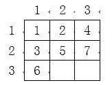

110道题

# 01字符串详解

## 01string的常见问题

**string的读入、遍历**

**string的加法、比较运算**

### **1093 - 打印小写字母表**

**题目描述**

把英文字母表的小写字母按顺序和倒序打印出来。(每行 13 个)

**输入**

无

**输出**

输出四行。

**样例**

**输入复制**

```

```

**输出复制**

```
abcdefghijklm
nopqrstuvwxyz
zyxwvutsrqpon
mlkjihgfedcba
```

**来源**

字符型

---

### **1101 - 时间的差**

**题目描述**

看到两个标准格式的时间，有小时，有分钟，有秒，格式如：*h*:*m*:*s*，即 时 : 分 : 秒。

你想知道，这两个时间之间相差多少吗？

**输入**

输入包括两行，两行均为一个“时 : 分 : 秒”格式的时间。

且本题保证第一个时间一定大于第二个时间！

**输出**

输出就是输入的两个时间之间的秒数差。

**样例**

**输入复制**

```
01:10:10
00:30:30
```

**输出复制**

```
2380
```

**来源**

字符串

---

### **1115 - 数字和**

**题目描述**

输入一个很大的数，求各位上的数字和。

**输入**

一个很大的整数（不超过 200 位）。

**输出**

一个整数。

**样例**

**输入复制**

```
123
```

**输出复制**

```
6
```

**来源**

字符串

---

### **1134 - 国王的魔镜**

**题目描述**

国王有一个魔镜，可以把任何接触镜面的东西变成原来的两倍——只是，因为是镜子嘛，增加的那部分是反的。

比如一条项链，我们用 AB 来表示，不同的字母表示不同颜色的珍珠。如果把 *B* 端接触镜面的话，魔镜会把这条项链变为 *A**BB**A* 。如果再用一端接触的话，则会变成 *A**BB**AA**BB**A* （假定国王只用项链的某一端接触魔镜）。

给定最终的项链，请编写程序输出国王没使用魔镜之前，最初的项链可能的最小长度。

**输入**

只有一个字符串（长度 ≤100），由大写英文字母组成，表示最终的项链。

**输出**

只有一个整数，表示国王没使用魔镜前，最初的项链可能的最小长度。

**样例**

**输入复制**

```
ABBAABBA
```

**输出复制**

```
2
```

**来源**

字符串

---

### **1387 - 简单加密**

**题目描述**

Julius Caesar曾经使用过一种很简单的密码。对于明文中的每个字符，将它用它字母表中后 55 位对应的字符来代替，这样就得到了密文。比如字符 A 用 F 来代替。如下是密文和明文中字符的对应关系。

密文：A B C D E F G H I J K L M N O P Q R S T U V W X Y Z；

明文：V W X Y Z A B C D E F G H I J K L M N O P Q R S T U；

你的任务是对给定的密文进行解密得到明文。

你需要注意的是，密文中出现的字母都是大写字母。密文中也包括非字母的字符，对这些字符不用进行解码。

**输入**

一行，给出密文，密文不为空，而且其中的字符数不超过 200200 。

**输出**

输出一行，即密文对应的明文。

**样例**

**输入复制**

```
NS BFW, JAJSYX TK NRUTWYFSHJ FWJ YMJ WJXZQY TK YWNANFQ HFZXJX
```

**输出复制**

```
IN WAR, EVENTS OF IMPORTANCE ARE THE RESULT OF TRIVIAL CAUSES
```

**来源**

字符串

---

### **1480 - 找字典码最小的字符串**

**题目描述**

编写程序，针对输入的 *N* 个不同的字符串，输出其中字典码最小的字符串。

**输入**

输入第一行给出正整数 *N* ；

随后 N* 行，每行给出一个长度小于 80 的非空字符串，其中不会出现换行符，空格，制表符。

**输出**

输出字典码最小的字符串。

**样例**

**输入复制**

```
5
Li
Wang
Zha
Jin
Xian
```

**输出复制**

```
Jin
```

**来源**

字符串

---

## 02 string的常见函数

string的查找和截取

string的插入，删除和替换

### **1097 - 统计字符的个数**

**题目描述**

从键盘中任意输入一串字符，直至输入 `#` 字符代表结束。

请编程统计输入的字符中的大写字母，小写字母和数字字符的个数分别是多少？

**输入**

输入只有一行，包括一串字符。(长度小于 20，且没有空格)

**输出**

输出只有一行，包括 3 个整数。分别代表大写字符，小写字符和数字字符的个数。

**样例**

**输入复制**

```
daDSALDdcada3240#
```

**输出复制**

```
5 7 4
```

**来源**

字符串

---

### **1408 - 合法的变量名？**

**题目描述**

James在一节 C++ 课程上，准备为自己的程序定义变量名称。老师告诉James，一个合法的变量名应该满足如下的三个条件：

1. 只能由字母（大写或者小写）、数字及下划线（'_'）组成。
2. 不能以数字开头。
3. 不能是 C++ 中有特殊含义的单词，由于 James 是 C++ 的初学者，只学过 int、double、cout、cin 这四个有特殊含义的单词，因此 James 只要避开这几个单词就可以。

请你编程帮助 James 判断他定义的变量名是否合法。

下表中列举了一些合法的变量名和非法的变量名的案例供你参考。

| 合法变量名案例                                                                                         | 非法变量名案例                                                                                                             |
| ------------------------------------------------------------------------------------------------------ | -------------------------------------------------------------------------------------------------------------------------- |
| x sum sum_x sum2 _sum INT注意：这是合法的，因为在C++中是区分大小写的，int是表示整数类型，但INT不是）。 | sum x：有空格（只能是字母、数字或下划线） 1x：以数字开头 int：有特殊含义 a#：有特殊字符“#”（只能是字母、数字、下划线）。 |

**输入**

一行，包含一个字符串，是James为变量起的名字，且长度不大于 20 。

**输出**

一行，如果是合法的 C++ 变量名，则输出 `yes`，否则输出 `no`。

**样例**

**输入复制**

```
sum
```

**输出复制**

```
yes
```

**输入复制**

```
sum x
```

**输出复制**

```
no
```

**输入复制**

```
1x
```

**输出复制**

```
no
```

**来源**

字符串

---

### **1117 - 重新排列**

**题目描述**

现在有一个 30 位以内的自然数，你可以将组成这个数的各位数字重新排列，得到一个数值为最小的新数，但新数的位数保持不变。

请编程打印出重新排列后的新数。（如：231 重新排序后位数不变的最小数是 123 ，而 23105 重新排序后位数不变的最小数是 10235）

**输入**

一个整数（位数 ≤30 位）。

**输出**

重新排列后最小的新数。

**样例**

**输入复制**

```
382
```

**输出复制**

```
238
```

**输入复制**

```
231050
```

**输出复制**

```
100235
```

**来源**

字符串

---

### **1128 - 整数串拆段**

**题目描述**

将一个长度小于 1010 位的数字串拆成 22 段，使其和为最小的素数。

例如数字串“ 1330413304 ” ，拆的方法有：

```
1 + 3304 = 3305 
13 + 304 = 317 
133 + 04 = 137 
1330 + 4 = 1334 
```

从上面可看出，和为素数的有：317 与 137 ，最小的是137。

**输入**

一个长度小于 10 的数字串。

**输出**

最小的和为素数的数，若无素数则输出 −1。

**样例**

**输入复制**

```
13304
```

**输出复制**

```
137
```

**输入复制**

```
2468
```

**输出复制**

```
-1
```

**来源**

字符串

---

### **1114 - 趣味填空**

**题目描述**

小华的寒假作业上，有这样一个趣味填空题： 给出用等号连接的两个整数，如 “1234＝127” 。

当然，现在这个等号是不成立的。题目让你在左边的整数中间某个位置插入一个加号，看有没有可能让等号成立。以上面的式子为例，如果写成 123+4=127，这就可以了。

请你编写一个程序来解决它。

**输入**

只有那个不相等的式子。已知，等号两边的整数都不会超过2×109 。

**输出**

如果存在这样的方案，请输出那个正确的式子。

如果不存在解决方案，请输出“Impossible!”（引号中的部分）。

**样例**

**输入复制**

```
1234=127
```

**输出复制**

```
123+4=127
```

**来源**

字符串

---

## 03string进阶问题

### **1100 - 词组缩写**

**题目描述**

定义：一个词组中每个单词的首字母的大写组合称为该词组的缩写。

比如，C语言里常用的 `EOF` 就是 end of file 的缩写。

**输入**

测试数据占一行，有一个词组（总长度不超过 200），每个词组由一个或多个单词组成；每组的单词个数不超过 10 个，每个单词有一个或多个大写或小写字母组成；

单词长度不超过 10，由一个或多个空格分隔这些单词。

**输出**

输出规定的缩写。

**样例**

**输入复制**

```
end of file
```

**输出复制**

```
EOF
```

**来源**

字符串

---

### **1103 - 字符串压缩**

**题目描述**

输入字符串，输出压缩后的字符串。压缩的方法是把连续的相同字母压缩为"长度+字母"的形式，在本题中，单个的字母不需要压缩。

**输入**

一行，一个字符串，只包含小写英文字母，长度不超过 255 。

**输出**

输出压缩的结果。

**样例**

**输入复制**

```
aaabbbbbx
```

**输出复制**

```
3a5bx
```

**来源**

字符串

---

### **1012 - 我是第几个单词**

**题目描述**

输入一个英文句子，例如：`This is a Book.`，可以看到句子是以 `.` 来作为结束符号的，并且单词之间以一个空格来分隔。

接着再输入一个单词 *A* ，请找出首次在句子中出现的与 *A* 相同的单词，是句子中的第几个单词，若不存在，则输出该句子中单词字符的总个数。

例如对上句子而言，若输入单词 `is`，则应输出：2。 若输入单词 `isa`，则应输出：11。

**输入**

第一行为以 `.` 结束的一个词组（仅由若干个大小写字母组成的单词构成，单词间由一空格隔开，除单词和最后的 `.` 以外，不含其它字符，句子总长度不超过 800，每个单词长度不超过 90 个字符）

第二行是一个单词（不含空格，长度不超过 90）。

**输出**

一个整数。

**样例**

**输入复制**

```
This is a Book.
Book
```

**输出复制**

```
4
```

**输入复制**

```
This is a Book.
isa
```

**输出复制**

```
11
```

**来源**

字符串

---

### **1123 - 表达式的值**

**题目描述**

给出一个表达式，其中运算符仅包含 `+` ,要求求出表达式的最终值。

如：1+1，则结果为 2，1+2+3 则结果为 6， 12+23 则结果 35 。

**输入**

仅一行，即为含有正整数和 `+` 号的表达式。

**输出**

仅一行，既为表达式算出的结果（所有数据保证计算结果 ≤109 ）。

**样例**

**输入复制**

```
1+1
```

**输出复制**

```
2
```

**输入复制**

```
12+23
```

**输出复制**

```
35
```

**输入复制**

```
384+3859+1118
```

**输出复制**

```
5361
```

**来源**

字符串

---

### **1127 - 整数的拼接**

**题目描述**

设有 *n* 个整数(3≤*n*≤100)，将这些整数拼接起来，可以形成一个最大的整数。

例如：*n*=3，三个整数分别为 21 7 34， 拼接后最大的整数为： 73421。

再比如：*n*=3，三个整数分别是 1 10 110 ，拼接后最大的整数是：111010。

**输入**

第一行一个整数 *n* ，表示有 *n* 个整数。

第二行 *n* 个整数，数与数之间用一个空格分隔。

**输出**

一个拼接后的最大的整数。

**样例**

**输入复制**

```
3
21 7 34
```

**输出复制**

```
73421
```

**来源**

字符串

---

### **1336 - 分数计算**

**题目描述**

从键盘读入一个分数算式，为 2 个分数做加法或者减法，请输出分数算式的结果，结果也用分数表达，且约分到最简形式。（请注意：做减法可能得到负的分数，如果是负数要输出负号 `-` ，如 `1/15-4/15` 结果为 `-1/5` ）（5.1.76）

**输入**

分数表达式；分数表达式中，每个分数的分子和分母都是正整数（不超过 1000 ），两个分数中的运算符，可能是加号，也可能是减号，且分数表达式不含空格。

**输出**

分数表达式计算的结果。

**样例**

**输入复制**

```
1/12+5/12
```

**输出复制**

```
1/2
```

**输入复制**

```
1/2+1/2
```

**输出复制**

```
1
```

**输入复制**

```
1/2-1/2
```

**输出复制**

```
0
```

**说明**

注意考虑特殊情况，如：`1/2+1/2=1`，`1/2-1/2=0`，这些情况下结果不需要表现为分数形式。

**来源**

字符串

---

# 02进制转换

## 01N进制和十进制互转

### **1108 - 正整数N转换成一个二进制数**

**题目描述**

输入一个不大于 32767 的整数 *n* ，将它转换成一个二进制数。

**输入**

输入只有一行，包括一个整数 *n* (0≤*n*≤32767)。

**输出**

输出只有一行。

**样例**

**输入复制**

```
100
```

**输出复制**

```
1100100
```

**输入复制**

```
0
```

**输出复制**

```
0
```

**来源**

字符串 进制转换

---

### **1290 - 二进制转换十进制**

**题目描述**

请将一个 25 位以内的 2 进制正整数转换为 10 进制！

**输入**

一个 25 位以内的二进制正整数。

**输出**

该数对应的十进制。

**样例**

**输入复制**

```
111111111111111111111111
```

**输出复制**

```
16777215
```

**来源**

进制转换

---

### **1289 - 正整数n转换为16进制**

**题目描述**

请从键盘读入一个非负整数 *n*（ n* 是一个**不超过 18 位**的非负整数），将 *n* 转换为 16 进制！

注意：16 进制即逢 16 进 1，每一位上可以是从小到大为 0、1、2、3、4、5、6、7、8、9、*A*、*B*、*C*、*D*、*E*、*F* 共 16 个大小不同的数，即逢 16 进 1，其中用 A*，*B*，*C*，*D*，*E*，*F* 这六个字母来分别表示 10，11，12，13，14，15。

如：60 的十六进制为 3*C*。（字母请用**大写**）

**输入**

一个不超过 18 位的非负整数 n* 。

**输出**

该数的十六进制值。

**样例**

**输入复制**

```
100000000000
```

**输出复制**

```
174876E800
```

**来源**

进制转换

---

### **1292 - 十六进制转十进制**

**题目描述**

请将一个**不超过10位**的十六进制正整数转换为十进制整数。

**输入**

10位以内的十六进制正整数，如果该十六进制中有字母，字母用大写英文字母表示。

**输出**

该数对应的十进制整数。

**样例**

**输入复制**

```
2ECF
```

**输出复制**

```
11983
```

**来源**

进制转换

---

### **1386 - 小丽找半个回文数**

**题目描述**

小丽同学在编程中学到了回文数的概念，如果一个数正过来读和反过来读是同一个数，那么这个数就是回文数；比如：2、5、8、66、121、686、12321 都是回文数，小丽发现，这样的数不算多。

于是小丽有个想法，如果这个数不是回文数，但这个数在 22 进制或者 1616 进制下是回文数，就算这个整数是半个回文数，比如 417417 并不是回文，但 417417 对应的 16 进制数是 *A*1 是回文数，因此 417 算半个回文数。

请你编程帮助小丽找符合条件的半个回文数。

**输入**

第一行是一个整数 *n*（5≤*n*≤100）； 第二行是 *n* 个整数（这些整数都是 0~10^8 之间的整数）；

**输出**

所有符合条件的半个回文数，每行一个。

**样例**

**输入复制**

```
5
121 417 27 100 21
```

**输出复制**

```
417
27
21
```

**来源**

进制转换

---

## 02二进制和八进制、十六进制互转

### **1294 - 二进制转十六进制**

**题目描述**

请将一个**不超过 100 位**的二进制数转换为十六进制数！

**输入**

一个不超过 100 位的二进制整数。

**输出**

该数对应的十六进制数。

**样例**

**输入复制**

```
11001001111011111000001000010011
```

**输出复制**

```
C9EF8213
```

**来源**

进制转换

---

### **1306 - 十六进制转二进制**

**题目描述**

请将一个**不超过 100 位**的十六进制数转换为二进制数！

**输入**

一个不超过 100 位的十六进制整数。

**输出**

该数对应的二进制数。

**样例**

**输入复制**

```
123456789ABCDEF
```

**输出复制**

```
100100011010001010110011110001001101010111100110111101111
```

**输入复制**

```
0
```

**输出复制**

```
0
```

**来源**

进制转换

---

# 03高精度运算

## 01高精度基础运算

### **1268 - 高精度加法**

**题目描述**

计算a+b的值，a,b皆为不超过240位的非负整数。

**输入**

两个正整数，每行一个

**输出**

一个数，代表两个整数的和

**样例**

**输入复制**

```
1
2
```

**输出复制**

```
3
```

**输入复制**

```
0
0
```

**输出复制**

```
0
```

**输入复制**

```
11111111111111111111
22222222222222222222
```

**输出复制**

```
33333333333333333333
```

**来源**

高精度算法

---

### **1269 - 高精度减法**

**题目描述**

高精度减法，求a-b。a,b都是不超过240位的非负整数。

**输入**

两个非负整数，每行一个。

**输出**

一个整数，代表两个整数相减之后的结果。

**样例**

**输入复制**

```
33333333333333333333333333333333333333333
22222222222222222222222222222222222222222
```

**输出复制**

```
11111111111111111111111111111111111111111
```

**来源**

高精度算法

---

### **1286 - 高精度乘单精度**

**题目描述**

高精度乘单精度，a*b。 a是一个很大的非负整数，但不超过240位，b是一个非负整数不超过10000，求a*b。

**输入**

两行数字。
第一行是a，第二行是b。

**输出**

一行，输出a * b的计算结果。

**样例**

**输入复制**

```
111111111111111111111111111111111111
10
```

**输出复制**

```
1111111111111111111111111111111111110
```

**来源**

高精度算法

---

### **1287 - 高精度乘**

**题目描述**

高精度乘，求两个很大的非负整数相乘的结果。

**输入**

2个非负整数，每个一行，每个整数不超过240位。

**输出**

一个整数，表示相乘的结果。

**样例**

**输入复制**

```
1111111111111111111111111
2222222222222222222222222
```

**输出复制**

```
2469135802469135802469135308641975308641975308642
```

**来源**

高精度算法

---

### **1271 - 高精度整数除法**

**题目描述**

求 *a*/*b* 的结果。

已知 a*，*b* 为 108108 范围内的非负整数，求 *a*/*b* 保留前 n* 位小数商的结果。

**输入**

读入三个整数 a* *b* *n*。

**输出**

输出一行数字。

**样例**

**输入复制**

```
97 61 50
```

**输出复制**

```
1.59016393442622950819672131147540983606557377049180
```

**来源**

（5.1.72）

---

## 02高精度运算应用

### **1280 - 求2的n次方**

**题目描述**

求 2 的 n 次方。（ 0≤*n*≤100）

**输入**

从键盘读入一个整数 n；

**输出**

请输出 2的 n次方；

**样例**

**输入复制**

```
100
```

**输出复制**

```
1267650600228229401496703205376
```

**来源**

高精度算法

---

### **1281 - 求2+2\*2+2\*2\*2+…+2\*2\*2\*….\*2**

**题目描述**

求2+2*2+2*2*2+…+2*2*2*…*2的和是多少？最后一项有多少2相乘由键盘读入的n决定（1<=n<=100）！

比如：n=3，那么s=2+2*2+2*2*2=14！

**输入**

从键盘读入一个整数n（1<=n<=100）

**输出**

输出求出的和

**样例**

**输入复制**

```
3
```

**输出复制**

```
14
```

**来源**

高精度算法

---

### **1285 - 计算N的阶乘**

**题目描述**

请计算 *n* 的阶乘（1≤*n*≤100）

*n* 的阶乘计算公式为：n*!=*n*×(*n*−1)×(*n−2)×⋯×1，如：5!=5×4×3×2×1=120

**输入**

一个整数 *n*(1≤*n*≤100)。

**输出**

*n* 的阶乘。

**样例**

**输入复制**

```
20
```

**输出复制**

```
2432902008176640000
```

**来源**

高精度算法

### **1296 - 求1!+2!+3!+4!+...+n!**

**题目描述**

请求出1!+2!+3!+4!+...+n!，请注意，n<=50。

n!=n*(n-1)*(n-2)*...*1，如：5!=5*4*3*2*1=120。

**输入**

请输入一个整数n（n<=50）

**输出**

输出求和的结果

**样例**

**输入复制**

```
10
```

**输出复制**

```
4037913
```

**来源**

高精度算法

---

# 04递推算法

## 01数值型递推

### **1238 - 统计每个月兔子的总数**

**题目描述**

有一对兔子，从出生后第 3 个月起每个月都生一对兔子，一对小兔子长到第三个月后每个月又生一对兔子，假如兔子都不死。

问第 n 个月（ n≤50 ）的兔子总数为多少对？

**输入**

输入 1 个整数 n ，表示第几个月。

**输出**

第 n* 个月兔子的总数量有多少对？

**样例**

**输入复制**

```
9
```

**输出复制**

```
34
```

**来源**

递归 递推

---

### **1082 - 猴子吃桃子**

**题目描述**

猴子吃桃子问题：猴子第一天摘下若干个桃子，当即吃了一半还不过瘾，又多吃了一个；第二天又将剩下的桃子吃掉一半又多吃了一个；以后每天早上都吃了前一天剩下的一半零一个。到了第十天想再吃时，见只剩下一个桃子，求第一天共摘了多少个桃子？

**输入**

无

**输出**

一个整数，第一天共有多少个桃子。

**来源**

需要找规律的循环

---

### **1148 - 数数小木块**

**题目描述**

在墙角堆放着一堆完全相同的正方体小木块，如下图所示：


因为木块堆得实在是太有规律了，你只要知道它的层数就可以计算所有木块的数量了。

**输入**

只有一个整数 *n* ，表示这堆小木块的层数，已知 1≤*n*≤100 。

**输出**

只有一个整数，表示这堆小木块的总数量。

**样例**

**输入复制**

```
5
```

**输出复制**

```
35
```

**来源**

函数问题 递归

## 02应用型递推

### **1216 - 数塔问题**

**题目描述**

有如下所示的数塔，要求从底层走到顶层，若每一步只能走到相邻的结点，则经过的结点的数字之和最大是多少？


**输入**

输入数据首先包括一个整数整数 *N* (1≤*N*≤100)，表示数塔的高度，接下来用 N* 行数字表示数塔，其中第 i 行有个 i 个整数，且所有的整数均在区间 [0,99]内。

**输出**

从底层走到顶层经过的数字的最大和是多少？

**样例**

**输入复制**

```
5
7
3 8
8 1 0
2 7 4 4
4 5 2 6 5
```

**输出复制**

```
30
```

**来源**

递推 动态规划

---

### **1410 - 数塔的行走路径？**

**题目描述**

有如下所示的数塔，要求从底层走到顶层，若每一步只能走到相邻的结点，要求经过结点的数字之和最大，请问应该如何走，请输出从塔底到塔顶的行走路线，同时计算出经过结点的最大数字和是多少？

（假设本问题中，不存在多条路线从塔底走到塔顶经过结点的数字和都是最大的，也就是本题涉及测试数据得到的路径都是唯一的）


为了方便计算我们将数塔中的值存到如下图所示的二维数组中，该数塔的行走路线将如下图的箭头所示。


**输入**

输入数据首先包括一个整数整数 *N*(1≤*N*≤100)，表示数塔的高度；

接下来用 N* 行数字表示数塔，其中第 i* 行有个 i* 个整数，且所有的整数均在区间 [0,99][0,99] 内。

**输出**

第一行，按照样例输出所示的形式，输出数塔的行走路线。

第二行，输出经过结点的最大数字和。

**样例**

**输入复制**

```
5
7
3 8
8 1 0
2 7 4 4
4 5 2 6 5
```

**输出复制**

```
5,2->4,2->3,1->2,1->1,1
30
```

**来源**

递推

---

### **1224 - 过河卒**

**题目描述**

*A* 点有一个过河卒，需要走到目标 B* 点。

卒行走规则：可以向下、或者向右。同时在棋盘上的任一点有一个对方的马（如下图的 C* 点），该马所在的点和所有跳跃一步可达的点称为对方马的控制点。

例如：下图 C 点可以控制 9 个点（图中的 1,2…8*P*1,*P*2…*P*8 和 C），卒不能通过对方马的控制点。 棋盘用坐标表示，现给定 *A* 点位置为 (0,0)， B 点位置为 (*n*,*m*) (n*,*m) 为不超过 10 的整数)，马的位置 C*为 (*X*,*Y)（约定: C 点与 *A* 点不重叠，与 B 点也不重叠）。

要求你计算出卒从 *A* 点能够到达 B 点的路径的条数。


**输入**

*B* 点的坐标 (*n*,*m*) 以及对方马的坐标 (*X*,*Y*)；（马的坐标一定在棋盘范围内，但要注意，可能落在边界的轴上）

**输出**

输出卒从 *A* 点能够到达 *B* 点的路径条数。

**样例**

**输入复制**

```
6 6 3 2
```

**输出复制**

```
17
```

**来源**

递推

---

### **1369 - Pell数列**

**题目描述**

有一种数列，它的前10项的值分别为：1 2 5 12 29 70 169 408 985 2378，这个数列被称为Pell数列，请问该数列的第n项的值是多少？（n<=1000）

**输入**

一个整数n。

**输出**

第n项的值。

**样例**

**输入复制**

```
10
```

**输出复制**

```
2378
```

**来源**

递推

---

# 05贪心算法-最优策略选择

### **1326 - 需要安排几位师傅加工零件**

**题目描述**

某工厂有 *n* 个零件加工的师傅，每位师傅每天能够加工出不同数量的零件。

现有 *m* 个零件要求一天加工完，请问该工厂最少需要派几个师傅来完成这次零件加工任务，如果安排所有的师傅都参与加工也不能在一天内完成任务，请输出 `NO`。（4.2.71）

**输入**

第一行有两个整数，用空格隔开；

第一个整数代表要加工的总零件个数 m* （m*≤106），第二个整数代表工厂的零件加工师傅的数量 n*（n≤100）。

第二行有 n* 个整数，分别代表每个师傅每天能够加工出来的零件数量（每个师傅每天加工的零件数量≤104）。

**输出**

输出工厂在 1 天时间内加工所有零件需要的师傅数量，或者输出 `NO`。

**样例**

输入复制

```
10 5
1 3 2 4 2
```

输出复制

```
4
```

**来源**

数组问题

---

### **1228 - 排队打水问题**

**题目描述**

有 n 个人排队到 *r* 个水龙头去打水，他们装满水桶的时间 1,2,...*t*1,*t*2,...,tn 为整数且各不相等，应如何安排他们的打水顺序才能使他们花费的总时间最少？

每个人打水的时间 = 排队的时间 + 实际打水的时间，本题假设一个人打好水，排在他后面的人接着打水的这个切换过程不消耗时间。

比如，有 2 个人 *A* 和 B ，他们打水的时间分别是 3 和 2 ，只有 1 个水龙头，这时，如果 A 先打水，*B* 后打水，那么 A 和 *B* 打水的时间分别为 3 、3+2（ B* 排队 3分钟）。

因此，所有人打水的总时间就是每个人的打水时间及每个人的排队时间的总和。

**输入**

第 1 行，两个整数 *n* (1≤*n*≤500) 和 r* (1≤*r*≤100)。

第 2 行，*n* 个正整数 1,2,...,*t*1,*t*2,...,tn ，1≤ti≤1000)表示每个人装满水桶的时间。

**输出**

11 行，一个正整数，表示他们花费的最少总时间。

**样例**

输入复制

```
4 2
2 6 4 5
```

输出复制

```
23
```

**来源**

贪心

---

### **1229 - 拦截导弹的系统数量求解**

**题目描述**

某国为了防御敌国的导弹袭击，发展出一种导弹拦截系统。但是这种导弹拦截系统有一个缺陷：虽然它的第一发炮弹能够到达任意的高度，但是以后每一发炮弹都不能高于前一发的高度。

假设某天雷达捕捉到敌国的导弹来袭。由于该系统还在试用阶段，所以只有一套系统，因此有可能不能拦截所有的导弹。

输入 n 个导弹依次飞来的高度（给出的高度数据是不大于 30000 的正整数），计算如果要拦截所有导弹最少要配备多少套这种导弹拦截系统。

比如：有 8 颗导弹，飞来的高度分别为

389 207 175 300 299 170 158 165

那么需要 2 个系统来拦截，他们能够拦截的导弹最优解分别是：

系统 1 ：拦截 389 207 175 170 158

系统 2 ：拦截 300 299 165

**输入**

两行，第一行表示飞来导弹的数量 n*（n*≤1000）；

第二行表示 n* 颗依次飞来的导弹高度；

**输出**

要拦截所有导弹最小配备的系统数 *k* 。

**样例**

输入复制

```
8
389 207 175 300 299 170 158 165  
```

输出复制

```
2
```

**来源**

贪心

---

### **1372 - 活动选择**

**题目描述**

学校在最近几天有 *n*（n≤100）个活动，这些活动都需要使用学校的大礼堂，在同一时间，礼堂只能被一个活动使。由于有些活动时间上有冲突，学校办公室人员只好让一些活动放弃使用礼堂而使用其他教室。

现在给出 *n* 个活动使用礼堂的起始时间 b**e**g**i**ni和结束时间 e**n**d**i (b**e**g**i**n**i << endi)，请你帮助办公室人员安排一些活动来使用礼堂，要求安排的活动尽量多。请问最多可以安排多少活动？

请注意，开始时间和结束时间均指的是某个小时的 00 分 00 秒，如：33 55，指的是 33:00~5:00 ，因此33 55和55 99这两个时间段不算冲突的时间段。

**输入**

第一行一个整数 *n* (n≤100)；

接下来的 *n* 行，每行两个整数，第一个b**e**g**i**n**i* ，第二个是 e**n**d**i (b**e**g**i**ni << e**n**di ≤≤ 32767)；

**输出**

输出最多能安排的活动数；

**样例**

**输入复制**

```
11
3 5
1 4
12 14
8 12
0 6
8 11
6 10
5 7
3 8
5 9
2 13
```

**输出复制**

```
4
```

**来源**

贪心 结构体

---

# 06递归进阶

## 01数值类的递归

### **1002 - 编程求解1+2+3+...+n**

**题目描述**

编程求解下列式子的值： S*=1+2+3+⋯+*n*。

**输入**

输入一行，只有一个整数 n*(1≤*n*≤1000) 。

**输出**

输出只有一行（这意味着末尾有一个回车符号），包括 1 个整数。

**样例**

**输入复制**

```
100
```

**输出复制**

```
5050
```

**来源**

简单循环

---

### **1241 - 角谷猜想**

**题目描述**

日本一位中学生发现一个奇妙的定理，请角谷教授证明，而教授无能为力，于是产生了角谷猜想。

猜想的内容：任给一个自然数，若为偶数则除以 2 ，若为奇数则乘 3 加 1，得到一个新的自然数后按上面的法则继续演算。若干次后得到的结果必为 1 。

请编写代码验证该猜想：求经过多少次运算可得到自然数 1 。

如：输入 22 ，则计算过程为。

```
22/2=11
11*3+1=34
34/2=17
17*3+1=52
52/2=26
26/2=13
13*3+1=40
40/2=20
20/2=10
10/2=5
5*3+1=16
16/2=8
8/2=4
4/2=2
2/2=1
```

经过 15 次运算得到自然数 1 。

**输入**

一行，一个正整数 n 。（ 1≤*n*≤20000 )

**输出**

一行，一个整数，表示得到 1 所用的运算次数。

**样例**

**输入复制**

```
22
```

**输出复制**

```
15
```

**来源**

需要找规律的循环

---

### **1108 - 正整数N转换成一个二进制数**

**题目描述**

输入一个不大于 32767 的整数 *n* ，将它转换成一个二进制数。

**输入**

输入只有一行，包括一个整数 n (0≤*n*≤32767)。

**输出**

输出只有一行。

**样例**

**输入复制**

```
100
```

**输出复制**

```
1100100
```

**输入复制**

```
0
```

**输出复制**

```
0
```

**来源**

字符串 进制转换

---

### **1088 - 求两个数M和N的最大公约数**

**题目描述**

求两个正整整数 *M* 和 N 的最大公约数(M*，*N都在长整型范围内）

（5.1.42）

**输入**

输入一行，包括两个正整数。

**输出**

输出只有一行，包括1个正整数。

**样例**

**输入复制**

```
45 60
```

**输出复制**

```
15
```

**来源**

需要找规律的循环

---

## 02应用类的递归

### **1223 - 汉诺塔的移动次数**

**题目描述**


汉诺塔的问题大家都已经很熟悉了，有三个柱子，每个柱子上有一些大小不一的金片，要把金片从 A柱移动到 C 柱，可以借助 *B* 柱，请问 n个金片的情况下，需要最少移动多少次？

**输入**

输入一个整数 n代表金片的数量（≤20）。

**输出**

一个整数，代表 n* 个金片的移动次数。

**样例**

**输入复制**

```
3
```

**输出复制**

```
7
```

**来源**

递归

---

### **1222 - 经典递归问题——汉诺塔**

**题目描述**

汉诺塔（又称河内塔）问题是印度的一个古老的传说。开天辟地的神勃拉玛在一个庙里留下了三根金刚石的棒，第一根上面套着 64 个圆的金片，最大的一个在底下，其余一个比一个小，依次叠上去，庙里的众僧不倦地把它们一个个地从这根棒搬到另一根棒上，规定可利用中间的一根棒作为帮助，但每次只能搬一个，而且大的不能放在小的上面。

面对庞大的数字(移动圆片的次数)18446744073709551615，看来，众僧们耗尽毕生精力也不可能完成金片的移动。


后来，这个传说就演变为汉诺塔游戏:

1. 有三根杆子 A*,*B*,*C 。A杆上有若干碟子。
2. 每次移动一块碟子，小的只能叠在大的上面。
3. 把所有碟子从 A 杆全部移到 C杆上。

经过研究发现，汉诺塔的破解很简单，就是按照移动规则向一个方向移动金片：

如 33 阶汉诺塔的移动：A*→*C*,*A*→*B*,*C*→*B*,*A*→*C*,*B*→*A*,*B*→*C*,*A*→*C。

此外，汉诺塔问题也是程序设计中的经典递归问题。

算法思路：

1. 如果只有一个金片，则把该金片从源移动到目标棒，结束。
2. 如果有 *n* 个金片，则把前 n*−1 个金片移动到辅助的棒，然后把自己移动到目标棒，最后再把前 n*−1 个移动到目标棒。

**输入**

一个整数 N，表示 A 柱上有 N 个碟子。（0<*n*≤10）

**输出**

若干行，即移动的最少步骤。

**样例**

**输入复制**

```
3
```

**输出复制**

```
A To C
A To B
C To B
A To C
B To A
B To C
A To C
```

**来源**

递归

---

### **1196 - 拐角I**

**题目描述**

输入整数 *N* ，输出相应方阵。

**输入**

一个整数 N* 。（ 0<*N*≤10 )

**输出**

一个方阵，每个数字的场宽为 3 。

**样例**

**输入复制**

```
5
```

**输出复制**

```
  1  1  1  1  1
  1  2  2  2  2
  1  2  3  3  3
  1  2  3  4  4
  1  2  3  4  5
```

**来源**

二维数组

---

### **1208 - 螺旋方阵**

**题目描述**

输出如样例所示的 *n*×*n* 的螺旋方阵。

**输入**

一个整数 n( 0<*n*<10 )。

**输出**

一个 n行方阵，每行 n个数，每个数场宽为 3。

**样例**

**输入复制**

```
5
```

**输出复制**

```
  1  2  3  4  5
 16 17 18 19  6
 15 24 25 20  7
 14 23 22 21  8
 13 12 11 10  9
```

**来源**

二维数组

---

# 07深度优先搜索DFS

### **1586 - 扫地机器人**

**题目描述**

Mike同学在为扫地机器人设计一个在矩形区域中行走的算法，Mike是这样设计的：先把机器人放在出发点 (1,1) 点上，机器人在每个点上都会沿用如下的规则来判断下一个该去的点是哪里。规则：优先向右，如果向右不能走（比如：右侧出了矩形或者右侧扫过了）则尝试向下，向下不能走则尝试向左，向左不能走则尝试向上；直到所有的点都扫过。

Mike为了验证自己设计的算法是否正确，打算先模拟一下这个算法，每当机器人走过一个单元格时，会在单元格内标记一个数字，这个数字从 1 开始，每经过一个单元格数字会递增 11 ，直到所有的单元格都扫一遍，也就是所有的单元格都标记过数字，机器人会自动停止。

比如：如果机器人按照上面的规则，清扫一个 3×4 大小的矩形区域，那么标记数字的结果如下图所示。


再比如：如果机器人按照上面的规则，清扫一个 5×5 大小的矩形区域，那么标记数字的结果如下图所示。


请你帮助Mike设计一个程序，按照上面的规则，将一个 *n*×*m* 大小的矩形，标记一下数字，输出最终标记的结果。

**输入**

一行内有 22 个两个整数 n 和 m ，用空格隔开，分别代表矩形区域的行数（高）和列数（宽）。

1＜*n*,*m*＜10。

**输出**

输出按题意机器人走过每个点之后，标记数字的结果，每个数字输出时场宽设置为 3。

**样例**

**输入复制**

```
3 4
```

**输出复制**

```
  1  2  3  4
 10 11 12  5
  9  8  7  6
```

**来源**

深搜

---

### **1430 - 迷宫出口**

**题目描述**

一天Extense在森林里探险的时候不小心走入了一个迷宫，迷宫可以看成是由 *n*×*n* 的格点组成，每个格点只有 2种状态， 0 和 1，前者表示可以通行后者表示不能通行。

同时当Extense处在某个格点时，他只能移动到东南西北(或者说上下左右)四个方向之一的相邻格点上，Extense想要从点 A 走到点 B ，问在不走出迷宫的情况下能不能办到。

如果起点或者终点有一个不能通行(为 1)，则看成无法办到。

**输入**

第 11 行是一个正整数 n (1≤*n*≤100)，表示迷宫的规模是 n*×*n 的。

接下来是一个 n*×*n* 的矩阵，矩阵中的元素为 0 或者 1。

再接下来一行是 4 个整数ha la hb lb, 描述 *A* 处在第 ha 行 第 *la* 列，*B* 处在第 hb行 第 *lb* 列。

**输出**

能办到则输出 `YES`，否则输出 `NO`。

**样例**

**输入复制**

```
3
0 1 1
0 0 1
1 0 0
1 1 3 3
```

**输出复制**

```
YES
```

**来源**

深搜 递归 广搜

---

### **1434 - 数池塘（四方向）**

**题目描述**

农夫约翰的农场可以表示成 *N*×*M*个方格组成的矩形。由于近日的降雨，在约翰农场上的不同地方形成了池塘。每一个方格或者有积水（`W`）或者没有积水（`.`）。

农夫约翰打算数出他的农场上共形成了多少池塘。一个池塘是一系列相连的有积水的方格，每一个方格周围的四个方格都被认为是与这个方格相连的。现给出约翰农场的图样，要求输出农场上的池塘数。

**输入**

第 1 行：由空格隔开的两个整数：*N* 和 M；

第 2…*N*+1 行：每行 M* 个字符代表约翰农场的一排方格的状态。每个字符或者是 `W` 或者是 `.`，字符之间没有空格。

**数据范围**

1≤*N*,*M*≤100。

**输出**

输出只有1行，输出约翰农场上的池塘数。

**样例**

**输入复制**

```
10 12
W........WW.
.WWW.....WWW
....WW...WW.
.........WW.
.........W..
..W......W..
.W.W.....WW.
W.W.W.....W.
.W.W......W.
..W.......W.
```

**输出复制**

```
13
```

**来源**

深搜 递归

---

# 08深搜进阶

### **1432 - 走出迷宫的最少步数**

**题目描述**

一个迷宫由 R 行 *C* 列格子组成，有的格子里有障碍物，不能走；有的格子是空地，可以走。

给定一个迷宫，求从左上角走到右下角最少需要走多少步(数据保证一定能走到)。只能在水平方向或垂直方向走，不能斜着走。

**输入**

第一行是两个整数，R 和 C ，代表迷宫的行数和列数。（ 1≤*R*,*C*≤40 )

接下来是 R* 行，每行 *C* 个字符，代表整个迷宫。空地格子用 `.` 表示，有障碍物的格子用 `#` 表示。

迷宫左上角和右下角都是 `.` 。

**输出**

输出从左上角走到右下角至少要经过多少步（即至少要经过多少个空地格子）。

计算步数要包括起点和终点。

**样例**

**输入复制**

```
5 5
..###
#....
#.#.#
#.#.#
#.#..
```

**输出复制**

```
9
```

**来源**

深搜 递归 广搜

---

### **1431 - 迷宫的第一条出路**

**题目描述**

已知一 *N*×*N* 的迷宫，允许往上、下、左、右四个方向行走，现请你**按照左、上、右、下顺序**进行搜索，找出第一条从左上角到右下角的路径。

**输入**

输入数据有若干行，第一行有一个自然数 N*（N*≤20），表示迷宫的大小；

其后有 *N* 行数据，每行有 N 个 0 或 1（**数字之间没有空格**，00 表示可以通过，11 表示不能通过），用以描述迷宫地图。入口在左上角 (1,1)处，出口在右下角(*N*,*N*) 处。

所有迷宫保证存在从入口到出口的可行路径。

**输出**

输出数据仅一行，为按照要求的搜索顺序找到的从入口到出口的第一条路径（搜索顺序：左、上、右、下）。

**样例**

**输入复制**

```
4
0001
0100
0010
0110
```

**输出复制**

```
(1,1)->(1,2)->(1,3)->(2,3)->(2,4)->(3,4)->(4,4)
```

**来源**

深搜 递归

---

### **1360 - 卒的遍历**

**题目描述**

在一张 n*×*m 的棋盘上（如 6 行 7 列）的最左上角 (1,1) 的位置有一个卒。该卒**只能向下或者向右走**，且卒采取的策略是**先向下**，**下边走到头就向右**，请问从 (1,1) 点走到 (*n*,*m*) 点可以怎样走，输出这些走法。


**输入**

两个整数 *n*，*m* 代表棋盘大小（3≤*n*≤8,3≤*m*≤8）

**输出**

卒的行走路线。

**样例**

**输入复制**

```
3 3
```

**输出复制**

```
1:1,1->2,1->3,1->3,2->3,3
2:1,1->2,1->2,2->3,2->3,3
3:1,1->2,1->2,2->2,3->3,3
4:1,1->1,2->2,2->3,2->3,3
5:1,1->1,2->2,2->2,3->3,3
6:1,1->1,2->1,3->2,3->3,3
```

**来源**

深搜 递归

---

# 09回溯

### **1739 - 迷宫的所有路径**

**题目描述**

已知一 *N*×*N* 的迷宫，允许往上、下、左、右四个方向行走，且迷宫中没有任何障碍，所有的点都可以走。

现请你**按照右、下、左、上顺序**进行搜索，找出从左上角到右下角的所有路径。

**输入**

输入一个整数 N（N≤5）代表迷宫的大小。

**输出**

按右、下、左、上搜索顺序探索迷宫，输出从左上角 (1,1) 点走到右下角 (*N*,*N*) 点的所有可能的路径。

**样例**

**输入复制**

```
3
```

**输出复制**

```
1:1,1->1,2->1,3->2,3->3,3
2:1,1->1,2->1,3->2,3->2,2->3,2->3,3
3:1,1->1,2->1,3->2,3->2,2->2,1->3,1->3,2->3,3
4:1,1->1,2->2,2->2,3->3,3
5:1,1->1,2->2,2->3,2->3,3
6:1,1->1,2->2,2->2,1->3,1->3,2->3,3
7:1,1->2,1->2,2->2,3->3,3
8:1,1->2,1->2,2->3,2->3,3
9:1,1->2,1->2,2->1,2->1,3->2,3->3,3
10:1,1->2,1->3,1->3,2->3,3
11:1,1->2,1->3,1->3,2->2,2->2,3->3,3
12:1,1->2,1->3,1->3,2->2,2->1,2->1,3->2,3->3,3
```

**来源**

回溯

---

### **1308 - 全排列的结果**

**题目描述**

从键盘读入一个整数 n*，请输出 1∼*n 中所有整数的全排列，按照由小到大输出结果，每组的 *n* 个数之间用空格隔开。

全排列的含义：从 *n* 个不同元素中任取 m （*m*≤*n*）个元素，按照一定的顺序排列起来，叫做从 n 个不同元素中取出 *m* 个元素的一个排列。当 *m*=*n* 时所有的排列情况叫全排列。

如当 n=3 时，全排列的结果为：

```
1 2 3
1 3 2
2 1 3
2 3 1
3 1 2
3 2 1
```

**输入**

一个整数 n*（1≤*n≤6）；

**输出**

1∼*n* 中所有数的全排列的结果，按照由小到大输出，每行 n 个数。

**样例**

**输入复制**

```
3
```

**输出复制**

```
1 2 3
1 3 2
2 1 3
2 3 1
3 1 2
3 2 1
```

**来源**

回溯

---

### **1358 - 素数环**

**题目描述**

从 1∼*n* 这 n 个数，摆成一个环，要求相邻的两个数的和是素数，按照由小到大请输出所有可能的摆放形式。

比如：*n*=4，输出形式如下；

```
1:1 2 3 4
2:1 4 3 2
3:2 1 4 3
4:2 3 4 1
5:3 2 1 4
6:3 4 1 2
7:4 1 2 3
8:4 3 2 1
total:8
```

比如：n=6，输出形式如下；

```
1:1 4 3 2 5 6
2:1 6 5 2 3 4
3:2 3 4 1 6 5
4:2 5 6 1 4 3
5:3 2 5 6 1 4
6:3 4 1 6 5 2
7:4 1 6 5 2 3
8:4 3 2 5 6 1
9:5 2 3 4 1 6
10:5 6 1 4 3 2
11:6 1 4 3 2 5
12:6 5 2 3 4 1
total:12
```

**输入**

一个整数 *n* ；（2≤*n*≤10）

**输出**

前若干行，每行输出一个素数环的解，最后一行，输出解的总数。

**样例**

**输入复制**

```
4
```

**输出复制**

```
1:1 2 3 4
2:1 4 3 2
3:2 1 4 3
4:2 3 4 1
5:3 2 1 4
6:3 4 1 2
7:4 1 2 3
8:4 3 2 1
total:8
```

**来源**

回溯

---

# 10搜索实现组合

### **2220 - 数字的组合**

**题目描述**

从 *n* 个互不相等的数中，选出 *r* 个数的组合，请问有哪些不同的选法，按照字典码的顺序，输出这些选出的数，每组数输出时要求按照从小到大的顺序输出。

比如，假设有 5 个数分别是 1 2 3 4 5 ，从中选出 3 个数的组合有：

```
1 2 3
1 2 4
1 2 5
1 3 4
1 3 5
1 4 5
2 3 4
2 3 5
2 4 5
3 4 5
```

**输入**

第 1 行输入两个整数 n*（3≤*n*≤20）和 r*（1≤*r*≤n）；

第 2 行输入 n 个整数，数字之间用空格隔开，**请注意：输入的n个整数不保证是有序的**。

**输出**

输出若干行，每行有 *r* 个数，用空格隔开。

**样例**

**输入复制**

```
5 3
2 3 5 1 4
```

**输出复制**

```
1 2 3
1 2 4
1 2 5
1 3 4
1 3 5
1 4 5
2 3 4
2 3 5
2 4 5
3 4 5
```

**说明**

【注意】

本题C++选手请使用 `scanf`、`printf` 替代 `cin`、`cout` 提升读写效率；

**来源**

深搜

---

### **2214 - 取数游戏**

**题目描述**

一个 N*×*M* 的由非负整数构成的数字矩阵，你需要在其中取出若干个数字，使得取出的任意两个数字不相邻（若一个数字在另外一个数字相邻 8 个格子中的一个即认为这两个数字相邻），求取出数字和最大是多少。

**输入**

第一行有两个正整数 *N* 和 *M* ，表示了数字矩阵为 N 行 M 列。（ 1≤*N*,*M*≤6 ）

**输出**

输出一个整数，代表符合题目要求的最大的数字和。（样例确保数字和在int范围内）

**样例**

**输入复制**

```
3 3
2 8 9
4 6 4
9 10 7
```

**输出复制**

```
27
```

**来源**

深搜

---

# 11分治思想-分而治之

### **1236 - 二分查找**

**题目描述**

请在一个有序递增数组中（不存在相同元素），采用二分查找，找出值 *x* 的位置，如果 x在数组中不存在，请输出 `-1` ！

**输入**

第一行，一个整数 n ，代表数组元素个数（n≤106）

第二行，*n* 个数，代表数组的 n 个递增元素（1≤数组元素值≤108）

第三行，一个整数 x ，代表要查找的数（0≤*x*≤108）

**输出**

�*x* 在数组中的位置，或者 `-1`。

**样例**

**输入复制**

```
10
1 3 5 7 9 11 13 15 17 19
3
```

**输出复制**

```
2
```

**说明**

请尝试采用递归和非递归两种方式来实现二分查找

**来源**

二分 分治

---

### **1010 - 数组元素的排序(快速排序）**

**题目描述**

对数组的元素按从小到大进行排序。

**输入**

第一行有一个整数 n ( 5≤*n*≤10 )；

第二行有 n个整数，每个整数的值在 [0,10^9] 的范围内。

**输出**

输出排序后的数组。

**样例**

**输入复制**

```
8
1 2 3 6 8 7 4 5
```

**输出复制**

```
1 2 3 4 5 6 7 8
```

**来源**

数组问题

---

# 12排序

### **1010 - 数组元素的排序**

**题目描述**

对数组的元素按从小到大进行排序。

**输入**

第一行有一个整数 n ( 5≤*n*≤10 )；

第二行有 n个整数，每个整数的值在 [0,10^9] 的范围内。

**输出**

输出排序后的数组。

**样例**

**输入复制**

```
8
1 2 3 6 8 7 4 5
```

**输出复制**

```
1 2 3 4 5 6 7 8
```

**来源**

数组问题

使用：冒泡排序、选择排序、桶排序、插入排序

---

# 13广度优先搜索

### **1751 - 快乐的马里奥**

**题目描述**

马里奥是一个快乐的油漆工人，这天他接到了一个油漆任务，要求马里奥把一个 n 行 *m* 列的矩阵每一格都用油漆标记一个数字，标记的顺序按照广度优先搜索的方式进行，也就是他会按照如下方式标记：

1、首先标记第 1 行第 1 列的单元格，标记数字为 1 ；

2、然后标记当前单元格上下左右四个方向所有能标记的单元格，且：

① 标记顺序按照：右、下、左、上的优先级；

② 不能标记到矩阵外，且标记过的数字不能重复标记；

3、当本单元格标记结束，寻找比本单元格中数字大 1 的单元格，标记那个单元格的上下左右四个方向，也是按照步骤 2 所示的要求进行标记。

依次类推，直到所有单元格都被标记。

比如：如果有一个 3×3 的矩阵如下，那么首先标记 1,1 单元格，并按照上面步骤 2 的要求标记其四周能够标记的单元格，标记结果如下：


接下来，标记比 1,1 格大 1 的数字的四周的单元格，也就是标记值为 2 的单元格四周的单元格，标记结果如下：


接下来标记值为 3 的单元格四周的单元格，标记结果如下：


接下来标记值为 44 的单元格四周的单元格，标记结果如下：



接下来标记值为 55 的单元格四周的单元格，标记结果如下：


接下来标记值为 66 的单元格四周的单元格，但这个数字四周的单元格已经被标记，因此继续标记值为 77 四周的单元格，标记结果如下：


此时，发现标记结束，得到如上图所示的标记结果。

**输入**

两个整数 n 和 *m* （2＜*n*,*m*≤100）。

**输出**

输出 n行 m 列的标记后的矩阵，输出每个数后空一格。

**样例**

**输入复制**

```
3 3
```

**输出复制**

```
1 2 4
3 5 7
6 8 9
```

**来源**

广搜

---

### **1443 - 泉水**

**题目描述**

Leyni是一个地质调查员，有一天在他调查的地方突然出现个泉眼。由于当地的地势不均匀，有高有低，他觉得如果这个泉眼不断的向外溶出水来，这意味着这里在不久的将来将会一个小湖。水往低处流，凡是比泉眼地势低或者等于的地方都会被水淹没，地势高的地方水不会越过。而且又因为泉水比较弱，当所有地势低的地方被淹没后，水位将不会上涨，一直定在跟泉眼一样的水位上。

由于Leyni已经调查过当地很久了，所以他手中有这里地势的详细数据。所有的地图都是一个矩形，并按照坐标系分成了一个个小方格，Leyni知道每个方格的具体高度。我们假定当水留到地图边界时，不会留出地图外，现在他想通过这些数据分析出，将来这里将会出现一个多大面积的湖。

**输入**

第一行有四个整数 n*,*m*,*p*1,*p*2 (n*,*m*≤1000)，n 和 m表示当前地图的长和宽，*p*1 和 p*2 表示当前地图的泉眼位置，即第 p*1 行第 p2 列。

随后的 n 行中，每行有 m 个数据。表示这每一个对应坐标的高度。

**输出**

输出对应地图中会有多少个格子被水充满。

**样例**

**输入复制**

```
3 5 2 3
3 4 1 5 1
2 3 3 4 7
4 1 4 1 1
```

**输出复制**

```
6
```

**来源**

广搜

---

### **1432 - 走出迷宫的最少步数**

**题目描述**

一个迷宫由 *R* 行 C 列格子组成，有的格子里有障碍物，不能走；有的格子是空地，可以走。

给定一个迷宫，求从左上角走到右下角最少需要走多少步(数据保证一定能走到)。只能在水平方向或垂直方向走，不能斜着走。

**输入**

第一行是两个整数，R 和 C ，代表迷宫的行数和列数。（ 1≤*R*,*C*≤40 )

接下来是 R 行，每行 *C* 个字符，代表整个迷宫。空地格子用 `.` 表示，有障碍物的格子用 `#` 表示。

迷宫左上角和右下角都是 `.` 。

**输出**

输出从左上角走到右下角至少要经过多少步（即至少要经过多少个空地格子）。

计算步数要包括起点和终点。

**样例**

**输入复制**

```
5 5
..###
#....
#.#.#
#.#.#
#.#..
```

**输出复制**

```
9
```

**来源**

深搜 递归 广搜

---

### **1442 - 走出迷宫的最短路径**

**题目描述**

有 *n*×*m* 的迷宫，该迷宫有一个入口，一个出口。编写一程序打印一条从迷宫入口到出口的最短路径，黑色方块的单元表示走不通（用 1 表示），白色方块的内容表示走的通（用 0 表示）。

只能往上下左右四个方向走，如果有最短路径，保证最短路径一定是唯一的，如果没有路径可以到达，则输出“no way”。

**输入**

第一行输入 2 个整数 *n* 和 m( n和 m 都是 10∼150 之间的整数)，代表迷宫的行数和列数；

接下来 *n* 行，每行有 m 个整数，1 代表不可走的点，0 代表可走的点；

接下来一行，有 2 个整数 s1 和 *s*2 代表入口的坐标；

接下来一行，有 2 个整数 e1 和 e2 代表出口的坐标；

本题数据上保证出发点和终点的值一定为 0，也就是不存在出发点和终点不能走的情况。

**输出**

输出从入口到出口的最短路径，如果没有路径可达输出“no way”。

**样例**

**输入复制**

```
8 5  
1 1 1 1 1  
0 0 0 0 1
1 1 1 0 1
1 0 0 0 1
1 0 0 1 1
1 0 0 0 1
1 1 1 0 1
1 0 0 0 1
2 1  
8 4
```

**输出复制**

```
(2,1)->(2,2)->(2,3)->(2,4)->(3,4)->(4,4)->(4,3)->(5,3)->(6,3)->(6,4)->(7,4)->(8,4)
```

**来源**

广搜

---

### **1441 - 骑士牛**

**题目描述**

John用他的一头母牛和Don先生交换了一头“骑士牛”。这头牛有一个独特的能力——在牧场中能像中国象棋中的马一样跑跳（会中国象棋吗？不会？注意：本题不考虑马被“蹩脚”的情况）。

当然，这头牛不能跳到岩石或树上，不过能跳到有牧草的地方。这儿有一个宽为 *X*，高为 *Y 的矩形牧场(1≤*X*≤150;1≤*Y≤150)。 “骑士牛”和其它牛一样喜欢干草。给你一张包含“骑士牛”出发地和树、岩石、灌木或其它障碍物及大包干草等位置信息的地图，确定“骑士牛”得到干草最少要跳几“跳”。

地图中“骑士牛”出发地用 `K`表示；障碍物用 `*` 表示，牧草用 `.` 表示，干草所在地用 `H` 表示。这儿有一个示例地图：


骑士牛得到干草的最少步骤在下图中用 `ABC……` 表示，最少要跳 5 “跳”（其它的路径可能超过 5 “跳”）：


**输入**

第 1 行: 两个空格隔开的整数: *X* 和 Y。

第 2..*Y*+1 行: 第 *Y*−*i*+2 行包含 *X* 个没有空格的字符（就像上面的地图一样）：表示第 i行的地图。

**输出**

一个单独的整数表示最少的得到干草的“跳”数。所有的数据都能得到干草。

**样例**

**输入复制**

```
10 11
..........
....*.....
..........
...*.*....
.......*..
..*..*...H
*.........
...*...*..
.K........
...*.....*
..*....*..
```

**输出复制**

```
5
```

**来源**

广搜

---

# 14指针

什么是指针

指针的作用

数组指针

# 15结构体和联合体

### **1414 - 期末考试成绩排名**

**题目描述**

期末考试结束了，数学成绩已经出来。

数学老师请你帮忙编写一个程序，可以帮助老师对班级所有同学的考试分数按照由高到低进行排序，并输出按照成绩排序后每个同学的学号、姓名、数学成绩。

**输入**

第一行是一个整数 *n*（ *n*≤100 ），代表班级的总人数；

接下来 n行，每行有 3 个数据，第一个数据是某个同学的学号，第二个数据是该同学的姓名的拼音（拼音不含空格），第三个数据是该同学的数学成绩（成绩是整数）；

**输出**

按照数学成绩由高到低输出每个同学的学号、姓名、数学成绩，每行含 1 个同学的 3 个数据，3 个数据用空格隔开。（如果出现多个同学数学成绩相同，则按照学号由小到大输出，不存在多个同学学号相同的情况）

**样例**

**输入复制**

```
3
1 zhangfang 98
2 liming 100
3 sunhua 99
```

**输出复制**

```
2 liming 100
3 sunhua 99
1 zhangfang 98
```

**输入复制**

```
3
1 zhangfang 95
3 sunhua 100
2 liming 100
```

**输出复制**

```
2 liming 100
3 sunhua 100
1 zhangfang 95
```

**来源**

容器 结构体

---

### **1315 - 遥控飞机争夺赛**

**题目描述**

红太阳杯遥控飞机大赛拉开帷幕。比赛规则为，每位选手让自己的飞机从起点到终点飞行 5次，组委会记录 5 次的飞行的成绩之后去掉一个最大成绩、一个最小成绩后计算剩余 3 个成绩的平值（平均分保留 3 位小数）作为该选手的最终成绩。

有 *n* 名选手参加了比赛，从键盘读入每位选手的编号以及他们的 5 次飞行的成绩。

请根据 n 名选手的比赛成绩，编程计算出冠军、亚军、季军的编号以及组委会计算出的成绩。（假设不存在多名选手成绩正好一样）（ 4.1.51 ）

**输入**

第一行为一个整数 *n* ，代表参加比赛的选手数量（ 4≤*n*≤100）

后面的 *n* 行，每行有 6 个数，第一个数是选手的编号，后 5 个数为选手的 5 次飞行的成绩。

**输出**

3行：

第一行输出冠军的编号及飞行成绩（保留 3 位小数）用空格隔开 2 个数；

第二行输出亚军的编号及飞行成绩；

第三行输出季军的编号及飞行成绩。

**样例**

**输入复制**

```
4
11 58 59 60 61 62
18 59 60 61 62 63
23 65 64 63 62 62 
10 60 61 61 65 62
```

**输出复制**

```
23 63.000
10 61.333
18 61.000
```

**来源**

二维数组 容器 结构体

---

### **1372 - 活动选择**

**题目描述**

学校在最近几天有 *n*（n≤100）个活动，这些活动都需要使用学校的大礼堂，在同一时间，礼堂只能被一个活动使。由于有些活动时间上有冲突，学校办公室人员只好让一些活动放弃使用礼堂而使用其他教室。

现在给出 n个活动使用礼堂的起始时间 b**e**g**i**ni和结束时间 e**n**di (b**e**g**i**ni << endi)，请你帮助办公室人员安排一些活动来使用礼堂，要求安排的活动尽量多。请问最多可以安排多少活动？

请注意，开始时间和结束时间均指的是某个小时的 00 分 00 秒，如：33 55，指的是 3:003:00~5:005:00 ，因此33 55和55 99这两个时间段不算冲突的时间段。

**输入**

第一行一个整数 *n* (n≤100)；

接下来的 n* 行，每行两个整数，第一个 b**e**g**i**n**i ，第二个是 e**n**di (*b**e**g**i**ni* << e**n**di≤≤ 32767)；

**输出**

输出最多能安排的活动数；

**样例**

**输入复制**

```
11
3 5
1 4
12 14
8 12
0 6
8 11
6 10
5 7
3 8
5 9
2 13
```

**输出复制**

```
4
```

**来源**

贪心 结构体

---

### **1499 - 宇宙总统2**

**题目描述**

地球历公元 6036 年，全宇宙准备竞选一个最贤能的人当总统，共有 *n* 个非凡拔尖的人竞选总统，现在投票已经结束，获得选票最多的人将荣登总统的宝座，如果有多个候选人获得票数一致，那么名字字典码最大的人将获得总统的宝座。请你编程计算出谁能够胜任总统的职位。

比如，有 10 个人参加了投票，这 10 张选票结果分别是。

```
zhangguoqiang
liming
wangfang
zhangguoqiang
wangfang
zhangguoqiang
zhaofei
zhaofei
wangfang
zhaofei
```

统计结果 ℎz**han**ggu**o**q**ian**g 、w**an**g**f**an**g 、ℎzhao**f**e**i 三人每人都是 33 票，由于 ℎz**ha**o**f**e**i*名字的字典码最大，ℎzhaofei当选为本届宇宙总统。

**输入**

第 1 行是一个整数 n ，代表投票的总数。（n≤1000）

第 2行~第 *n*+1 行，每行是一个得到选票的人的名字（名字一定是小写的拼音，没有空格）。

**输出**

输出 n* 行，按照每个人的得票数由高到低的顺序输出每个人的名字和得票数，中间用空格隔开。（如果有多个人得票数一致，则名字字典码大的人排在前面）

**样例**

**输入复制**

```
10
liming
wangfang
zhangguoqiang
zhangguoqiang
wangfang
zhangguoqiang
zhaofei
zhaofei
wangfang
zhaofei
```

**输出复制**

```
zhaofei 3
zhangguoqiang 3
wangfang 3
liming 1
```

**来源**

容器 结构体

---

# 17STL标准模板库

## 01Vector向量

### **1500 - 数组存数**

**题目描述**

今有 *N* 个数组，初始时，N 个数组均为空。共有 *M* 次操作，每次在第 X 个数组中加入数字 Y。问最终各数组中有多少数，并将它们排序输出。

比如，输入如下数据：

```
3 5
1 3
1 2
1 1
2 1
3 1
```

表示有 3 个数组，共有 5 次操作，分别向第 1 个数组存入 3，第 1 个数组存入 2 ，第 1 个数组存入 1，第 2 个数组存入 1，第 3 个数组存入1。

输出如下：

```
3 1 2 3
1 1
1 1
```

第 1 行表示：第 1 个数组中有 3 个数，排序结果为 1 2 3；

第 2 行表示：第 2 个数组中有 1 个数，排序结果为 1；

第 3 行表示：第 3 个数组中有 1 个数，排序结果为 1；

**输入**

第一行两个整数 N*、*M（N*≤100000,*M≤3000）。

接下来 *M* 行，每行两个整数*X*、*Y*，含义见试题描述。（1≤*X*≤*N*，*Y*≤109）

**输出**

共 *N* 行；

第 i 行第一个数 S**U**M，表示第 *i* 个数组数的个数，接下来 S**U**M 个数，为排序之后的数组。

**样例**

**输入复制**

```
3 5
1 3
1 2
1 1
2 1
3 1
```

**输出复制**

```
3 1 2 3
1 1
1 1
```

**来源**

容器 vector

---

### **1503 - 排序**

**题目描述**

给定 *N* 个数组，要求先对这 N个数组分别进行排序，然后再根据 N 的数组的字典序对这 N 个数组进行排序。

输出排序的结果。

**输入**

第一行一个整数 N，表示数组数。

接下来 N（N≤1000）行，每一行先包含一个整数 C ( C≤1000），表示数组的大小，接下来 *C* 个整数，表示数组中的一个元素。

**输出**

共 N 行，每行表示一个数组。

**样例**

**输入复制**

```
4
1 3
1 1
2 2 1
3 2 3 1
```

**输出复制**

```
1
1 2
1 2 3
3
```

**来源**

容器 vector

---

### **1504 - 约瑟夫问题**

**题目描述**

约瑟夫问题来源于公元1世纪的犹太历史学家Josephus。问题描述，有n个人（分别以编号1，2，3...n表示）围成一个圆圈，从编号为1的人开始进行1～m正向报数，报到m的那个人出列；他的下一个人又从1开始报数，数到m的那个人又出列；如此重复下去，直到所有的人全部出列，求最后一个出列人的编号

**输入**

输入文件仅有一行包含二个用空格隔开的整数N，M （2≤N≤100000，M≤10^9）。

**输出**

输出文件仅有一行包含一个整数表示一个整数，表示最后一个人在队列中的编号。

**样例**

**输入复制**

```
8 3
```

**输出复制**

```
7
```

**来源**

容器 vector

---

## 02deque双向队列

### **1789 - 双向队列**

**题目描述**

想想双向链表……双向队列的定义差点儿相同，也就是说一个队列的队尾同一时候也是队首。两头都能够做出队，入队的操作。

如今给你一系列的操作。请输出最后队列的状态；

**命令格式：**

`LIN X` 表示一个整数，命令代表左边进队操作；

`RIN X` 表示右边进队操作；

`ROUT` 表示右边出队操作；

`LOUT` 表示从左边出队操作。

**输入**

第一行包括一个整数 *M*(*M*≤10000)，表示有 *M* 个操作；

下面 M* 行每行包括一条命令；

命令可能不合法，对于不合法的命令，请在输出中处理；

**输出**

输出的第一行包括队列进行了 *M* 次操作后的状态。从左往右输出，每两个之间用空格隔开。

下面若干行处理不合法的命令（假设存在）；

对于不合法的命令。请输出一行 `X ERROR`。

当中 X 表示是第几条命令；

**样例**

**输入复制**

```
8
LIN 5
RIN 6
LIN 3
LOUT
ROUT
ROUT
ROUT
LIN 3
```

**输出复制**

```
3
7 ERROR
```

**来源**

队列

---

## 03list链表

list的增删改查遍历

## 04set集合

set集合的基本使用，增删改查

## 05map映射

map映射增删改查

### **1490 - 坐标排序**

**题目描述**

输入 *n* 个不同的坐标，按 x 轴的值从小到大排序，如果 x 相同，则按照 y排序。

**输入**

第 1 行是一个整数 *n*（ n≤10000 ）。

接下来有 n行，每行有 2 个整数，代表了 1 个点的坐标。

**输出**

输出 n 行，每行有 2 个整数，输出排序后的 n 个坐标。

**样例**

**输入复制**

```
4
-1 -1
1 1
-1 1
1 -1
```

**输出复制**

```
-1 -1
-1 1
1 -1
1 1
```

**来源**

容器

---

### **1542 - 小X算排名**

**题目描述**

小 *X* 很关心自己在学校的表现。

班主任手上有一本“个人得分记录本”，如果一位同学表现好就会加分，表现差则会扣分。学期结束，每位同学都得知了自己的个人得分。小 X 想知道其他同学情况如何，但由于排名不公布，他只好一个个去问班里的其他同学。

现在，小 *X* 手上有班里共 N 位同学的个人得分，他想知道每位同学的排名 （得分相同则排名相同，见样例），可并不知道该如何计算，希望你帮帮他。

**输入**

第一行包含一个整数 N 。

接下来 N 行，第i 行包含一个整数 *Ai*，表示第 *i* 位同学的得分。

**输出**

*N* 行，第 i 行包含一个整数，表示第 i 位同学的排名。

**样例**

**输入复制**

```
5
95
100
99
99
96
```

**输出复制**

```
5
1
2
2
4
```

**说明**

**数据范围**

对于 30% 的数据，*N*≤10。

对于 60%的数据，N≤1000。

对于 100%的数据 1≤*N*≤100000，0≤*Ai*≤100000。

**【注意】**

由于本题读入、输出的数据较多，C++选手请使用 `scanf`和 `printf` 替代 `cin`和 `cout` 提升读写效率。

**来源**

常州市2015“信息与未来”夏令营选拔赛

**来源**

市赛 二分 容器

## 06stack栈

stack的增删改查

### **1415 - 10进制转D进制**

**题目描述**

十进制整数 N* 和其他 *D*（*D*的值为 2到162到16）进制数的转换是计算机实现计算的基本问题，其解决方法很多，其中一个简单算法基于下列原理：N == (N *d**i**v* *d*) ×× d* ++ *N* m**o**d* d* (其中：d**i**v* 为整除运算，m**o**d* 为求余运算)。简单来说，就是除 D* 取余，然后倒过来得到 D* 进制的数。

例如：


**输入**

有两个整数 *N* 和 D*，*N 表示要转换的十进制非负整数， *D* 代表要转换的进制（2到16）

**输出**

*N* 进制转 D 进制的结果。

**样例**

**输入复制**

```
1348 2
```

**输出复制**

```
10101000100
```

**来源**

容器 stack 进制转换

---

### **1486 - 括号匹配**

**题目描述**

输入一个由 `()[]`四种符号构成的字符串。判断其中的括号是否匹配，是，就输出 `yes`，否则输出 `no`。

比如：输入 `([])`、`([()])`、`[((()))]`、`()[][][]()[]`这几个字符串（双引号内部的内容），我们都算是匹配的。

再比如：输入 `([)`、`([)]`、`([(]))`这几个字符串，我们都认为是不匹配的。

**输入**

一个由 `()[]`四种符号构成的字符串，字符串长度不超过 100100 。

**输出**

如果匹配，请输出 `yes`，如果不匹配，请输出 `no`。

**样例**

**输入复制**

```
([])
```

**输出复制**

```
yes
```

**来源**

容器 stack

---

## 08queue队列

队列的增删改查

### **1489 - 叫号软件**

**题目描述**

课代表 SW 由于工作失误被扣了奖学金，所以他不得不去某家饭店打工，饭店很火爆，经常没有位置，所以不得不叫号。

他管理叫号软件，一天他不小心把叫号软件的程序删除了，他感觉他完蛋了， 正准备跑路，善良的你不忍心他丢工作你能帮他重新写一个叫号软件吗？

软件有三个指令：

1. `END` 为结束程序。
2. `PUSH NAME` 为新来了一个名字叫做 `NAME` 的人排队，`NAME` 的长度小于等于 10 ，且 `NAME` 没有重复。
3. `POP` 为如果有人在排队则输出当前队列中来的最早的人的名字并将其从队列里删除，如果队列没有人输出 `EMPTY`。

**输入**

输入可能有若干行(保证不超过 100000)，每行一个如下的命令：

`PUSH NAME`（`NAME`没有空格）。

`POP`。

`END`。

其中，`END` 命令只会在最后一行出现，并且保证有 `END`。 输入 `END` 命令后立刻结束程序。

**输出**

针对每个 `POP` 命令输出一行，如果有人在排队则输出当前队列中来的最早的人的名字并将其从队列里删除。否则，输出 `EMPTY`。

**样例**

**输入复制**

```
PUSH LZX
PUSH CQW
POP
PUSH SW
POP
POP
POP
END
```

**输出复制**

```
LZX
CQW
SW
EMPTY
```

**来源**

容器

---

## 09priority_queue优先级队列

优先级队列的增删改查

---

# 17二分查找

### **1236 - 二分查找**

**题目描述**

请在一个有序递增数组中（不存在相同元素），采用二分查找，找出值 *x* 的位置，如果 x 在数组中不存在，请输出 `-1` ！

**输入**

第一行，一个整数 n ，代表数组元素个数（n≤106）

第二行，n 个数，代表数组的 n 个递增元素（1≤数组元素值≤108）

第三行，一个整数 x ，代表要查找的数（0≤*x*≤108）

**输出**

�*x* 在数组中的位置，或者 `-1`。

**样例**

**输入复制**

```
10
1 3 5 7 9 11 13 15 17 19
3
```

**输出复制**

```
2
```

**说明**

请尝试采用递归和非递归两种方式来实现二分查找

**来源**

二分 分治

---

### **1894 - 二分查找左侧边界**

**题目描述**

请在一个有序不递减的数组中（数组中有相等的值），采用二分查找，找到值 *x* 第 1 次出现的位置，如果不存在 *x* 请输出 −1。

请注意：本题要求出 q个 *x* ，每个 x在数组中第一次出现的位置。

比如有 6个数，分别是：1 2 2 2 3 3，那么如果要求 3 个数：3 2 5，在数组中第一次出现的位置，答案是：5 2 −1。

**输入**

第一行，一个整数 n*，代表数组元素个数（n*≤105）

第二行，*n* 个整数，用空格隔开，代表数组的 n 个元素（1≤数组元素的值≤108）

第三行，一个整数 q，代表有要求出 *q* 个数首次出现的位置（q≤105）

第四行，*q* 个整数，用空格隔开，代表要找的数（1≤要找的数≤108）

**输出**

输出 1 行，含 q* 个整数，按题意输出要找的每个数在数组中首次出现的位置，如果不存在这样的数，请输出 −1。

**样例**

**输入复制**

```
6
1 2 2 2 3 3
3
3 2 5
```

**输出复制**

```
5 2 -1
```

**说明**

**【注意】**

由于本题读入、输出的数据较多，C++选手请使用 `scanf`和 `printf` 替代 `cin`和 `cout` 提升读写效率。

**来源**

二分 分治

---

### **1895 - 二分查找右侧边界**

**题目描述**

请在一个有序不递减的数组中（数组中的值有相等的值），采用二分查找，找到最后 1 次出现值 *x* 的位置，如果不存在 x 请输出 −1。

请注意：本题要求出 q 个 x*，每个 x* 在数组中最后一次出现的位置。

比如有 66 个数，分别是：1 2 2 2 3 3，那么如果要求 3 个数：3 2 5，在数组中最后一次出现的位置，答案是：6 4 −1。

**输入**

第一行，一个整数 n*，代表数组元素个数（n*≤105）

第二行，n* 个整数，用空格隔开，代表数组的 n* 个元素（1≤1≤数组元素的值≤108≤108）

第三行，一个整数 q* ，代表有要求出 q* 个数最后一次出现的位置（q*≤105）

第四行，*q* 个整数，用空格隔开，代表要找的数（1≤要找的数≤108）

**输出**

按题意输出位置或者 −1−1。

**样例**

**输入复制**

```
6
1 2 2 2 3 3
3
3 2 5
```

**输出复制**

```
6 4 -1
```

**说明**

**【注意】**

由于本题读入、输出的数据较多，C++选手请使用 `scanf`和 `printf` 替代 `cin`和 `cout` 提升读写效率。

**来源**

二分 分治

---

### **1898 - 同时出现的数**

**题目描述**

medusa同学拿到了 2 组数字，老师请你编程帮他找出，第 2 组数中的哪些数，在第 1 组数中出现了，从小到大输出所有满足条件的数。

比如：

第 11 组数有：88 77 99 88 22 66 33

第 22 组数有：99 66 88 33 33 22 1010

那么应该输出：22 33 33 66 88 99

**输入**

第一行两个整数 n 和 *m* ，分别代表 2 组数的数量。

第二行 n个正整数。

第三行 m个正整数。

对于 60% 的数据 1≤*n*,m≤1000，每个数≤2×10^9。

对于 100% 的数据 1≤*n*, *m*≤100000 ，每个数 ≤2×10^9。

**输出**

按照要求输出满足条件的数，数与数之间用空格隔开。

**样例**

**输入复制**

```
7 7
8 7 9 8 2 6 3
9 6 8 3 3 2 10
```

**输出复制**

```
2 3 3 6 8 9
```

**来源**

数组问题 二分

---

### **1899 - 最满意的方案**

**题目描述**

高考结束了，同学们要开始了紧张的填写志愿的过程，大家希望找一个自己最满意的大学填报方案，请你编程帮忙实现。 现有 *m* (m*≤100000) 所学校，每所学校预计分数线是 ai* (a**i*≤10^6) 。有 n*(*n*≤100000) 位学生，估分分别为 *b**i* (b*i*≤10^6)。

根据 *n* 位学生的估分情况，分别给每位学生推荐一所学校，要求学校的预计分数线和学生的估分相差最小（可高可低，毕竟是估分嘛），这个最小值为不满意度。求所有学生不满意度和的最小值。

**输入**

第一行读入两个整数 *m*,*n*，*m* 表示学校数， n表示学生数。

第二行共有 m个数，表示 m 个学校的预计录取分数。

第三行有 n个数，表示 *n* 个学生的估分成绩。

**输出**

一行，为最小的不满意度之和。（数据保证计算结果≤109）

**样例**

**输入复制**

```
4 3
513 598 567 689
500 600 550
```

**输出复制**

```
32
```

**来源**

数组问题 二分

---

# 18二分答案

### **1908 - 伐木工**

**题目描述**

伐木工人米尔科需要砍倒 *M* 米长的木材。这是一个对米尔科来说很容易的工作，因为他有一个漂亮的新伐木机，可以像野火一样砍倒森林。不过，米尔科只被允许砍倒单行树木。

米尔科的伐木机工作过程如下：米尔科设置一个高度参数 H*（米），伐木机升起一个巨大的锯片到高度 H*，并锯掉所有的树比 *H* 高的部分（当然，树木不高于 H米的部分保持不变）。米尔科就得到树木被锯下的部分。

例如，如果一行树的高度分别为 20，15，10 和 17 ，米尔科把锯片升到 1515 米的高度，切割后树木剩下的高度将是 15，15，10 和 15，而米尔科将从第 1 棵树得到 5 米，从第 4 棵树得到 2 米，共得到 7 米木材。

米尔科非常关注生态保护，所以他不会砍掉过多的木材。这正是他为什么尽可能高地设定伐木机锯片的原因。帮助米尔科找到伐木机锯片的最大的整数高度 *H* ，使得他能得到木材至少为 M* 米。换句话说，如果再升高 1米，则他将得不到 M* 米木材。

**输入**

第 1 行：2 个整数 N 和 M*，*N* 表示树木的数量（1≤*N*≤10^6），M 表示需要的木材总长度（1≤*M*≤2×10^9）。

第 2 行：*N* 个整数表示每棵树的高度，值均不超过 109。所有木材长度之和大于 *M* ，因此必有解。

**输出**

11 个整数，表示砍树的最高高度。

**样例**

**输入复制**

```
5 20
4 42 40 26 46
```

**输出复制**

```
36
```

**来源**

二分答案

---

### **1916 - 防御迷阵**

**题目描述**

一队士兵来到了敌军城外，准备进攻敌城。敌人在城外布置一个防御迷阵，要进入城池首先必须通过城池外的防御迷阵。

迷阵由 *n*×*m* 个相同的小房间组成，每个房间与相邻四个房间之间有门可通行。而第 1 行的 m 个房间有 *m* 扇向外打开的门，是迷阵的入口。除了第 1 行和第 n 行的房间外，每个房间都安装了激光杀伤装置，将会对进入房间的人造成一定的伤害。第 *i* 行第 j 列造成的伤害值为a*ij*。 （第 1 行和第 n 行的 *aij* 值全部为0）。

现在士兵打算以最小伤害代价通过迷阵，显然，他们可以选择任意多的人从任意的门进入，但必须到达第 n* 行的房间。一个士兵受到的伤害值为他在经过的路径上所有房间的伤害值中的最大值。现在，士兵们掌握了迷阵的情况，他们需要提前知道怎么安排士兵的行进路线可以使得伤害值最小。

**输入**

第一行有两个整数 n*,*m 表示迷阵的大小。

接下来 n 行，每行 *m* 个数，第 i 行第 j 列的数表示 aij

数据范围：2≤*n*,*m*≤1000，ij≤100≤1000。

**输出**

输出一个数，表示最小伤害代价。

**样例**

**输入复制**

```
4 2
0 0 
3 5 
2 4 
0 0 
```

**输出复制**

```
3
```

**来源**

二分答案 广搜

---

### **1909 - 跳石头**

**题目描述**

一年一度的“跳石头”比赛又要开始了!

这项比赛将在一条笔直的河道中进行，河道中分布着一些巨大岩石。组委会已经选择好了两块岩石作为比赛起点和终点。在起点和终点之间，有 N 块岩石（不含起点和终点的岩石）。在比赛过程中，选手们将从起点出发，每一步跳向相邻的岩石，直至到达终点。

为了提高比赛难度，组委会计划移走一些岩石，使得选手们在比赛过程中的最短跳跃距离尽可能长。由于预算限制，组委会至多从起点和终点之间移走 M 块岩石（不能移走起点和终点的岩石）。

**输入**

第一行包含三个整数 L,N,M ，分别表示起点到终点的距离，起点和终点之间的岩石数，以及组委会至多移走的岩石数。保证L≥1 且 N≥M≥0 。

接下来 N 行，每行一个整数，第 i 行的整数 Di( 0 < Di < L)， 表示第 i 块岩石与起点的距离。这些岩石按与起点距离从小到大的顺序给出，且不会有两个岩石出现在同一个位置。

**输出**

一个整数，即最短跳跃距离的最大值。

**样例**

**输入复制**

```
25 5 2
2
11
14
17
21
```

**输出复制**

```
4
```

**说明**

输入输出样例1说明：将与起点距离为 2 和 14 的两个岩石移走后,最短的跳跃距离为 4 (从与起点距离 17 的岩石跳到距离 21 的岩石,或者从距离 21 的岩石跳到终点)。

另：对于20% 的数据, 0≤M≤N≤10 。

对于 50% 的数据,0≤M≤N≤100 。

对于 100% 的数据, 0≤M≤N≤50,000,1≤L≤1,000,000,000 。

【来源】NOIP2015提高组复赛day2。

**来源**

noip提高组复赛 二分

---

# 19动态规划

### **1216 - 数塔问题**

**题目描述**

有如下所示的数塔，要求从底层走到顶层，若每一步只能走到相邻的结点，则经过的结点的数字之和最大是多少？


**输入**

输入数据首先包括一个整数整数 *N* (1≤*N*≤100)，表示数塔的高度，接下来用 N* 行数字表示数塔，其中第 *i* 行有个 *i* 个整数，且所有的整数均在区间 [0,99][0,99] 内。

**输出**

从底层走到顶层经过的数字的最大和是多少？

**样例**

**输入复制**

```
5
7
3 8
8 1 0
2 7 4 4
4 5 2 6 5
```

**输出复制**

```
30
```

**来源**

递推 动态规划

---

### **1589 - 最大部分和（连续部分和）**

**题目描述**

有 n 个整数（1≤*n*≤100），排成一排，例如：

n=7
−2 13 12 9 14 −10 2 （7个整数）

其最大的部分和为 48 （即 13+12+9+14）。

**输入**

第一行一个整数 n；

第二行 n*个整数 xi（−100≤*xi≤100）；

第二行的数之间有一个空格；

**输出**

一个整数（即最大的连续的部分和）。

**样例**

**输入复制**

```
7
-2 13 12 9 14 -10 2 
```

**输出复制**

```
48
```

**说明**

**【来源】**

2014江苏省青少年信息学奥林匹克竞赛复赛。

**来源**

省赛 动态规划

---

### **1794 - 最长不下降子序列（LIS）**

**题目描述**

|

**输入**

第一行为 *n*，表示 n 个数（10≤*n*≤10000）；

第二行 n 个整数，数值之间用一个空格分隔（1≤*ai*≤*n*）；

**输出**

最长不下降子序列的长度。

**样例**

**输入复制**

```
3
1 2 3
```

**输出复制**

```
3
```

**来源**

动态规划

---

### **1649 - 前缀最大值**

**题目描述**

|

**输入**

一行两个正整数 *n*, x ，分别表示数列的长度和随机种子。(*n*≤100000,x<997)

**输出**

一行一个正整数表示该数列的前缀最大值之和。

**样例**

**输入复制**

```
5 666
```

**输出复制**

```
3408
```

**说明**

**样例解释**

数列为 666,304,692,188,596，前缀最大值为666,692,692,692,和为 3408。

---

### **1653 - 取数**

**题目描述**

|

**输入**

第一行是一个整数 *N*；

第二行有 *N 个符合条件的整数。

**输出**

一个整数，即最大和。

**样例**

**输入复制**

```
5
13 18 28 45 21
```

**输出复制**

```
63
```

**来源**

动态规划

---

### **1277 - 合唱队形求解**

**题目描述**

|

**输入**

|

**输出**

输出包括一行，这一行只包含一个整数，就是最少需要几位同学出列。

**样例**

**输入复制**

```
8
186 186 150 200 160 130 197 220
```

**输出复制**

```
4
```

**来源**

动态规划

---

### **1276 - 挖地雷的算法**

**题目描述**

在一个地图上有n个地窖（n<=200）,每个地窖中埋有一定数量的地雷。同时，给出地窖之间的连接路径，并规定路径都是单向的,且保证都是小序号地窖指向大序号地窖，也不存在可以从一个地窖出发经过若干地窖后又回到原来地窖的路径。某人可以从任一处开始挖地雷，然后沿着指出的连接往下挖（仅能选择一条路径），当无连接时挖地雷工作结束。设计一个挖地雷的方案，使他能挖到最多的地雷。

如下图所示：圆圈内的1 2 3 4 5 6，代表6个地窖的编号，地窖编号旁边的数字代表这个地窖地雷的数量！


**输入**

第一行：地窖的个数；
第二行为依次每个地窖地雷的个数；
下面若干行：
xi yi  //表示从xi可到yi，xi<yi。
最后一行为"0 0"表示结束。

**输出**

第一行输出挖地雷的地窖编号的顺序：k1-k2-…-kv

第二行输出一个整数，代表最多能挖到的地雷的数量

**样例**

**输入复制**

```
6
5 10 20 5 4 5
1 2
1 4
2 4
3 4
4 5
4 6
5 6
0 0
```

**输出复制**

```
3-4-5-6
34
```

**来源**

动态规划

---

### **1282 - 简单背包问题**

**题目描述**

|

**输入**

第 1 行：背包最大载重 *ma**x**w*，物品总数 n ；

第 2行到第 *n*+1 行：每个物品的重量和价值；

**输出**

一个数字即背包内物品最大价值；

**样例**

**输入复制**

```
10 3
4 5
3 4
6 9
```

**输出复制**

```
14
```

**来源**

动态规划 背包问题

---

# 20动态规划进阶

## 01LIS和LCS

### **1893 - 最长上升子序列LIS（2）**

**题目描述**

给定一个长度为 *N* 的数列，求数值严格单调递增的子序列的长度最长是多少。

**输入**

第一行包含整数 N 。

第二行包含 N个整数，表示完整序列。

1≤*N*≤100000，−10^9≤ 数列中的数 ≤10^9

**输出**

输出一个整数，表示最大长度。

**样例**

**输入复制**

```
6
1 3 2 8 5 6
```

**输出复制**

```
4
```

**来源**

动态规划

---

### **1821 - 最长公共子序列(LCS)(1)**

**题目描述**

给出 1∼*n* 的两个排列 *P*1 和 P2 ，求它们的最长公共子序列。

**输入**

第一行是一个数 n ；（ n 是 5∼1000 之间的整数）

接下来两行，每行为 n 个数，为自然数 1∼*n* 的一个排列（1∼*n* 的排列每行的数据都是 1∼*n* 之间的数，但顺序可能不同，比如 1∼5 的排列可以是：1 2 3 4 5 ，也可以是 2 5 4 3 1 ）。

**输出**

一个整数，即最长公共子序列的长度。

**样例**

**输入复制**

```
5 
3 2 1 4 5
1 2 3 4 5
```

**输出复制**

```
3
```

**来源**

动态规划

---

### **1822 - 最长公共子序列(LCS)(2)**

**题目描述**

给出 1∼*n* 的两个排列 *P*1 和 P2，求它们的最长公共子序列。

和最长公共子序列(LCS)(1)问题不同的是，本题的 n 在 5∼100000 之间。

**输入**

第一行是一个数 n ；（*n* 是 5∼100000 之间的整数）

接下来两行，每行为 *n* 个数，为自然数 1∼*n* 的一个排列（1∼*n* 的排列每行的数据都是 1∼*n* 之间的数，但顺序可能不同，比如 1∼5 的排列可以是：1 2 3 4 5，也可以是 2 5 4 3 1）。

**输出**

一个整数，即最长公共子序列的长度。

**样例**

**输入复制**

```
5 
3 2 1 4 5
1 2 3 4 5
```

**输出复制**

```
3
```

**说明**

**数据范围**

对于 50% 的数据，*n*≤1000；

对于 100% 的数据，n≤100000。

**来源**

动态规划

---

## 02常见各类背包问题

### **1282 - 简单背包问题**

**题目描述**

|

**输入**

第 1 行：背包最大载重 *ma**x**w*，物品总数 *n* ；

第 2 行到第 n*+1 行：每个物品的重量和价值；

**输出**

一个数字即背包内物品最大价值；

**样例**

**输入复制**

```
10 3
4 5
3 4
6 9
```

**输出复制**

```
14
```

**来源**

动态规划 背包问题

---

### **1780 - 采灵芝**

**题目描述**

仙岛上种了无数的不同种类的灵芝，小芳跟着爷爷来到仙岛采摘灵芝。由于他们带的食物和饮用水有限，必须在时间 *t* 内完成采摘。

假设岛上有 m 种不同种类的灵芝，每种灵芝都有无限多个，已知每种灵芝采摘需要的时间，以及这种灵芝的价值；

请你编程帮助小芳计算，在有限的时间 *t* 内，能够采摘到的灵芝的最大价值是多少？

**输入**

输入第一行有两个整数 *T*（1≤*T*≤100000）和 M*（1≤*M*≤2000），用一个空格隔开，T*代表总共能够用来采灵芝的时间，M 代表岛上灵芝的种类数。

接下来的 M* 行每行包括两个在 1 到 10000 之间（包括 1 和 10000 ）的整数，分别表示采摘某种灵芝的时间和这种灵芝的价值。

**输出**

输出一行，这一行只包含一个整数，表示在规定的时间内，可以采到的灵芝的最大总价值。

**样例**

**输入复制**

```
70 3
71 100
69 1
1 2
```

**输出复制**

```
140
```

**来源**

动态规划 背包问题

---

### **1888 - 多重背包（1）**

**题目描述**

有 *N* 种物品和一个容量是 V 的背包。

第 i 种物品最多有 *si* 件，每件体积是 v**i，价值是 w**i。

求解将哪些物品装入背包，可使物品体积总和不超过背包容量，且价值总和最大。

输出最大价值。

**输入**

第一行两个整数，N*，V*，用空格隔开，分别表示物品种数和背包容积。

接下来有 N 行，每行三个整数 v**i*,*w**i*,*s*i*，用空格隔开，分别表示第 i 种物品的体积、价值和数量。

数据范围：

0<*N*,*V*≤100,0<*v**i*,*w**i*,*s**i*≤100。

**输出**

输出一个整数，代表最大价值。

**样例**

**输入复制**

```
4 10
3 2 2
4 3 2
2 2 1
5 3 4
```

**输出复制**

```
8
```

**来源**

动态规划 背包问题

---

### **1889 - 多重背包（2）**

**题目描述**

有 *N* 种物品和一个容量是 *V* 的背包。

第 *i* 种物品最多有 si 件，每件体积是 vi，价值是 wi 。

求解将哪些物品装入背包，可使物品体积总和不超过背包容量，且价值总和最大。

输出最大价值。

**输入**

第一行两个整数，N*，V*，用空格隔开，分别表示物品种数和背包容积。

接下来有 *N* 行，每行三个整数 v**i*,*w**i*,*si，用空格隔开，分别表示第 *i* 种物品的体积、价值和数量。

**输出**

输出一个整数，表示最大价值。

数据范围：

0<*N*≤1000, 0<*V*≤2000, <*vi*,*wi*,*si*≤2000。

**样例**

**输入复制**

```
4 5
1 2 3
2 4 1
3 4 3
4 5 2
```

**输出复制**

```
10
```

**来源**

动态规划 背包问题

---

### **1905 - 混合背包**

**题目描述**

|

**输入**

|

**输出**

输出一个整数，表示最大价值。

**样例**

**输入复制**

```
4 5
1 2 -1
2 4 1
3 4 0
4 5 2
```

**输出复制**

```
8
```

**来源**

背包问题 动态规划

---
