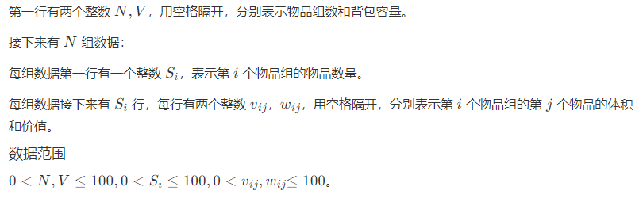

# 01并查集

## 01并查集基础问题

### **1921 - 是不是亲戚**

**题目描述**

若某个家族人员过于庞大，要判断两个是否是亲戚，确实还很不容易，现在给出某个亲戚关系图，求任意给出的两个人是否具有亲戚关系。

规定：*x* 和 y 是亲戚，y 和 z 是亲戚，那么 *x* 和 z 也是亲戚。如果 x*,*y 是亲戚，那么 *x* 的亲戚都是 y 的亲戚，y的亲戚也都是 x 的亲戚。

**输入**

|

**输出**

*P*行，每行一个 `Yes` 或 `No`。表示第 i 个询问的答案为“具有”或“不具有”亲戚关系。

**样例**

**输入复制**

```
6 5 3
1 2
1 5
3 4
5 2
1 3
1 4
2 3
5 6
```

**输出复制**

```
Yes
Yes
No
```

**来源**

并查集

---

### **1922 - 修路**

**题目描述**

某市调查城镇交通状况，得到现有城镇道路统计表。表中列出了每条道路直接连通的城镇。市政府 "村村通工程" 的目标是使全市任何两个城镇间都可以实现交通（但不一定有直接的道路相连，只要相互之间可达即可）。

请你计算出最少还需要建设多少条道路？

**输入**

输入包含若干组测试数据，每组测试数据的第一行给出两个用空格隔开的正整数，分别是城镇数目 *n* 和道路数目 *m* （输入 n=0 表示测试数据结束）；

随后的 m 行对应 m 条道路，每行给出一对用空格隔开的正整数，分别是该条道路直接相连的两个城镇的编号。简单起见，城镇从 1到 n* 编号。

注意：两个城市间可以有多条道路相通。

对于 100% 的数据，保证 1≤*n*<1000 。

**输出**

对于每组数据，对应一行一个整数。表示最少还需要建设的道路数目。

**样例**

**输入复制**

```
4 2
1 3
4 3
3 3
1 2
1 3
2 3
5 2
1 2
3 5
999 0
0
```

**输出复制**

```
1
0
2
998
```

**来源**

并查集

---

### **1923 - 躲避拥堵的最佳路线**

**题目描述**

小明所在的城镇有 *m* 条路连接了 n 个区（ n 个区的编号在 1∼*n* 的范围内），每条大道将两个区相连接，每条大道有一个拥挤度。

小明想要开车从 s 区去 t 区，请你帮他规划一条路线，使得经过道路的拥挤度的最大值最小。

**输入**

第一行有四个用空格隔开的 n*,*m*,*s*,*t ，其含义见题目描述。

接下来 m 行，每行三个整数 u*,*v*,*w ，表示有一条大道连接区 u 和区 v ，且拥挤度为 w ，道路为双向道路，两个方向都可以走。

两个区之间可能存在多条大道。

**数据规模与约定**

对于 30% 的数据，保证 *n*≤10 。

对于 60% 的数据，保证 n≤100 。

对于 100% 的数据，保证 1≤*n*≤10^4，1≤*m*≤2×10^4, *w*≤10^4,1≤*s*,*t*≤*n*。

且从 s 出发一定能到达 *t* 区。

**输出**

输出一行一个整数，代表最大的拥挤度。

**样例**

**输入复制**

```
3 3 1 3
1 2 2
2 3 1
1 3 3
```

**输出复制**

```
2
```

**来源**

二分答案 并查集

---

### **1925 - 团队数量**

**题目描述**

芝加哥组织了一场激烈的军事竞赛，很多国家的军人慕名而来，他们要么是队友，要么是敌人。

现建立如下规则：

1. 我的队友的队友，是我的队友；
2. 我的敌人的敌人也是我的队友；

两个人只要是队友，就认为他们属于同一团队，现给你若干参赛军人之间的关系，请问：最多有多少个团队？

**输入**

|

**输出**

输出文件只有一行，表示最大可能的团队数。

**样例**

**输入复制**

```
6
4
E 1 4
F 3 5
F 4 6
E 1 2
```

**输出复制**

```
3
```

**说明**

|

**来源**

并查集

---

### **1930 - 关押罪犯**

**题目描述**

S 城现有两座监狱，一共关押着 *N* 名罪犯，编号分别为 1−*N*。他们之间的关系自然也极不和谐。很多罪犯之间甚至积怨已久，如果客观条件具备则随时可能爆发冲突。我们用“怨气值”（一个正整数值）来表示某两名罪犯之间的仇恨程度，怨气值越大，则这两名罪犯之间的积怨越多。如果两名怨气值为 c* 的罪犯被关押在同一监狱，他们俩之间会发生摩擦，并造成影响力为 c* 的冲突事件。

每年年末，警察局会将本年内监狱中的所有冲突事件按影响力从大到小排成一个列表，然后上报到 S 城 Z 市长那里。公务繁忙的 Z 市长只会去看列表中的第一个事件的影响力，如果影响很坏，他就会考虑撤换警察局长。

在详细考察了N* 名罪犯间的矛盾关系后，警察局长觉得压力巨大。他准备将罪犯们在两座监狱内重新分配，以求产生的冲突事件影响力都较小，从而保住自己的乌纱帽。假设只要处于同一监狱内的某两个罪犯间有仇恨，那么他们一定会在每年的某个时候发生摩擦。

那么，应如何分配罪犯，才能使 Z 市长看到的那个冲突事件的影响力最小？这个最小值是多少？

**输入**

|

**输出**

共 1 行，为 Z 市长看到的那个冲突事件的影响力。如果本年内监狱中未发生任何冲突事件，请输出 `0`。

**样例**

**输入复制**

```
4 6
1 4 2534
2 3 3512
1 2 28351
1 3 6618
2 4 1805
3 4 12884
```

**输出复制**

```
3512
```

**说明**

【输入输出样例说明】

罪犯之间的怨气值如下面左图所示，右图所示为罪犯的分配方法，市长看到的冲突事件影响力是 3512（由 2 号和 3 号罪犯引发）。其他任何分法都不会比这个分法更优。


【数据范围】

对于 30%的数据有 N≤15。

对于 70%的数据有 N*≤2000,*M≤50000。

对于 100%的数据有 N*≤20000,*M≤100000。

**来源**

noip提高组复赛 并查集

---

## 02并查集的应用

### **1929 - 最短网络 Agri-Net（USACO3.1）**

**题目描述**

Farmer John 被选为他们镇的镇长！他其中一个竞选承诺就是在镇上建立起互联网，并连接到所有的农场。当然，他需要你的帮助。

FJ 已经给他的农场安排了一条高速的网络线路，他想把这条线路共享给其他农场。为了用最小的消费，他想铺设最短的光纤去连接所有的农场。

你将得到一份各农场之间连接费用的列表，你必须找出能连接所有农场并所用光纤最短的方案。每两个农场间的距离不会超过 105 。

**输入**

|

**输出**

只有一个输出，其中包含连接到每个农场的光纤的最小长度。

**样例**

**输入复制**

```
4
0 4 9 21
4 0 8 17
9 8 0 16
21 17 16 0
```

**输出复制**

```
28
```

**来源**

USACO 并查集 贪心

---

## 03带权并查集

### **1926 - 立方体积木Cube Stacking**

**题目描述**

|

**输入**

第 1 行输入 *P*，之后 P 行每行输入一条指令，形式为 M X Y 或者 C X。
输入保证不会有将立方柱放在自己头上的指令。

**输出**

输出共 P* 行，对于每个统计指令，输出其结果。

**样例**

**输入复制**

```
6
M 1 6
C 1
M 2 4
M 2 6
C 3
C 4
```

**输出复制**

```
1
0
2
```

**来源**

USACO 带权并查集

---

# 02图论基础

## 01图论基础问题

### **2052 - 图的dfs遍历**

**题目描述**

一个有 *n* 个结点的无向连通图，这些结点以编号：1,2…*n* 进行编号，现给出结点间的连接关系。

请以结点 1 为起点，按dfs（深度优先搜索）、优先访问小编号结点的顺序遍历并输出该图。

**输入**

第一行为两整数，n 和 e ，表示 n* 个顶点，e 条边。（ 2≤*n*,*e*≤10 ）

以下 e* 行每行两个数，表示两个结点是连通的。

**输出**

只有一行，为按照优先访问小编号结点的dfs的结果。

**样例**

**输入复制**

```
5 7
1 2
1 3
1 4
2 4
2 5
3 5
4 5
```

**输出复制**

```
1 2 4 5 3
```

**来源**

图论 图的遍历

---

### **2053 - 图的bfs遍历**

**题目描述**

一个有 *n* 个结点的无向连通图，这些结点以编号：1,2…*n* 进行编号，现给出结点间的连接关系。

请以结点 1 为起点，按广度优先搜索（bfs）、优先访问小编号结点的顺序遍历并输出该图。

**输入**

第一行为两整数，n 和 *e* ，表示 n 个顶点，e 条边。（ 2≤*n*,*e*≤10 ）

以下 e 行每行两个数，表示两个结点是连通的。

**输出**

只有一行，为节点按照广度优先、小编号结点优先访问的结果。

**样例**

**输入复制**

```
5 7
1 2
1 3
1 4
2 4
2 5
3 5
4 5
```

**输出复制**

```
1 2 3 4 5
```

**来源**

图论 图的遍历

---

## 02欧拉路-图的一笔画问题

### **2055 - 欧拉路**

**题目描述**

有一个无向图，图中要么有两个奇点要么0奇点，如果是欧拉回路请从第一个点（1号点）为起点开始遍历，如果有两个奇点，则以字典序大的为起点开始遍历，在遍历的过程中，字典序小结点的先遍历。

请输出满足条件的欧拉路或者欧拉回路。

**输入**

第一行两个整数，n和e，表示有n个结点（结点编号为1~n），e条边。（5<=n<=20,5<=e<=15）

接下来e行，每行有2个数，代表这两个结点之间有一条边。（本题数据保证两个结点之间最多只有1条边，确保本题存在欧拉路或者欧拉回路）

**输出**

只有一行，为满足条件的欧拉路或欧拉回路。

**样例**

**输入复制**

```
5 5
1 2
2 3
3 4
4 5
5 1
```

**输出复制**

```
1 2 3 4 5 1
```

**来源**

图论 欧拉路

---

## 03图论-最短路问题

### **2048 - 最短路径**

**题目描述**

在带权有向图 *G* 中，给定一个源点 v ，求从 v 到 G中的其余各顶点的最短路径问题，叫做单源点的最短路径问题。

在常用的单源点最短路径算法中，迪杰斯特拉算法是最为常用的一种，是一种按照路径长度递增的次序产生最短路径的算法。

在本题中，读入一个有向图的带权邻接矩阵（即数组表示），建立有向图并按照以上描述中的算法求出源点至每一个其它顶点的最短路径长度。

**输入**

|

**输出**

只有一行，共有 *n*−1 个整数，表示源点至其它每一个顶点的最短路径长度。

如果不存在从源点至相应顶点的路径，输出 −1。

**样例**

**输入复制**

```
4 2
0 3 0 1
0 0 4 0
2 0 0 0
0 0 1 0
```

**输出复制**

```
6 4 7 
```

**输入复制**

```
3 1
0 1 0
0 0 0
2 3 0
```

**输出复制**

```
1 -1
```

**输入复制**

```
3 1
0 0 0
0 0 0
0 0 0
```

**输出复制**

```
-1 -1
```

**说明**

在本题中，需要按照题目描述中的算法完成迪杰斯特拉算法，并在计算最短路径的过程中将每个顶点是否可达记录下来，直到求出每个可达顶点的最短路径之后，算法才能够结束。

迪杰斯特拉算法的特点是按照路径长度递增的顺序，依次添加下一条长度最短的边，从而不断构造出相应顶点的最短路径。

另外需要注意的是，在本题中为了更方便的表示顶点间的不可达状态，可以使用一个十分大的值作为标记。

**来源**

图论

---

### **2047 - 最短距离和路径问题**

**题目描述**

有 *n* 个城市（编号为 1∼*n*），m 条道路（*n*<1000,*m*<10000)，每条道路有个长度（道路是双向的，两个方向都能走），请找到从起点 s 到终点 t 的最短距离和经过的城市名。

**输入**

第一行输入四个数，分别为 *n*,*m*,*s*,t（n<1000,m<10000，1≤*s*,*t*≤n）

接下来 m 行，每行三个数 x*,*y*,*len ，分别为两个城市名和距离。（1≤*x*,*y*≤*n*，1≤len≤50000）

**输出**

每组输出占两行。

第一行输出起点到终点的最短距离。

第二行输出最短路径上经过的城市名，如果有多条最短路径，输出字典序最小的那条。若不存在从起点到终点的路径，则输出`can't arrive`。

**请注意：本题两个相同的城市之间可能存在多条路径。**

**样例**

**输入复制**

```
3 3 1 3
1 3 3
1 2 1
2 3 1
```

**输出复制**

```
2
1 2 3
```

**输入复制**

```
4 3 1 4
1 2 3
1 2 1
2 3 1
```

**输出复制**

```
can't arrive
```

**来源**

图论

---

### **2080 - 邻接点**

**题目描述**

一个有向图中有 *n* 个点（编号为 1∼*n* ），e 条边，请读入 *e* 条边，按照结点编号从小到大的顺序，输出每个点，及每个点的邻接点（有路径可到达的结点）有哪些（输出邻接点也按照编号从小到大的顺序）。

例如：有如下图所示的有向图


结点 1的邻接点有：2 3 4

结点 2 的邻接点有：3 4

结点 3 的邻接点有：5

结点 4 的邻接点有：3 5

结点 5 没有邻接点。

**输入**

第 1 行有 2 个整数，n 和 e ，代表有 *n* 个点， e 条边；（n≤1,000,000，e≤10,000）；

接下来 e行，每行有 2 个整数 x*,*y ，代表 x 到 y 之间存在一有向条边（x*,*y*≤*n）

本题测试数据确保任意两点之间最多只有 1条边、且数据合法，不存在 x 点到 x 点有边的情况。

**输出**

按照从小到大的顺序，先输出每个点的编号（如果该点没有出度，则该点不输出），再换行输出该点有出边可达的点的编号（也是按从小到大的顺序），输出格式请参考本题的样例。

**样例**

**输入复制**

```
5 8
1 2
2 3
2 4
1 3
1 4
4 3
3 5
4 5
```

**输出复制**

```
1
2 3 4
2
3 4
3
5
4
3 5
```

**说明**

样例解释：

样例输入将形成如下图所示的图形，其中：

结点1的邻接点有：2 3 4

结点2的邻接点有：3 4

结点3的邻接点有：5

结点4的邻接点有：3 5

结点5没有邻接点，因此不输出


**来源**

图论 邻接表

---

### **2044 - 城市之间的最短路**

**题目描述**

小丁同学准备去A国旅游，他买了一张A国的地图，地图标出了A国著名的 *n* 个旅游热门城市，并标注了这 n 个城市之间有 m 条双向路线相连以及每条双向路线的长度。

请你编程帮助小丁求出其中两个城市之间的最短距离。

**输入**

|

**输出**

输出 *x* 市与 *y* 市之间的最短距离，如果 x 市与 y 市之间非连通，则输出 `No path`。

**样例**

**输入复制**

```
4 4
1 2 4
1 3 1
1 4 1
2 3 1
2 4
```

**输出复制**

```
3
```

**来源**

图论

---

### **2051 - 有负权边的最短路**

**题目描述**

给定一个 *n* 个顶点，m 条边的有向图（其中某些边权可能为负，但保证没有负环）。请你计算从 1 号点到其他点的最短路（顶点从 1 到 n 编号）。

**输入**

第一行两个整数n*,*m 。

接下来的 *m* 行，每行有三个整数 u*,*v*,*l ，表示 u 到 v 有一条长度为 l 的边。

**数据范围**

|

**输出**

共 *n*−1 行，第 i行表示 1 号点到 *i*+1 号点的最短路。

**样例**

**输入复制**

```
3 3
1 2 -1
2 3 -1
3 1 2
```

**输出复制**

```
-1
-2
```

**来源**

图论 spfa

---

### **2211 - 求任意两点之间的最短路**

**题目描述**

给定一个 *n* 个顶点，m条边的有向图（其中某些边权可能为负，但保证没有负环、自环）。

请编程计算出任意两点之间的最短路。

**输入**

第一行两个整数 *n*, m；

接下来 m行，每行有 3 个整数 *u*、*v*、*l*，表示 u 点到 *v* 点之间有一条有向边，边长为 l；

1≤*n*≤100，1≤*m*≤5000，−1000≤*l*≤1000。

注意：样例数据保证两点之间只有一条有向边。

**输出**

输出共 n行，每行有 *n* 个整数，第 i 行的第 j个数，代表的是从点 i 到点 j 的最短路的值；

如果两点之间不存在能达到的路径，请输出字母`N`；

**样例**

**输入复制**

```
3 3
1 2 -1
2 3 -1
3 1 2
```

**输出复制**

```
0 -1 -2
1 0 -1
2 1 0
```

**来源**

图论

---

# 03背包DP

## 0101背包

### **1282 - 简单背包问题**

**题目描述**

有一个背包能装的重量 *ma**x**w* (正整数，0≤*ma**x**w*≤20000)，同时有 n件物品(1≤*n*≤100)，每件物品有一个重量 w**i(正整数)和一个价值 p**i (正整数)。要求从这 *n* 件物品中任取若干件装入背包内，使背包的物品价值最大。

**输入**

第 1 行：背包最大载重 ma**x**w，物品总数 n ；

第 2 行到第 n+1 行：每个物品的重量和价值；

**输出**

一个数字即背包内物品最大价值；

**样例**

**输入复制**

```
10 3
4 5
3 4
6 9
```

**输出复制**

```
14
```

**来源**

动态规划 背包问题

---

## 02完全背包

### **1780 - 采灵芝**

**题目描述**

仙岛上种了无数的不同种类的灵芝，小芳跟着爷爷来到仙岛采摘灵芝。由于他们带的食物和饮用水有限，必须在时间 *t* 内完成采摘。

假设岛上有 *m* 种不同种类的灵芝，每种灵芝都有无限多个，已知每种灵芝采摘需要的时间，以及这种灵芝的价值；

请你编程帮助小芳计算，在有限的时间 t* 内，能够采摘到的灵芝的最大价值是多少？

**输入**

|

**输出**

输出一行，这一行只包含一个整数，表示在规定的时间内，可以采到的灵芝的最大总价值。

**样例**

**输入复制**

```
70 3
71 100
69 1
1 2
```

**输出复制**

```
140
```

**来源**

动态规划 背包问题

---

## 03多重背包

### **1888 - 多重背包（1）**

**题目描述**

有 *N* 种物品和一个容量是 V的背包。

第 i 种物品最多有 s**i 件，每件体积是 v**i，价值是 wi。

求解将哪些物品装入背包，可使物品体积总和不超过背包容量，且价值总和最大。

输出最大价值。

**输入**

第一行两个整数，*N*，*V*，用空格隔开，分别表示物品种数和背包容积。

接下来有 N* 行，每行三个整数 v**i*,*w**i*,*si*，用空格隔开，分别表示第 i* 种物品的体积、价值和数量。

数据范围：

0<*N*,*V*≤100,0<*vi*,*wi,*si≤100。

**输出**

输出一个整数，代表最大价值。

**样例**

**输入复制**

```
4 10
3 2 2
4 3 2
2 2 1
5 3 4
```

**输出复制**

```
8
```

**来源**

动态规划 背包问题

---

### **1889 - 多重背包（2）**

**题目描述**

有 *N* 种物品和一个容量是 *V* 的背包。

第 i 种物品最多有 s**i 件，每件体积是 v**i，价值是 wi 。

求解将哪些物品装入背包，可使物品体积总和不超过背包容量，且价值总和最大。

输出最大价值。

**输入**

第一行两个整数，N*，*V，用空格隔开，分别表示物品种数和背包容积。

接下来有 N 行，每行三个整数 v**i*,*w**i*,*s*i*，用空格隔开，分别表示第 i 种物品的体积、价值和数量。

**输出**

输出一个整数，表示最大价值。

数据范围：

0<*N*≤1000, 0<*V*≤2000, 0<*vi*,*wi*,si≤2000。

**样例**

**输入复制**

```
4 5
1 2 3
2 4 1
3 4 3
4 5 2
```

**输出复制**

```
10
```

**来源**

动态规划 背包问题

---

## 04混合背包

### **1905 - 混合背包**

**题目描述**

有 *N* 种物品和一个容量是 V* 的背包。

物品一共有三类：

1. 第一类物品只能用 1 次（01背包）；
2. 第二类物品可以用无限次（完全背包）；
3. 第三类物品最多只能用 s*i* 次（多重背包）；

每种体积是 *vi*，价值是 w*i*。

求解将哪些物品装入背包，可使物品体积总和不超过背包容量，且价值总和最大。

输出最大价值。

**输入**

|

**输出**

输出一个整数，表示最大价值。

**样例**

**输入复制**

```
4 5
1 2 -1
2 4 1
3 4 0
4 5 2
```

**输出复制**

```
8
```

**来源**

背包问题 动态规划

---

## 05二维费用背包

### **2075 - 最大卡路里**

**题目描述**

神州飞船准备运送一批食品到太空站，该飞船能够运送食品的重量、体积都有严格的限制。

现已知 n件完全不同的食品，每种食品的重量、体积及该食品能够提供的卡路里的值，请你编程计算出，该飞船最多能够运送多少卡路里的食物？

**输入**

第一行有两个整数，表示神州飞船能够装载食物的体积最大值(<400)和质量最大值(<400)；

第二行，一个整数 食品总数 *N* (<50)；

第三行 ∼ 第 3+*N* 行，每行三个数，表示第 *i* 件食品的体积(<400) 质量(<400) 所含卡路里(<500)。

**输出**

一个整，表示所能达到的最大卡路里的值( int 范围内)

**样例**

**输入复制**

```
320 350
4
160 40 120
80 110 240
220 70 310
40 400 22
```

**输出复制**

```
550
```

**来源**

动态规划 背包 二维费用背包

---

## 06有依赖的背包

### **1928 - 采购礼品**

**题目描述**

王老师来到商店为同学们采购礼品。

这家店有 *n* 种礼品（编号是 1∼*n* ），每种礼品只有 1 件。老板为了促销，对礼品进行搭配销售，有关联性的礼品必须都要采购（奇怪的规定），比如 1号礼品和 3 号礼品搭配了，33 号和 88 号礼品搭配了，那么王老师想要买 1 号礼品的话，就需要把 33 号和 88 号礼品都买了。

现给定每种礼品的价钱和价值，请问在有限的钱 w* 的情况下，能够买到礼品的最大价值是多少？

**输入**

|

**输出**

一行，表示可以获得的最大价值。

**样例**

**输入复制**

```
5 3 10
3 10
3 10
3 10
5 100
10 1
1 3
3 2
4 2
```

**输出复制**

```
1
```

**来源**

背包 并查集

---

### **1820 - 金明的预算方案**

**题目描述**

金明今天很开心，家里购置的新房就要领钥匙了，新房里有一间金明自己专用的很宽敞的房间。更让他高兴的是，妈妈昨天对他说：“你的房间需要购买哪些物品，怎么布置，你说了算，只要不超过 *n* 元钱就行”。今天一早，金明就开始做预算了，他把想买的物品分为两类：主件与附件，附件是从属于某个主件的，下表就是一些主件与附件的例子：

| 主件   | 附件           |
| :----- | :------------- |
| 电脑   | 打印机，扫描仪 |
| 书柜   | 图书           |
| 书桌   | 台灯，文具     |
| 工作椅 | 无             |

|

**输入**

|

**输出**

输出一行一个整数表示答案。

**样例**

**输入复制**

```
1000 5
800 2 0
400 5 1
300 5 1
400 3 0
500 2 0
```

**输出复制**

```
2200
```

**说明**

**数据规模与约定**

|

**来源**

noip2006提高组第2题

---

## 07分组背包

### **1906 - 分组背包问题**

**题目描述**

有 *N* 组物品和一个容量是 V 的背包。每组物品有若干个，同一组内的物品最多只能选一个。

每件物品的体积是 *vij*，价值是 w*ij*，其中 i 是组号，j 是组内编号。

求解将哪些物品装入背包，可使物品总体积不超过背包容量，且总价值最大。

输出最大价值。

**输入**

|

**输出**

输出一个整数，表示最大价值。

**样例**

**输入复制**

```
3 5
2
1 2
2 4
1
3 4
1
4 5
```

**输出复制**

```
8
```

**来源**

背包问题 动态规划

---

## 08背包问题问法变化

### 01**背包求方案数**

### **1890 - 小明买书**

**题目描述**

新的学习开始了，小明来到书店采购辅导书。

小明有 *M* 元，书店有 N* 种不同的书，第 i* 种书卖 A**i* 元，假设小明每种书最多只能买 1 本，且要花完 M 元，请问小明有多少种不同的买书方案？

**输入**

|

**输出**

输出一个整数，代表买书的方案数。（请注意：本题的计算结果可能会超过int）

**样例**

**输入复制**

```
4 4
1 1 2 2
```

**输出复制**

```
3
```

**来源**

动态规划 背包问题

---

### **1904 - 数字的组合**

**题目描述**

|

**输入**

|

**输出**

包含一个整数，表示可选方案数（本题的计算结果一定在int范围内）。

**样例**

**输入复制**

```
4 4
1 1 2 2
```

**输出复制**

```
3
```

**来源**

动态规划 背包问题

---

### **完全背包相关**

### **1885 - 钱币兑换**

**题目描述**

在一个国家仅有 1 分，2 分，3 分硬币，将钱 N 分 (N<32768) 兑换成硬币有很多种兑法。

请你编程序计算出共有多少种兑法。

**输入**

输入一个正整数 N*，*N* 小于 32768。

**输出**

输出兑换的方法数。（本题数据的计算结果在int范围内）

**样例**

**输入复制**

```
2934
```

**输出复制**

```
718831
```

**来源**

动态规划 背包问题

---

### **1903 - 自然数的拆分方案总数**

**题目描述**

给定一个自然数 *N* ，要求把 N 拆分成若干个正整数相加的形式，参与加法运算的数可以重复。

**注意:**

1. 拆分方案不考虑顺序，也就是 3=1+2 和 3=2+1 算作相同的方案；
2. 至少拆分成 22 个数的和。
3. 求拆分的方案数 mod2147483648mod2147483648 的结果。

**输入**

一个自然数 *N*。（1≤*N*≤4000）

**输出**

输入一个整数，表示结果。

**样例**

**输入复制**

```
7
```

**输出复制**

```
14
```

**说明**

**【举例】**

按题意，数字 55 有 66 种不同的拆分方案，分别是：

```
1+1+1+1+1
1+1+1+2
1+1+3
1+4
1+2+2
2+3
```

**来源**

动态规划 背包问题

---

### **2072 - 公交乘车**

**题目描述**

A城市有一条非常特别的街道，该街道在每个公里的节点上都有一个公交车站，乘客可以在任意的公交站点上车，在任意的公交站点下车。乘客根据每次乘坐公交的公里数进行付费，比如，下表就是乘客乘坐不同的公里数要付的费用。（请注意：不一定公里数越高，费用越高，这也是这条街道特别的地方）

| 公里数   | 1    | 2    | 3    | 4    | 5    | 6    | 7    | 8    | 9    | 10   |
| -------- | ---- | ---- | ---- | ---- | ---- | ---- | ---- | ---- | ---- | ---- |
| 付费金额 | 12   | 21   | 31   | 40   | 49   | 58   | 69   | 79   | 90   | 101  |

一辆公交车单次行驶的公里数一定不超过 1010 公里，一个乘客如果打算乘坐公交车完成 n* 公里（1≤*n*≤100）的行程，他可以选择无限次的换车来完成行程。

请问，他最少要花多少钱？

**输入**

第一行十个整数分别表示公交行走 1 到 10 公里的费用（≤500）。注意这些数并无实际的经济意义，即行驶 10 公里费用可能比行驶一公里少。

第二行一个整数 n* 表示，旅客的总路程数。（1≤*n*≤100）

**输出**

仅一个整数表示最少费用。

**样例**

**输入复制**

```
12 21 31 40 49 58 69 79 90 101
15
```

**输出复制**

```
147
```

**来源**

动态规划 背包

---

### 多重背包相关问题

### **1892 - 砝码称重**

**题目描述**

|

**输入**

|

**输出**

|

**样例**

**输入复制**

```
1 1 0 0 0 0
```

**输出复制**

```
3
```

**来源**

noip复赛 背包问题 动态规划

---

# 09前缀和

### **2060 - 计算能力**

**题目描述**

小 *A* 同学有着很强的计算能力，张老师为了检验小 *A* 同学的计算能力，写了一个 *n* 个数的数列。

张老师问了小 A 同学 m 个问题，每个问题都是请小 A 同学计算这个数列从第 x 个数开始到第 *y* 个数结束这个区间的所有数的和。

请你编程帮助张老师计算出结果。

**输入**

第一行包含两个整数 *n* 和 m 。

第二行包含 n 个整数。

接下来 m行，每行包含两个整数 x和 y表示。

**数据范围**

1≤*x*≤*y*≤*n*。

1≤*n*,*m*≤100000。

数列中元素的值，在 [−1000,1000][−1000,1000] 的范围内。

**输出**

共 *m* 行，每行输出一个询问的结果。

**样例**

**输入复制**

```
6 3
1 3 6 5 4 2
1 3
2 5
3 6
```

**输出复制**

```
10
18
17
```

**来源**

前缀和差分

---

### **2061 - 子矩阵求和**

**题目描述**

小 A 同学有着很强的计算能力，张老师为了检验小 *A* 同学的计算能力，写了一个 n 行 *m* 列的矩阵数列。

张老师问了小 A 同学 k 个问题，每个问题会先告知小 A 同学 4个数 x*1,*y*1,*x*2,*y2 表示这是矩阵中 2 个点的行列的值，以这两个点为一个矩形的左上角和右下角，可以从矩阵中画出一个子矩阵，张老师请小 A 同学计算出这个子矩阵中所有数的和。

请你编程帮助张老师计算出结果。

**输入**

|

**输出**

共 *k* 行，每行输出一个询问的结果。

**样例**

**输入复制**

```
3 5 4
1 1 6 7 4
6 10 4 9 9
2 6 7 3 7
1 2 2 4
2 4 3 5
2 2 3 5
1 3 2 4
```

**输出复制**

```
37
28
55
26
```

**来源**

前缀和差分

---

### **2119 - 任务的最少完成时间**

**题目描述**

小 *A* 同学接到了 n 个需要完成的任务，这 n个任务必须按照接到的顺序完成，每个任务的完成时间为 *ai*。

由于任务非常艰巨，小 A 同学从老师那里领到了一张减负卡，用这张卡，小 A 可以从 n 个任务中任意的删除 k个连续的任务，只需要完成剩余的任务。

请问，小 A 完成所有任务的总时间最少是多少？

**输入**

|

**输出**

一个整数，表示小 *A* 任务完成的最少时间。

**样例**

**输入复制**

```
5 2
1 3 2 5 4
```

**输出复制**

```
6
```

**来源**

前缀和差分

---

### **2105 - 不太甜的糖果**

**题目描述**

小Y走啊走啊，翻山越岭、跋山涉水，终于，小Y累了。虽然，糖果的诱惑强大，但他的两条腿已经不听使唤，只能坐在地上叹气，内心无比焦急……

突然眼前一黑，小Y没有昏过去，但是眼前出现了一个糖人。在这无人之地，小Y没有别的办法，只得求助糖人。

善良的糖人没法拒绝小Y的请求，但还要遵守这个世界的规则，所以，小Y不能”不劳而获”，但小Y现在已经没有力气。糖人只让他玩一个小小的游戏，完成这个游戏，小Y才能获得补充能量，继续前进。

但是，小Y满脑子都是糖果，他没有心思玩游戏，只想着吃糖。所以，他向你求助。

游戏的规则是这样的： 给定一排长度为 n* 的糖果串，每个糖果有一个甜度；在不改变糖果顺序的前提下，求出一个最短的糖果串使得它的甜度之和大于等于 m* 。

**输入**

第一行包含两个数 n* 和 m*，第二行有 n* 个数。

**输出**

输出一行，包含一个数，即最短的糖果串的长度；如果找不到这样的糖果串，输出 00。

**样例**

**输入复制**

```
10 15 
5 1 3 5 10 7 4 9 2 8 
```

**输出复制**

```
2
```

**说明**

**【样例说明】**

糖果串为连续的。

对于样例数据，选第四五个可以达到 15 或者第五六个能达到 17 ，所以最短糖果串为 2 。

**【数据范围】**

对于 20% 的数据，*n*≤200

对于 50% 的数据，n≤2000

对于 80% 的数据，n≤100000

对于 90% 的数据，n≤200000

对于 100% 的数据，n≤230000

1≤*M*≤1000，糖果的甜度为正整数，且本题数据保证连续若干糖果的甜度和在int范围内。

**来源**

数组 二分答案 前缀和差分 动态规划

---

# 10差分

### **2062 - 倒水**

**题目描述**

在一个桌子上摆放了 *n* 个杯子，每个杯子中有一定量的水。小 A 同学负责向杯子中倒水，他总共倒了 *k* 次，每次会向从第 L个杯子到第 R 个杯子中添加 P 毫升的水（注意：水只可能增加，不可能减少）。

请问小 A 同学倒了 k 次水之后， n个杯子每个杯子有多少毫升的水。

**输入**

第一行包含两个整数 n 和 k。

第二行包含 *n* 个整数，表示一开始每个杯子中水的毫升数。

接下来 k 行，每行包含三个整数 L*,*R*,*P，表示一次操作。

**数据范围**

1≤*n*,*k*≤100000

1≤*L*≤*R*≤*n*,0≤*P*≤1000

杯子中水的初始量在 [0,1000][0,1000] 的范围内。

本题数据上保证所有的杯子在加水之后，水量值仍然**在 int 范围内**。

**输出**

共一行，包含 *n* 个整数，表示最终 n 个杯子每个杯子有多少毫升的水。

**样例**

**输入复制**

```
8 3
1 2 10 8 1 5 1 1
7 8 12
1 8 4
2 3 12
```

**输出复制**

```
5 18 26 12 5 9 17 17
```

**来源**

前缀和差分

---

### **1538 - 小 X 与煎饼达人(flip)**

**题目描述**

|

**输入**

输入数据第一行包含两个用空格隔开的正整数表示 *n* 和 *m* 。

接下来 m 行每行两个用空格隔开的正整数 *x* 和 y*， 表示每次将区间 [x*，*y*] 中的 *y*−*x*+1 块煎饼翻个个儿。

开始时这 n 块煎饼都是反面朝上（提示： 可以用 0 表示煎饼的反面，1 表示煎饼的正面）

**输出**

输出仅有一行包含一个整数 *ans* ， 表示最后有 ans 块煎饼是正面朝上的。

**样例**

**输入复制**

```
10 5
1 8
5 6
1 9
3 8
2 7
```

**输出复制**

```
5
```

**说明**

|

【来源】

常州市2016“信息与未来”夏令营选拔赛

**来源**

市赛 前缀和差分

---

# 11数学知识

## 01素数

### **2136 - 筛素数**

**题目描述**

输入一个整数 *n*，请问 1∼*n* 范围内有多少个素数？

**输入**

一个整数 n*（1≤*n≤10^6）

**输出**

输出 n 范围内素数的个数。

**样例**

**输入复制**

```
20
```

**输出复制**

```
8
```

**来源**

筛素数

---

### **2007 - 半质数**

**题目描述**

上完体育课，小 T 同学去校园超市买了瓶水，喝完后就直接去机房上编程课了，给创 新实验班上编程课的 Q 教练曾经培养出过世界冠军金斌大神，这可是小 T 和他的小伙伴们 的偶象啊！小 T 同学从小学起就一直在金斌学长亲手开发的在线评测系统上提交程序，一 想起小学编程课眼前立刻浮现出 Q 教练的亲切笑容，想起自己初学编程时有些单词如 continue 等总是记不住，每当遇到这种情况 Q 教练总会不厌其烦地拼给自己听。

自从进入 初三后小 T 已经有很久没写程序了，也很久没见到和蔼可亲的 Q 教练了，今天这节课来得 太及时了，想到这里小 T 不由加快了脚步，走进机房，只见一阵凉风拍面而来，瞬间让人 神清气爽，原来 Q 教练知道我们上一节是体育课，早开好了空调在等我们了。

今天的编程 课 Q 教练一上来就抛给了大家一个高端大气的问题：编程寻找给定范围内的半质数。半质数小 T 还是第一次听说，这个问题明显比找质数档次高多了！ 质数的定义小 T 早在小学 就知道了，质数又称素数，指在大于 1 的自然数中，只能被 1 和本身整除的数， 也可定义为只有 1 和本身两个因数的数。

而半质数的定义是这样的：若对于一个正整数 *N*，恰好能够分解成两个质数的乘积，它就被称为半质数。比如，4=2×2，15=3×5 都是半质数，12 不是半质数，它的质因子分解式为 12=2×2×3，分解出的质数共有 3 个，其中有 2 个质数 2， 1 个质数 3。

**输入**

输入数据仅有一行包含两个用空格隔开的正整数 S 和 E*，其中 2≤*S*≤*E<5000000 。

**输出**

输出数据仅有一行包含一个整数表示在 S 到 *E* 之间共有多少个半质数。

**样例**

**输入复制**

```
4 26
```

**输出复制**

```
10
```

**说明**

**【样例解释】**

在 4 到 26 之间共有 10 个半质数，分别是 4, 6, 9, 10, 14, 15, 21, 22, 25, 26 。

**【数据范围】**

30%的数据满足：2≤*S*≤*E*<500；

60% 的数据满足：2≤*S*≤*E*<50000；

100%的数据满足：2≤*S*≤*E*<5000000。

**【来源】**

2014年常州市赛

**来源**

2014年常州市赛

---

### **1080 - 质因子**

**题目描述**

任意输入一正整数 *N* ，求出它的所有质因子。如：10＝2×5，20＝2×2×5。

**输入**

输入只有一行，包括 1 个整数 n (1≤*n*≤32768)。

**输出**

输出若干行，按从小到大的顺序给出这个数的所有质因子，每行一个。

**样例**

**输入复制**

```
36
```

**输出复制**

```
2
2
3
3
```

**输入复制**

```
100
```

**输出复制**

```
2
2
5
5
```

**输入复制**

```
11
```

**输出复制**

```
11
```

**来源**

循环

---

### **2137 - 质因子2**

**题目描述**

|

**输入**

输入只有一行，包括1个整数n (1<n≤10^9 )。

**输出**

输出若干行，按从小到大的顺序给出这个数的所有质因子，每行一个。

**样例**

**输入复制**

```
36
```

**输出复制**

```
2
2
3
3
```

**来源**

循环

---

## 02唯一分解定理

### **2140 - 质因子3**

**题目描述**

|

**输入**

|

**输出**

按题意输出分解结果。

**样例**

**输入复制**

```
100
```

**输出复制**

```
100=2^2*5^2
```

**来源**

因子

---

### **2138 - 乘积的约数个数**

---

**题目描述**

|

**输入**

|

**输出**

输出一个整数，表示所给正整数的乘积的约数个数。

**样例**

**输入复制**

```
5
3
2
4
18
11
```

**输出复制**

```
40
```

**来源**

因数

---

### **2139 - 乘积的约数和**

**题目描述**

|

**输入**

|

**输出**

输出一个整数，表示所给正整数的乘积的约数和。

**样例**

**输入复制**

```
5
3
2
4
18
11
```

**输出复制**

```
14880
```

**来源**

因数

---


# 12树

### **2164 - 子结点的数量**

**题目描述**

给定一棵树中的若干父结点和子结点的关系描述（结点 1 是树根），请问该树中，每个结点有多少个子结点。

比如：读入父子关系如下，先读入父结点，再读入子结点。

```
1 2
2 3
2 4
```

根据读入，可以画出树如下。


因此每个结点的子结点的数量分别是：1 2 0 0 。

**输入**

第 1 行，读入一个整数 n ，表示树中结点的数量，树中的结点编号也是 1∼*n*。（n≤100）

接下来 n*−1 行，每行有一对父子关系 x* *y*，*x* 表示父结点的编号，y 表示子结点的编号。

输入数据保证一定合法，能够形成一棵树，且不存在重复的父子关系的读入。

**输出**

输出 *n* 个数，用空格隔开，表示按照编号从小到大的顺序，输出每个结点子结点的数量。

**样例**

**输入复制**

```
4
1 2
2 3
2 4
```

**输出复制**

```
1 2 0 0
```

**来源**

树

---

### **2165 - 子结点的数量（2）**

**题目描述**

|

```
2 1
2 3
2 4
```

因此每个结点的子结点的数量分别是：1 2 0 0 。

**输入**

|

**输出**

输出 *n* 个数，用空格隔开，表示按照编号从小到大的顺序，输出每个结点子结点的数量。

**样例**

**输入复制**

```
4
2 1
2 3
2 4
```

**输出复制**

```
1 2 0 0
```

**来源**

树

---

### **1775 - 谁的孙子最多**

**题目描述**

给定一棵树，其中 11 号结点是根结点，问哪一个结点的孙子结点最多，有多少个。（孙子结点，就是儿子结点的儿子结点。）

**输入**

|

**输出**

一行两个整数，表示孙子结点最多的结点，以及其孙子结点的个数，如果有多个，输出编号最小的（本题测试数据确保有解）。

**样例**

**输入复制**

```
5
2 2 3
1 4
0
1 5
0
```

**输出复制**

```
1 1
```

**来源**

vector 树

---

### **2188 - 找树根**

**题目描述**

一棵树有 *n* 个结点，已知树上所有的父子结点关系，请问该树的根是几号结点，哪个结点的子结点最多，该结点有哪些子结点。

**输入**

第一行，有 1个整数 n代表结点数量（1<*n*≤100）

接下来若干行；每行两个结点 x和 y*，表示 y* 是 x 的孩子(1≤*x*,*y*≤1000)

请注意：树上结点的编号不一定是连续的。

**输出**

第一行输出树根的编号。

第二行输出孩子最多的结点编号（如果有多个结点的子结点都是最多的，则输出编号最大的那个）。

第三行输出第二行求出的孩子最多的结点，有哪些孩子，按照编号从小到大，输出这些孩子的编号，用空格隔开。

**样例**

**输入复制**

```
5
4 1
4 2
1 3
1 5
```

**输出复制**

```
4
4
1 2
```

**来源**

树

---

### **2170 - 树的高度**

**题目描述**

一棵树有 *n* 个结点，结点编号为 1~*n*，其中 1 号结点为根结点，根结点的深度为 1 ，请问树的高度是多少。

**输入**

第一行是整数 n，表示结点数。（1≤n≤100）

后面若干行，每行两个整数ab*，表示 b* 是 a的子结点。

本题测试数据保证所有结点能构建为一棵树。

**输出**

求这棵树的高度。

**样例**

**输入复制**

```
5
1 2
1 3
3 4
3 5
```

**输出复制**

```
3
```

**来源**

树

---

### **2171 - 树的高度（2）**

**题目描述**

一棵树有 *n* 个结点，结点编号为 1~n*，其中 1 号结点为根结点，根结点的深度为 1，请问每个结点的父结点是谁，每个结点的深度是多少。

**输入**

|

**输出**

输出有 *n*−1 行（根结点不需要输出），每行输出 3 个整数；

第 i 行输出：结点编号 *i*+1，编号为 *i*+1 的结点的父结点的编号，该结点的深度（三个整数之间用空格隔开）。

**样例**

**输入复制**

```
5
2 1
4 3
1 3
3 5
```

**输出复制**

```
2 1 2
3 1 2
4 3 3
5 3 3
```

**来源**

树

---

### **2166 - 子树的大小及深度**

**题目描述**

现在有一棵 *n* 个结点的树，结点 1 为这棵树的根，结点 1 的深度为 1，求出每棵子树的大小及每个结点的深度。

比如，有如下图所示的树：


**该树中：**

结点 1 对应的子树大小为 6，深度为 1。

结点 2 对应的子树大小为 5，深度为 2。

结点 3 对应的子树大小为 1，深度为 3。

结点 4 对应的子树大小为 1，深度为 3。

结点 5 对应的子树大小为 2，深度为 3。

结点 6 对应的子树大小为 1，深度为 4。

**输入**

|

**输出**

输出有 *n* 行。

第 *i* 行输出 2 个整数，分别是以编号 i* 为根的子树的大小，以及编号 i* 对应的结点的深度。

**样例**

**输入复制**

```
6
1 2
5 2
2 3
4 2
5 6
```

**输出复制**

```
6 1
5 2
1 3
1 3
2 3
1 4
```

**来源**

树

---

### **2167 - 树的公共祖先（LCA）**

**题目描述**

给定一棵树和两个不同的结点，求出他们最近的公共祖先父结点。

已知该树有 n* 个结点，标号 1..*n* 。

**输入**

|

**输出**

输出 x 与 y 的最近公共祖先 roo*t*。

**样例**

**输入复制**

```
9
9 7
2 1
3 2
4 2
5 3
8 5
9 5
6 4
7 4
```

**输出复制**

```
2
```

**来源**

树

---

### **2168 - 树的公共祖先(LCA)(2)**

**题目描述**

给定一棵树和两个不同的结点，求出他们最近的公共祖先父结点。

已知该树有 n 个节点，标号1…*n* ，标号为 1 的结点是该树的根。

**输入**

|

**输出**

*x* 与 *y* 的最近公共祖先。

**样例**

**输入复制**

```
9
9 7
2 1
3 2
4 2
5 3
8 5
9 5
6 4
7 4
```

**输出复制**

```
2
```

**来源**

树

---

### **2172 - 树的直径**

**题目描述**

树的直径指的是，树中两点之间的最长路径。现给定一棵树的数据，请问该树的直径的是多少？


比如，如图所示的树，直径应该是 3−2−5−6，路径长度为 3。

**输入**

|

**输出**

输出一个整数 *n* 代表树的直径。

**样例**

**输入复制**

```
6
1 2
3 2
5 6
2 4
5 2
```

**输出复制**

```
3
```

**来源**

树

---

### **2207 - 树的中心**

**题目描述**

给定一棵树，树中有 *n* 个结点（结点编号为 1∼*n* ），请求出该树的中心结点的编号。树的中心指的是，**该结点离树中的其他结点，最远距离最近**。

比如，按照树的中心的定义，下图中的结点 11 和结点 33 ，就是该树的中心。


**输入**

第 1行包括一个整数 *n*（n≤10^5），代表树中结点的数量。

接下来 n−1 行，每行有 2 个整数 x和 *y*，代表结点 *x* 到结点 *y* 之间有一条边。（不确定结点之间的父子关系）

**输出**

请输出树的中心结点的编号，如果有多个中心结点，请按照从小到大的顺序输出所有中心结点的编号。

**样例**

**输入复制**

```
5
2 1
1 3
3 4
3 5
```

**输出复制**

```
1 3
```

**来源**

树

---

### **2190 - 树的重心**

**题目描述**

给定一颗树，树中有 *n* 个结点（编号 1∼*n* ）。 请你找到树的重心，并输出树的重心的结点编号。

重心定义：重心是指树中的一个结点，如果将这个点删除后，剩余各个连通块中结点数的最大值最小，那么这个结点被称为树的重心。

如下图所示的树的重心为 1 号结点。


**输入**

第 1 行读入一个整数 *n*，代表树的结点的数量（ 1≤*n*≤10^5 ）；

接下来 *n*−1 行，每行读入两个整数 x* 和 y* ，表示结点 x* 和 y* 之间有一条边（注意：不确定 x* 和 y* 的父子关系）。

**输出**

请输出树的重心的结点编号，如果树有多个重心，请按照编号从小到大依次输出，数字之间用空格隔开。

**样例**

**输入复制**

```
9
1 2
1 7
2 8
2 5
4 3
1 4
3 9
4 6
```

**输出复制**

```
1
```

**来源**

树

----

# 13二叉树

## 01二叉树问题

### **2182 - 二叉树的遍历**

**题目描述**

给出一个 *n* 个结点的二叉树，请求出二叉树的前序遍历，中序遍历和后序遍历。

**输入**

第一行有一个整数 n (0<*n*≤26)，表示二叉树有 n 个结点；

以下 n 行，每行第一个为一个大写字母表示结点的值，第 *i*+1 行的结点编号为 i ；

后面为两整数，第一个表示该结点左孩子结点编号，第二个表示该结点右孩子的结点编号，如果该编号为 0 表示没有；（编号为 1 的结点是树的根）

**输出**

共三行，第一行为二叉树的前序遍历，第二行为中序遍历，第三行为后序遍历；

**样例**

**输入复制**

```
7
F 2 3
C 4 5
E 0 6
A 0 0
D 7 0
G 0 0
B 0 0
```

**输出复制**

```
FCADBEG
ACBDFEG
ABDCGEF
```

**说明**

**【样例解释】**

样例对应的二叉树如图所示：


**来源**

二叉树

---

### **2183 - 求二叉树的深度及遍历结果**

**题目描述**

从键盘读入一棵二叉树，请问这棵二叉树的深度是多少？这棵二叉树如果后序遍历的结果是什么？

**输入**

第 1 行输入一个整数 *n* ，代表读入的数据数量。（n≤100）

第 2 行读入 *n* 个非负整数，代表读入的数据，读入的整数中，如果值大于 0 ，代表的是二叉树的结点，如果值等于0 ，代表当前结点为空。（根结点的深度为 1 ）

二叉树的构造按照层次顺序（即第 1 层 1 个整数，第 2 层 2个，第 3 层 4 个，第 4 层有 8 个......，如果某个结点不存在以 0 代替）。

样例数据确保读入的第 n 个整数 >0。

**输出**

输出有 2 行；

第 1行输出该二叉树的深度；

第 2行输出后序遍历二叉树得到的序列，数字之间用空格隔开；

**样例**

**输入复制**

```
5
1 2 0 3 4
```

**输出复制**

```
3
3 4 2 1
```

**说明**

**【样例解释】**

样例对应二叉树如下图所示：


**来源**

二叉树

---

### **2184 - 根据前序中序求后序**

**题目描述**

给定一棵二叉树的前序遍历和中序遍历，求其后序遍历。

**输入**

读入 2 个两个字符串，每个一行，长度均小于等于 26。

第一行为前序遍历，第二行为中序遍历。

二叉树中的结点名称以大写字母表示： *A*，*B*，*C*... 。

**输出**

输出一行，为后序遍历的字符串。

**样例**

**输入复制**

```
ABC
CBA
```

**输出复制**

```
CBA
```

**输入复制**

```
ABCDEFGH
CBEDAFHG
```

**输出复制**

```
CEDBHGFA
```

**来源**

二叉树

---

## 02完全二叉树

### 2186 - 结点的查找

**题目描述**

有一棵 *n* 个结点的完全二叉树，按照从上到下、从左到右的顺序，结点编号分别是 1∼*n* ，该二叉树的根所在的层数为1；

请问该二叉树的第 k* 层有哪些结点，按照从左到右的顺序输出这些结点的编号？（如果第 *k* 层没有结点，请输出 `EMPTY`）

**输入**

读入有多组数据。

每组数据的输入 2 个整数 *n* 和 k*(1≤*n*≤1000)，n 代表完全二叉树的结点数量，再输入一个 k 代表深度（1≤*k≤20）。

如果读入的 n 为 0 ，表示读入结束。

**输出**

输出该树中第 k* 层得所有结点，结点间用空格隔开。

如果第 k* 层没有结点，请输出`EMPTY`。

**样例**

**输入复制**

```
5 7
7 2
0
```

**输出复制**

```
EMPTY
2 3
```

**来源**

二叉树

---

### **2185 - 子树的大小**

**题目描述**


有如上图所示的完全二叉树，该二叉树有 *n* 个结点，编号从上向下、从左向右以此为 1∼*n*。请问，编号为 *m* 的结点所在的子树，包含了多少个结点？

比如，*n*=12，m*=3，则上图中的结点 13，14，15 以及后面的结点都是不存在的，结点 m*=3 所在子树中包括的结点有 3，6，7，12，因此结点*m* 的所在子树中共有 4 个结点。

**输入**

输入两个整数 m*，*n*。 (1≤*m*≤*n*≤10^9)

**输出**

输出结点 m 所在子树中包含的结点的数目。

**样例**

**输入复制**

```
3 7
```

**输出复制**

```
3
```

**来源**

二叉树

---

### **2187 - 是否是完全二叉树**

**题目描述**

棵深度为 *k* 的有 *n* 个结点的二叉树，对树中的结点按从上至下、从左到右的顺序进行编号，如果编号为 i*（1≤*i*≤*n）的结点与满二叉树中编号为 i 的结点在二叉树中的位置相同，则这棵二叉树称为完全二叉树。

**完全二叉树的特点：叶子结点只能出现在最下层和次下层，且最下层的叶子结点集中在树的左部。**

现在根据边的连接情况判断一棵树是否是完全二叉树。

**输入**

|

**输出**

如果是完全二叉树，输出 `yes` ，否则输出 `no`。

**样例**

**输入复制**

```
5 1
1 2
3 1
4 2
2 5 
```

**输出复制**

```
yes
```

**来源**

二叉树

---

## 03哈夫曼树

### **2193 - 哈夫曼树**

**题目描述**

哈夫曼树的定义是：一棵具有 *n* 个带权叶结点的二叉树，使得所有叶结点的带权路径长度（叶结点 ×× 叶结点到根结点的路径长度）之和最小，这样的二叉树被称为最优二叉树，也称哈夫曼树。

比如：有 4 个结点的权值是5 4 2 9，可以构建出如下三颗不同的二叉树，第 2 棵二叉树的带权路径长度是最小的。


请读入一个整数 n* ，代表叶结点的数量，再读入 n* 个整数，代表叶结点的权值，请求出对应哈夫曼树的带权路径长度。

**输入**

|

**输出**

输出构造出的哈夫曼树的带权路径长度。

**样例**

**输入复制**

```
5
5 3 8 2 9
```

**输出复制**

```
59
```

**来源**

二叉树

---

## 04二叉排序树

### **2195 - 二叉排序树**

**题目描述**

从键盘读入 *n* 个不相同的整数，以每个整数作为结点的值，来创建一棵二叉排序树，假设读入的第 1 个点是这棵树的根结点。

请求出这棵二叉排序树中序和后续遍历的结果？

**输入**

|

**输出**

共两行，第一行为中序遍历的结果，第二行为后序遍历的结果，同一行的输出用空格隔开。

**样例**

**输入复制**

```
8
23 45 12 6 7 89 13 47
```

**输出复制**

```
6 7 12 13 23 45 47 89 
7 6 13 12 47 89 45 23
```

**来源**

二叉树

---

# 14区间DP

### **2057 - 合并石子**

**题目描述**

在一个操场上一排地摆放着 *N* 堆石子。现要将石子有次序地合并成一堆。规定每次只能选相邻的 22 堆石子合并成新的一堆，并将新的一堆石子数记为该次合并的得分。

设计一个程序，计算出将 N* 堆石子合并成一堆的最小得分。

**输入**

第一行为一个正整数 *N* (2≤*N*≤100)。

以下 *N* 行，每行一个正整数，小于 10000，分别表示第 i* 堆石子的个数（1≤*i*≤*N*）。

**输出**

为一个正整数，即最小得分。

**样例**

**输入复制**

```
7
13
7
8
16
21
4
18
```

**输出复制**

```
239
```

**来源**

动态规划 区间动归

---

### **2058 - 石子合并（环形）**

**题目描述**

在一个圆形操场的四周摆放 *N* 堆石子，现要将石子有次序地合并成一堆。规定每次只能选相邻的 2 堆合并成新的一堆，并将新的一堆的石子数，记为该次合并的得分。

试设计出一个算法，计算出将 N 堆石子合并成 1 堆的最小得分和最大得分。

**输入**

|

**输出**

输出共 2 行，第 1 行为最小得分，第 2 行为最大得分。

**样例**

**输入复制**

```
4
4 5 9 4
```

**输出复制**

```
43
54
```

---

### **2213 - 相同数的合并**

**题目描述**

给定一个 1×*n* 的地图，在里面合并数字，每次可以合并相邻两个相同的数（数值范围 1∼40），问序列中出现的最大数字的值是多少。

注意合并后的数值并非加倍而是+1，例如 2 与 2 合并后的数值为 3。

**输入**

第 1 行有一个整数 n (2≤*N*≤248)。

接下来 n 行，每行有 1 个整数。

**输出**

输出一个整数，代表能得到的最大的整数。

**样例**

**输入复制**

```
4
1
1
1
2
```

**输出复制**

```
3
```

**说明**

**样例解释**

在此示例中，首先合并第二个 1 和第三个 1 以获得序列 2 ，然后将 2 合并为 3 。

请注意，合并前两个 1 不是最佳选择。

**来源**

USACO16OPEN

---

### **2059 - 能量项链**

**题目描述**

|

**输入**

|

**输出**

|

**样例**

**输入复制**

```
4
2 3 5 10
```

**输出复制**

```
710
```

**说明**

【来源】

NOIP 2006 提高组 第一题

**来源**

NOIP 2006 提高组 第一题

---

# 15双指针


# 16尺取法

