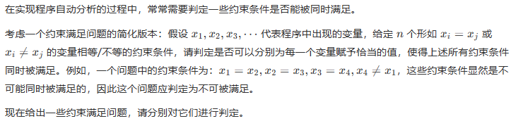
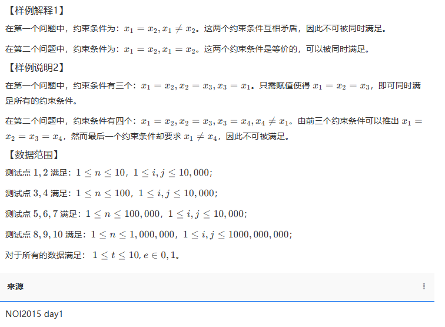

## 01字符串哈希

### **01-1915 - 子串判重**

**题目描述**

给定一个含有 26 个小写英文字母的字符串。有 *m* 次询问，每次给出 2 个区间，请问这两个区间里的子字符串是否一样？

**输入**

第一行输入一个字符串 s 。

第二行一个数字 *m*，表示 *m* 次询问。

接下来 *m* 行，每行四个数字 l1,l2,*r*1,*r*2 ，分别表示此次询问的两个区间，注意字符串的位置从 l1开始编号。

**数据范围：**

1≤*lengh*(*S*),*m*,*l*1,*r*1,*l*2,*r*2≤1000000

**输出**

对于每次询问，输出一行表示结果。

如果两个子串完全一样，输出 `Yes`，否则输出 `No`（注意大小写）。

**样例**

**输入复制**

```
aabbaabb
3
1 3 5 7
1 3 6 8
1 2 1 2
```

**输出复制**

```
Yes
No
Yes
```

**来源**

哈希

---

### 02-**2362 - 前缀和后缀**

**题目描述**

给定若干由小写字母组成的字符串（这些字符串总长 ≤4*10^5 ），在每个字符串中求出所有既是前缀又是后缀的子串长度。

例如：abab**c**abababab**c**abab，既是前缀又是后缀的：ab，*abab*，abab**c**abab，*abab**c**abababab**c**abab* 。

**输入**

输入若干行，每行一个字符串。

**输出**

对于每个字符串，输出一行，包含若干个递增的整数，表示所有既是前缀又是后缀的子串长度。

**样例**

**输入复制**

```
ababcababababcabab
aaaaa
```

**输出复制**

```
2 4 9 18
1 2 3 4 5
```

**来源**

POJ

---

## 02哈希表

### 01-**2363 - 书号管理**

**题目描述**

图书管理是一件十分繁杂的工作，在一个图书馆中每天都会有许多新书加入。为了更方便的管理图书（以便于帮助想要借书的客人快速查找他们是否有他们所需要的书），我们需要设计一个图书查找系统。

该系统需要支持 2 种操作：

*add*(*x*) 表示新加入一本书号为 x 的图书。

find(x) 表示查询是否存在一本书号为 x 的图书。

**输入**

第一行包括一个正整数 n，表示操作数。 以下 n 行，每行给出 2种操作中的某一个指令条，指令格式为：

add x
find x

在书号 *x* 与指令（add，find）之间有一个隔开，我们保证所有书号都是一个值在 [−10^9≤x≤10^9]之间的整数。

本题 *n*≤10^6

**输出**

对于每个 find(x) 指令，我们必须对应的输出一行 `yes` 或 `no`，表示当前所查询的书是否存在于图书馆内。

注意：一开始时图书馆内是没有一本图书的，本题允许加入到图书馆的书号 *x* 出现重复。

**样例**

**输入复制**

```
8
add 3
add 100006
add 6
find 6
add 100009
find 9
add -100000
find 3
```

**输出复制**

```
yes
no
yes
```

---

### **02-2361 - 图书管理**

**题目描述**

图书管理是一件十分繁杂的工作，在一个图书馆中每天都会有许多新书加入。为了更方便的管理图书（以便于帮助想要借书的客人快速查找他们是否有他们所需要的书），我们需要设计一个图书查找系统。

该系统需要支持 2种操作：

*add*(*s*) 表示新加入一本书名为 *s* 的图书。

*f**in**d*(*s*) 表示查询是否存在一本书名为 s的图书。

**输入**

第一行包括一个正整数 n，表示操作数。

以下 *n* 行，每行给出 2 种操作中的某一个指令条，指令格式为：

*add* *s*

*f**in**d* *s*

在书名 s与指令（add，find）之间有一个空格隔开，我们保证所有书名的长度都不超过 200。

可以假设读入数据是准确无误的。

本题 n≤30000 。

**输出**

对于每个 find(s) 指令，我们必须对应的输出一行 `yes` 或 `no`，表示当前所查询的书是否存在于图书馆内。

注意：一开始时图书馆内是没有一本图书的。并且，对于相同字母不同大小写的书名，我们认为它们是不同的。

**样例**

**输入复制**

```
4
add Inside C#
find Effective Java
add Effective Java
find Effective Java
```

**输出复制**

```
no
yes
```

## 03离散化

### 01-**1764 - 统计数字**

**题目描述**

某次科研调查时得到了 *n* 个自然数，每个数均不超过1500000000（1.5×10^9）

已知不相同的数不超过 10000个，现在需要统计这些自然数各自出现的次数，并按照自然数从小到大的顺序输出统计结果。

**输入**

包含 n+1 行；

第一行是整数 *n* ，表示自然数的个数；

第 2~*n*+1 每行一个自然数。

**输出**

包含 *m* 行（ *m* 为 *n* 个自然数中不相同数的个数），按照自然数从小到大的顺序输出。

每行输出两个整数，分别是自然数和该数出现的次数，其间用一个空格隔开。

**样例**

**输入复制**

```
8
2
4
2
4
5
100
2
100
```

**输出复制**

```
2 3
4 2
5 1
100 2
```

**说明**

**数据范围**

40%40%的数据满足：1≤*n*≤1000

80%80%的数据满足：1≤*n*≤50000

100%100%的数据满足：1≤*n*≤200000，每个数均不超过1500000000(1.5×10^9)

NOIP 2007 提高第一题

**来源**

NOIP 2007 提高第一题

---

### 02-**2845 - 自动灌溉**

**题目描述**

农场的有一个用于科学研究的大棚，大棚内有一条笔直的直线，直线的每个整数位置上都种植了一株科研植物，整数位置的范围为 0~10^9

大棚内设有一个自动灌溉机，会根据各植物检测到的特征数据，对特定位置的植物进行灌溉 。

现从计算机中调取了某一天 *N* 次灌溉记录。第 i条灌溉记录有两个数据 *Pi* 和 X**i，代表为位于 P**i位置的植物，灌溉了 Xi 毫升的水。

针对当天的灌溉记录有 M 次询问，第 *j* 条询问需要计算一个区间 [*Lj*,Rj]当天的总灌溉量。

请编程计算出 M次询问，每次的询问结果。

**输入**

第 1行读入 2个整数 N和 M；

接下来 *N* 行，每行读入 2 个整数 *P* 和 *X*；

接下来 *M* 行，每行读入 2 个整数 L和 R；

**输出**

输出 *M* 行，每行一个整数，代表每次询问的结果。

**样例**

**输入复制**

```
3 4
2 1
8 2
5 3
1 3
2 5
3 8
2 8
```

**输出复制**

```
1
4
5
6
```

**说明**

**数据范围**

对于 100的数据，1≤*N*,*M*≤10^5，0≤*P*≤10^9，1≤*X*≤10^4，0≤*L*≤*R*≤10^9；

**来源**

东方博宜OJ

---


### **03-2843 - 程序自动分析**

**题目描述**

|

**输入**

输入的第一行包含一个正整数 *t*，表示需要判定的问题个数。注意这些问题之间是相互独立的。

对于每个问题，包含若干行：

第一行包含一个正整数 *n*，表示该问题中需要被满足的约束条件个数。接下来 n 行，每行包括三个整数 i*,*j*,*e，**描述一个相等/不等的约束条件，相邻整数之间用单个空格隔开**。若 e=1，则该约束条件为 xi=xj。若*e*=0，则该约束条件为 xi≠xj。

**输出**

输出包括 *t* 行。

输出文件的第 *k* 行输出一个字符串 `YES` 或者 `NO`（字母全部大写），`YES` 表示输入中的第 *k* 个问题判定为可以被满足，`NO` 表示不可被满足。

**样例**

**输入复制**

```
2
2
1 2 1
1 2 0
2
1 2 1
2 1 1
```

**输出复制**

```
NO
YES
```

**输入复制**

```
2
3
1 2 1
2 3 1
3 1 1
4
1 2 1
2 3 1
3 4 1
1 4 0
```

**输出复制**

```
YES
NO
```

**说明**

|

---

